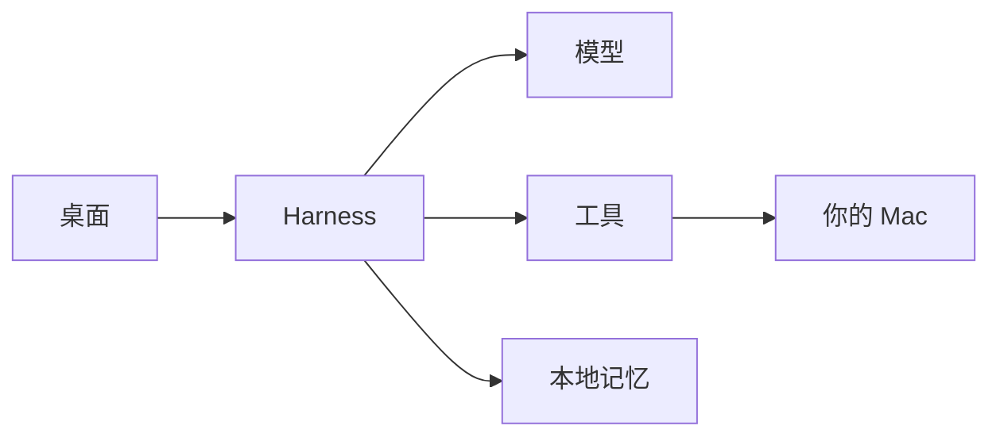

<p align="center">
  
</p>

<p align="center">
  <strong>不是对话框。<br>是跑在你 Mac 上、把活干完的 Agent。</strong>
</p>

<p align="center">
  macOS · Local-first · OpenAI 兼容 · Key 不出本机
</p>

<p align="center">
  
</p>

模型负责想。Harness 负责做成。读仓库、改文件、跑命令、验证、提交——整条路径在本地闭环，高危操作先问你。

<table>
  <tr>
    <td width="50%" valign="top">
      <h3>Harness</h3>
      流式循环、工具审批、只读并行、上下文压缩、<code>@file</code>、Plan / Build。
    </td>
    <td width="50%" valign="top">
      <h3>工具</h3>
      文件、Shell、Git、Web、Browser、Desktop、Voice。不是插件橱窗，是能执行的手。
    </td>
  </tr>
  <tr>
    <td width="50%" valign="top">
      <h3>记忆</h3>
      PGlite 存会话、项目和可检索记忆。越用越知道你的仓库。
    </td>
    <td width="50%" valign="top">
      <h3>桌面</h3>
      截屏、系统自动化。辅助功能与屏幕录制授权后，它能看见并操作这台 Mac。
    </td>
  </tr>
</table>

## 架构



界面在渲染进程。循环、工具、加密 Key 在主进程。完整数据流：[docs/ARCHITECTURE.md](docs/ARCHITECTURE.md)。

## 本地体验

现在没有现成安装包。在 **Apple Silicon Mac** 上把代码拉下来跑即可。也可以把这段说明丢给你的智能体，让它帮你 clone、安装并启动。

**需要：** macOS、[Node.js 22+](https://nodejs.org/)（建议 22.19 或更高）、Git。

```bash
git clone https://github.com/syy-shark/sharker.git
cd sharker
npm install
npm run dev
```

第一次 `npm run dev` 会在 `src/sharker-core` 里再装一层工作区依赖，可能要一两分钟。终端出现 `[dev] starting Sharker desktop` 之后会弹出桌面窗口。

打开后：

1. 选一个本地工作区（你要让它改的那个仓库或文件夹）
2. 打开设置，填 OpenAI 兼容的 API Key 和模型
3. 直接说要做什么

Key 只存在本机，经 `safeStorage` 加密。不要把 Key 写进仓库。

已经 clone 过、想跟到最新：

```bash
git pull
npm install
npm run dev
```

Computer / Browser / Voice 等系统权限见 [docs/computer-use-setup.md](docs/computer-use-setup.md)。要改这个仓库本身，先读 [AGENTS.md](AGENTS.md)。

## 文档

- [Agent 能做什么](docs/agent-capabilities.md)
- [Computer / Browser / Voice 安装](docs/computer-use-setup.md)
- [路线图](docs/roadmap-harness.md)
- [改这个仓库](AGENTS.md)

索引在 [docs/ARCH.md](docs/ARCH.md)。每一层源码目录都有同级 `ARCH.md`。设置经 `safeStorage` 加密，记忆在 `~/.sharker/memory-db`。不要提交 API Key。
特此感谢 Codex OpenCode Maka 提供的思路
