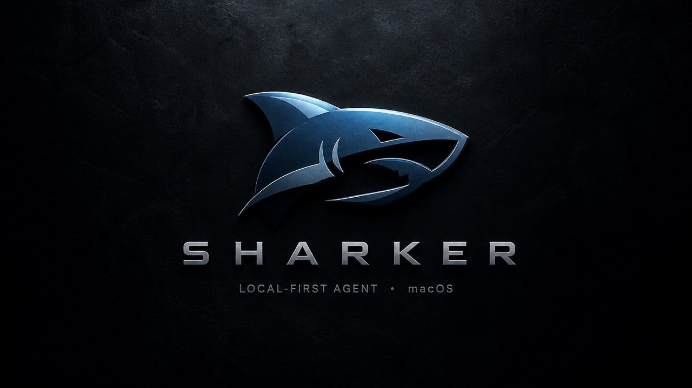
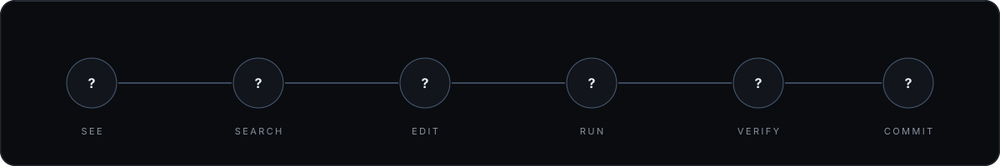
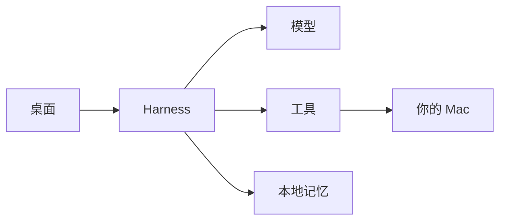

<p align="center">
  
</p>

<p align="center">
  <strong>不是对话框。<br>是跑在你 Mac 上、把活干完的 Agent。</strong>
</p>

<p align="center">
  macOS · Local-first · OpenAI 兼容 · Key 不出本机
</p>

<p align="center">
  
</p>

模型负责想。Harness 负责做成。读仓库、改文件、跑命令、验证、提交——整条路径在本地闭环，高危操作先问你。

<table>
  <tr>
    <td width="50%" valign="top">
      <h3>Harness</h3>
      流式循环、工具审批、只读并行、上下文压缩、<code>@file</code>、Plan / Build。
    </td>
    <td width="50%" valign="top">
      <h3>工具</h3>
      文件、Shell、Git、Web、Browser、Desktop、Voice。不是插件橱窗，是能执行的手。
    </td>
  </tr>
  <tr>
    <td width="50%" valign="top">
      <h3>记忆</h3>
      PGlite 存会话、项目和可检索记忆。越用越知道你的仓库。
    </td>
    <td width="50%" valign="top">
      <h3>桌面</h3>
      截屏、系统自动化。辅助功能与屏幕录制授权后，它能看见并操作这台 Mac。
    </td>
  </tr>
</table>

## 架构



界面在渲染进程。循环、工具、加密 Key 在主进程。完整数据流：[docs/ARCHITECTURE.md](docs/ARCHITECTURE.md)。

## 启动

```bash
npm install
npm run dev
```

`npm run dev` 启动 **Maka** 桌面（`src/maka-core`）。Sharker 源码仍在仓库里，要用原来的壳时跑 `npm run dev:sharker`。

要求 macOS、Node 22+。打开后选工作区，配好模型，直接说要做什么。

```bash
npm run build      # 生产构建 Sharker
npm run preview    # 预览 Sharker 产物
```

## 文档

- [Agent 能做什么](docs/agent-capabilities.md)
- [Computer / Browser / Voice 安装](docs/computer-use-setup.md)
- [路线图](docs/roadmap-harness.md)
- [改这个仓库](AGENTS.md)

索引在 [docs/ARCH.md](docs/ARCH.md)。每一层源码目录都有同级 `ARCH.md`。设置经 `safeStorage` 加密，记忆在 `~/.sharker/memory-db`。不要提交 API Key。
