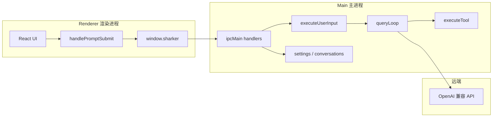

# Sharker 系统架构

## 进程模型



- **渲染进程**：`src/`，只做 UI 与状态，不直接访问文件系统或跑 shell。
- **主进程**：`electron/main/`，持有设置、对话存储、Agent 循环、工具执行。
- **预加载**：`electron/preload/`，暴露类型安全的 `window.sharker` API。

## 一次发消息的完整路径（Turn 管线）

1. 用户输入 → `App.tsx` `handlePromptSubmit`（空闲直接派发；忙时排队或插队）
2. 排队消息显示「排队中」气泡；当前 turn `done` 后自动按序派发下一条
3. `ipc invoke` `chat:send` → `electron/main/index.ts` → `executeUserInput`
4. `queryServe` 占坑（`turn_start`、AbortController、120s 超时）
5. `processUserInput`：斜杠命令本地处理（`shouldQuery=false`）或进入 `onQuery`
6. `onQuery`：`loadSettings` → `compressContextIfNeeded` → 组装 system + skills
7. `queryLoop`：`streamChat` 流式调模型；有 `tool_calls` 则审批 + `executeTool`（最多 12 轮）
8. `StreamChunk` 经 `chat:stream` 推回 UI（含 `token` / `think` / `tool_*` / `command`）
9. 结束后 `persistActiveConversation` 写入 `.sharker/conversations/`

## 目录与职责

```
sharker/
├── agent/          # Harness：loop、verify、bootstrap、tool-definitions
├── tools/          # 模块化工具：schemas + builtins + registry
├── skills/         # Skill 发现与 prompt 注入
├── providers/      # LLM API 客户端
├── shared/         # 主/renderer 共用类型与纯逻辑
├── electron/       # 主进程、preload、持久化
├── src/            # React 前端
└── docs/           # 全局文档索引
```

## 持久化位置

| 数据 | 路径 |
|------|------|
| 应用设置 | `~/.config/.../settings.json`（userData，API Key 加密） |
| 会话、长期记忆、Agent 事件 | `~/.sharker/memory-db`（嵌入式 PGlite） |
| Skills（优先 .claude，其次 .sharker） | `~/.claude/skills/`、`<workspace>/.claude/skills/`、`~/.sharker/skills/`、`<workspace>/.sharker/skills/` |

## 权限

- `sandbox`：工具路径必须在当前工作区内
- `full`：可访问整机（整理桌面、系统路径）

高危操作（删除递归、git push、skill 脚本等）弹窗审批。

## 相关文档

- [agent/README.md](../agent/README.md) — 循环细节
- [shared/ipc.ts](../shared/ipc.ts) — IPC 常量一览
- [roadmap-harness.md](./roadmap-harness.md) — 演进方向
