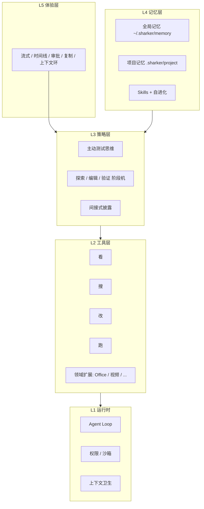
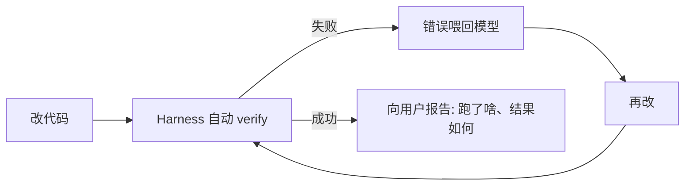
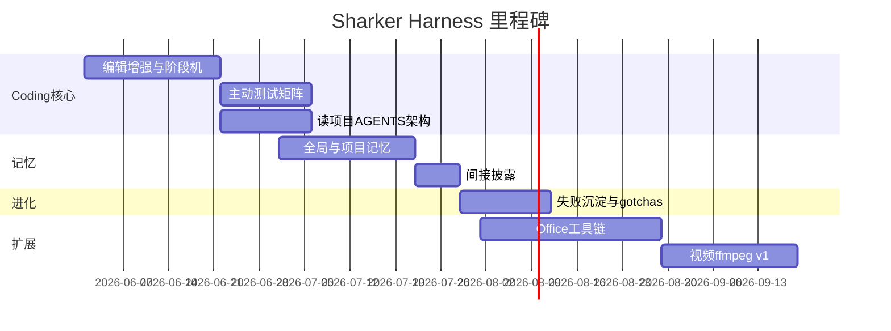

# Sharker Harness 路线图（讨论稿）

> 目标：模型有了，用一套工程化 Harness 让它 **看、搜、改、跑** 做到极致；Coding 是主战场，办公/多媒体是扩展战场；记忆与自进化让系统越用越聪明。

---

## 总架构：五层马鞍

**原则（乔布斯式 Coding）**：不是堆功能，是 **把一条用户路径做到底**——从「听懂」到「改对」到「测过」到「可交付」，每一步 Harness 兜底，而不是指望模型自觉。

---

## Phase 0：现状（已完成）

- 看搜改跑 + Git + Skills + 终端
- 沙箱 / 审批、上下文压缩、寒暄跳过 tools
- 工作区快照、写代码纪律、输出截断、改后自动 verify
- 过程 UI、对话管理

---

## Phase 1：Coding Harness 核心（最高优先级，4～6 周）

> **Coding 是一切的地基。** 办公、视频都建立在「文件 + 命令 + 可靠循环」之上。

### 1.1 看 · 搜 — 做到「一次找对」

| 项 | 内容 | 产出 |
|----|------|------|
| 行号 read | read_file 返回 `L12: content` 格式 | 模型改行更准 |
| 符号粗索引 | 启动时扫描 export/function/class → 轻量 index.json | 少 2 轮 grep |
| 并行只读 | 同一轮多个 grep/read 并行执行 | 探索快 30～50% |
| @ 文件引用 | 用户消息里 `@src/foo.ts` 自动注入内容 | 对标 Cursor |
| 语义搜（可选） | ripgrep + 文件路径权重，后期可接 embedding | 大仓库找代码 |

### 1.2 改 — 做到「改完能对」

| 项 | 内容 |
|----|------|
| apply_patch | 统一 patch 格式，多 hunk，失败自动重读重试 |
| 编辑前快照 | write/search_replace 前备份到 `.sharker/snapshots/` |
| UI 撤销 | 侧栏或消息旁「还原此次修改」 |
| 阶段机 | **探索期** 只开放 read/grep；**编辑期** 开放 write；**验证期** 开放 terminal |
| 工程化 prompt | 按栈注入：Node→npm、Rust→cargo、Python→pytest |

### 1.3 跑 · 测 — 主动测试思维（你要的重点）

| 项 | 内容 |
|----|------|
| 验证矩阵 | 按项目类型选命令：npm test / pytest / cargo test / go test |
| 测试优先纪律 | system：有 test 必先跑；改完必再跑 |
| 新增测试引导 | 修 bug 时提示模型考虑补测试 |
| 覆盖率（后期） | 可选跑 coverage，报告未覆盖路径 |
| 主动汇报 | 回复里固定一节「验证结果」，不只说「改好了」 |

### 1.4 读项目 — 深度理解

| 项 | 内容 |
|----|------|
| AGENTS.md | `<工作区>/.sharker/AGENTS.md` 或根目录 `AGENTS.md`，规则注入 |
| 架构摘要 | 首次打开项目生成 `architecture.md` 缓存，增量更新 |
| 依赖图（轻量） | package.json / Cargo.toml / pyproject 解析 → 技术栈卡片 |

---

## Phase 2：记忆系统（3～4 周）

> **间接式披露**：不一次塞满上下文，按需加载。

### 2.1 全局记忆 `~/.sharker/memory/`

| 文件 | 存什么 | 何时注入 |
|------|--------|----------|
| `preferences.md` | 用户偏好（语言、是否自动跑测试、常用模型） | 每轮摘要 1 段 |
| `facts.md` | 跨项目事实（「用户主语言中文」「桌面路径」） | 相关时 keywords 匹配 |
| `learnings.md` | Harness 自进化写入的教训 | 同类任务失败后再注入 |

**披露策略**：只注入与当前消息相关的条目（关键词 / 小模型路由），上限 500 token。

### 2.2 项目记忆 `<工作区>/.sharker/project/`

| 文件 | 存什么 |
|------|--------|
| `context.md` | 项目是什么、目录约定、分支策略 |
| `decisions.md` | 架构决策记录 ADR 简版 |
| `gotchas.md` | 踩坑：「别改 electron/main 的 X」 |
| `workflow.md` | 什么时候该做什么：发布流程、测试命令 |

对话结束时 **可选提炼** 新事实写入（需用户确认或设置自动）。

### 2.3 与 Skill 的关系

| | Skill | 项目记忆 |
|---|-------|----------|
| 形式 | SKILL.md + scripts | markdown 记忆文件 |
| 触发 | 用户意图匹配 | 任务类型 + 项目 |
| 进化 | 人工维护 + 导入 repo | **自动提炼 + 人工编辑** |

---

## Phase 3：自进化（2～3 周，依赖 Phase 2）

| 机制 | 说明 |
|------|------|
| 失败归因 | verify 失败 / 用户点踩 → 记录 tool+错误模式 |
| 教训沉淀 | 同类失败 2 次 → 写入 `learnings.md` 或 `gotchas.md` |
| Skill 提议 | 重复 3 次的工作流 → 提议生成新 SKILL 草稿 |
| 指标面板（后期） | 成功率、平均轮次、verify 通过率 |

**边界**：自进化只写 **记忆/Skill 草稿**，不自动改 Harness 代码，避免失控。

---

## Phase 4：Coding 以外 — 通用工作（6～8 周，并行可拆）

### 4.1 文档办公

| 场景 | 实现路径 |
|------|----------|
| Word .docx | Python `python-docx` / `pandoc` 终端工具 |
| PDF | `pdftotext` 读、`pandoc`/`weasyprint` 生成、表单用 `pdftk` |
| PPT .pptx | `python-pptx` 脚本封装为 skill 或专用 tool |
| Excel | `openpyxl` / CSV 优先 |

**Harness 要点**：读 binary → 转 markdown 摘要进上下文；改 → 脚本生成新文件；跑 → 验证文件可打开/页数对。

### 4.2 桌面与文件整理

- 工作区 = 桌面 / 下载 / 文档
- 批量重命名、按规则分类、去重
- full 模式 + 明确 UI 提示

### 4.3 视频剪辑（重活，单独里程碑）

| 阶段 | 能力 |
|------|------|
| v1 | ffmpeg 剪辑：裁切、合并、转码、提取音频 |
| v2 | 字幕：whisper 转写 → srt 嵌入 |
| v3 | 简单时间线 UI 预览（后期） |

依赖：**跑** 层成熟 + Skills（`video-edit` skill 封装 ffmpeg 命令）。

---

## Phase 5：工程化治理（持续）

| 项 | 说明 |
|----|------|
| Harness 版本 | `harnessVersion` 写入设置，便于迁移 |
| 能力开关 | 设置里：自动测试 / 自进化 / Office / 视频 |
| 可观测 | 主进程 log：每轮 tools、耗时、verify 结果 |
| 评测集 | `fixtures/` 标准任务：修 bug、加功能、整理文件，回归 Harness |

---

## 推荐实施顺序（一起讨论时可调整）

**近期 3 个 Sprint 建议**（接下来真正开干）：

1. **Sprint A**：apply_patch + 编辑快照/撤销 + 验证矩阵（pytest/cargo/…）
2. **Sprint B**：AGENTS.md + 项目 memory 文件 + 间接披露加载器
3. **Sprint C**：阶段机（探索/编辑/验证）+ 并行只读 + @ 文件引用

---

## 已拍板决策（2026-06）

| 议题 | 决定 |
|------|------|
| 看搜改跑 + 主动测试 + 读项目 + 记忆 + 自进化 | 全部认可，按路线图推进 |
| **记忆自动写入** | 允许自动提炼进 `gotchas.md` / `learnings.md`（可设置开关） |
| **Office** | Word、PDF、PPT **都要**，同 Phase 4 一并规划 |
| **视频** | v1 接受 ffmpeg 命令行，无时间线 UI |
| **文档驱动** | 全局 `docs/` + 每模块 `README.md`，见 [DOC-GUIDE.md](./DOC-GUIDE.md) |

---

## 待确认（次要）

1. **full 模式**：整理桌面、Office 是否默认提示用户切 full？
2. 记忆自动写入的 **撤销/编辑** UI 何时做？

---

## 成功标准（一年后）

- Coding：用户说修 bug，**80%** 任务 verify 通过且无需人手 copy 命令
- 记忆：换对话 / 换天回来，项目约定仍被遵守
- 办公：Word/PDF 常见「改字、合并、导出」可一句话完成
- 视频：裁切合并转码一句话可完成
- Harness：每个能力有开关、有日志、有回归用例

此文档随讨论迭代，确认 Sprint 后拆 GitHub Issues / 实现任务。
