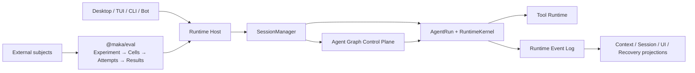

<!--
  Licensed to the Apache Software Foundation (ASF) under one
  or more contributor license agreements.  See the NOTICE file
  distributed with this work for additional information
  regarding copyright ownership.  The ASF licenses this file
  to you under the Apache License, Version 2.0 (the
  "License"); you may not use this file except in compliance
  with the License.  You may obtain a copy of the License at

      http://www.apache.org/licenses/LICENSE-2.0

  Unless required by applicable law or agreed to in writing,
  software distributed under the License is distributed on an
  "AS IS" BASIS, WITHOUT WARRANTIES OR CONDITIONS OF ANY
  KIND, either express or implied.  See the License for the
  specific language governing permissions and limitations
  under the License.
-->

[中文](./ARCHITECTURE.zh-CN.md)

# Maka Backend Architecture

Maka has one execution authority: Runtime Host. Desktop, TUI, CLI, bots, and evaluation clients ask Runtime Host to execute work; none owns a second Runtime.



Runtime Host owns Session and Turn identity, agent lifecycle, continuation, tools, permissions, and events. `@maka/eval` owns benchmark experiment semantics only: subjects, tasks, repetitions, cells, immutable attempts, result selection, budgets, and verifier configuration. A Maka subject always crosses the public Runtime Host client/protocol boundary; an external competitor is a generic external subject.

## Runtime layers

1. Runtime Event Log is the canonical source for model messages, tool calls, tool results, and termination facts. Context pruning and compaction change provider input projections, not history.
2. SessionManager and AgentRun own execution lifecycle. Runtime Host owns admission, client capabilities, interactions, and the public protocol.
3. Agent Graph schedules dependent work using child Sessions and sends every activation back through the same Runtime.
4. Storage owns interactive Runtime state. It has no Eval-specific root, TaskRun ledger, or experiment result authority.

## Eval boundary

```text
Experiment = benchmark + executor + subjects + tasks + repetitions
Cell       = task × repetition × subject

repetition   = a new experimental sample
infra retry  = a replacement attempt for the same cell
continuation = internal Runtime Host behavior within a Maka subject
```

One Experiment uses one fully expanded declarative spec. Every arm shares its executor, benchmark, tasks, budget, and verifier. A/B is simply a two-arm Experiment. Harbor and Pier are executor adapters, not independent workflows.

The result kernel contains only score, normalized usage, attributable cost, duration, status or failure reason, and artifacts. When a cell has multiple attempts, the earliest valid attempt is authoritative; operators cannot choose a preferred outcome.

## Code boundaries

| Area | Responsibility |
|---|---|
| `packages/core` | Pure Session, Runtime Event, AgentRun, permission, and protocol contracts |
| `packages/storage` | Interactive Runtime stores and SQLite control planes |
| `packages/runtime` | SessionManager, AgentRun, model adapters, tools, context, recovery, and Graph reconciliation |
| `packages/runtime-host` | Sole hosted execution authority and public client/protocol |
| `packages/eval` | Experiment cells, attempts, result selection, and subject/executor adapters |
| `packages/cli` | TUI, `maka run`, and the public `maka eval` route |
| `apps/desktop/src/main` | Electron composition and product-entry adapters |

## Reading paths

- Runtime facts and projections: [Runtime core](./docs/architecture/runtime-core-architecture-draft.md) and [compaction](./docs/architecture/llm-compaction-events-log-projection-draft.md).
- Crash recovery and continuation: [Runtime resume](./docs/architecture/runtime-resume-architecture.md).
- Multi-agent scheduling: [Agent Graph](./docs/architecture/agent-graph-stream-scheduling-draft.md).
- Evaluation behavior and public seams: [`packages/eval`](./packages/eval).

Historical designs remain under [`docs/archive`](./docs/archive/README.md). Current GitHub issues and source take precedence over older drafts.
