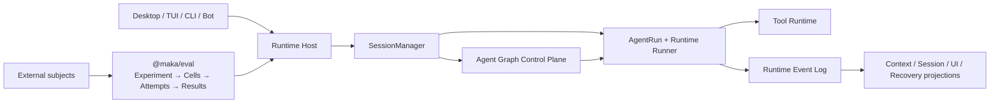

<!--
  Licensed to the Apache Software Foundation (ASF) under one
  or more contributor license agreements.  See the NOTICE file
  distributed with this work for additional information
  regarding copyright ownership.  The ASF licenses this file
  to you under the Apache License, Version 2.0 (the
  "License"); you may not use this file except in compliance
  with the License.  You may obtain a copy of the License at

      http://www.apache.org/licenses/LICENSE-2.0

  Unless required by applicable law or agreed to in writing,
  software distributed under the License is distributed on an
  "AS IS" BASIS, WITHOUT WARRANTIES OR CONDITIONS OF ANY
  KIND, either express or implied.  See the License for the
  specific language governing permissions and limitations
  under the License.
-->

[ENGLISH](./ARCHITECTURE.md)

# Maka 后端架构

Maka 只有一个执行 authority：Runtime Host。Desktop、TUI、CLI、bot 和 Eval client 都请求 Runtime Host 执行工作，不再拥有第二套 Runtime。



Runtime Host 拥有 Session 和 Turn identity、agent lifecycle、continuation、tools、permissions 与 events。`@maka/eval` 只拥有 benchmark 实验语义：subjects、tasks、repetitions、cells、immutable attempts、result selection、budget 和 verifier 配置。Maka subject 必须经过公开的 Runtime Host client/protocol 边界；外部竞品是 generic external subject。

## Runtime 分层

1. Runtime Event Log 是模型消息、Tool Call、Tool Result 和终止事实的 canonical source。上下文裁剪与 compaction 只改变 provider input projection，不改写历史。
2. SessionManager 和 AgentRun 拥有执行生命周期。Runtime Host 拥有 admission、client capability、interaction 与公开协议。
3. Agent Graph 通过 child Session 调度依赖工作，并把每次 activation 送回同一 Runtime。
4. Storage 只拥有交互 Runtime 状态，不再有 Eval 专用 root、TaskRun ledger 或实验结果 authority。

## Eval 边界

```text
Experiment = benchmark + executor + subjects + tasks + repetitions
Cell       = task × repetition × subject

repetition   = 新的实验样本
infra retry  = 同一个 cell 的替换 attempt
continuation = Maka subject 内部的 Runtime Host 行为
```

一个 Experiment 使用一份完全展开的声明式 spec。所有 arms 共享 executor、benchmark、tasks、budget 和 verifier。A/B 只是双臂 Experiment。Harbor 和 Pier 是 executor adapter，不是独立 workflow。

通用结果只包含 score、normalized usage、可归因 cost、duration、status 或 failure reason 以及 artifacts。一个 cell 有多个 attempts 时，以最早有效 attempt 为权威，operator 不能人工挑选结果。

## 代码边界

| 区域 | 职责 |
|---|---|
| `packages/core` | Session、Runtime Event、AgentRun、permission 和协议等纯 contract |
| `packages/storage` | 交互 Runtime store 与 SQLite control plane |
| `packages/runtime` | SessionManager、AgentRun、模型 adapter、tools、context、recovery 与 Graph reconciliation |
| `packages/runtime-host` | 唯一 hosted execution authority 与公开 client/protocol |
| `packages/eval` | Experiment cell、attempt、result selection 与 subject/executor adapter |
| `packages/cli` | TUI、`maka run` 与唯一公开 `maka eval` 路由 |
| `apps/desktop/src/main` | Electron composition 与产品入口 adapter |

## 阅读路径

- Runtime 事实与 projection：[Runtime core](./docs/architecture/runtime-core-architecture-draft.zh-CN.md) 与 [compaction](./docs/architecture/llm-compaction-events-log-projection-draft.zh-CN.md)。
- Crash recovery 与 continuation：[Runtime resume](./docs/architecture/runtime-resume-architecture.zh-CN.md)。
- Multi-agent scheduling：[Agent Graph](./docs/architecture/agent-graph-stream-scheduling-draft.zh-CN.md)。
- Eval 行为与公开 seam：[`packages/eval`](./packages/eval)。

历史设计保存在 [`docs/archive`](./docs/archive/README.md)。当前 GitHub Issue 与源码优先于旧 draft。
