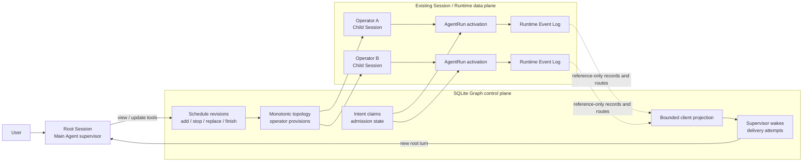
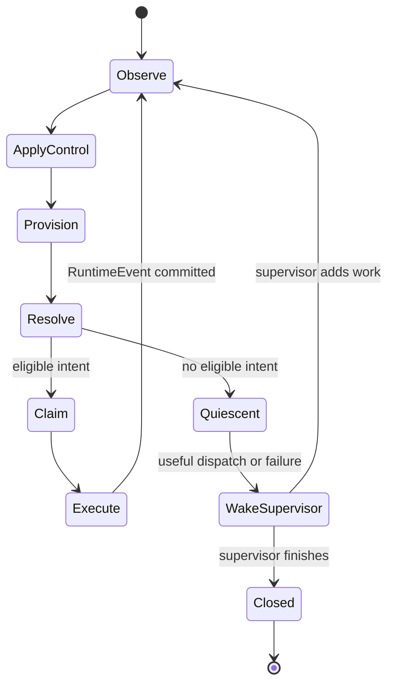
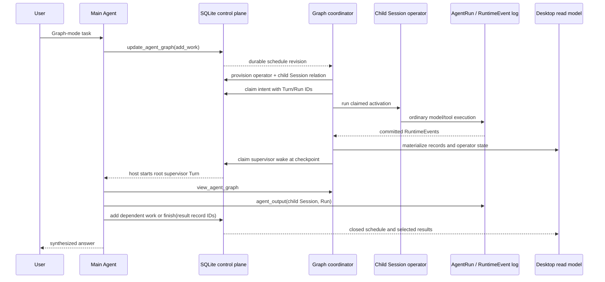

<!--
  Licensed to the Apache Software Foundation (ASF) under one
  or more contributor license agreements.  See the NOTICE file
  distributed with this work for additional information
  regarding copyright ownership.  The ASF licenses this file
  to you under the Apache License, Version 2.0 (the
  "License"); you may not use this file except in compliance
  with the License.  You may obtain a copy of the License at

      http://www.apache.org/licenses/LICENSE-2.0

  Unless required by applicable law or agreed to in writing,
  software distributed under the License is distributed on an
  "AS IS" BASIS, WITHOUT WARRANTIES OR CONDITIONS OF ANY
  KIND, either express or implied.  See the License for the
  specific language governing permissions and limitations
  under the License.
-->

# Chapter 7: Graph Is a Schedule, Not a Second Runtime—Streaming Agent Work Under a Main-Agent Supervisor

> This chapter answers one question: how can Maka coordinate dependent, dynamically expanding Agent work as a graph without inventing another Agent runtime? Maka treats each child Session as an operator container, each Session-inline AgentRun as an activation, and each committed RuntimeEvent as a reference-only stream record. A SQLite control plane stores topology, schedule intent, admission, and supervisor wake state. The existing Session and Runtime ledgers still own execution facts. The main Agent stays beside the graph as an always-available supervisor; it observes and changes the schedule, but normal record delivery never waits for its approval. **Graph is a durable schedule over Runtime facts, not a second execution universe.**

This chapter builds directly on Chapter 1. The Runtime Event Log remains the semantic authority for what an Agent did. Graph adds identities and projections that answer different questions: which child Session is one operator, which committed records flow to another operator, which work the supervisor requested, which intent was admitted exactly once, and when the root Agent should be woken to inspect a stable checkpoint.

It is written for engineers changing Graph contracts, child Sessions, scheduling, recovery, or Desktop integration. It describes the implementation verified on 2026-08-23. The chapter does not describe arbitrary cyclic workflows, distributed execution, graph-wide resource optimization, or a visual workflow authoring system.

## Start with work that changes shape while it runs

Suppose a user asks Maka to review a cross-cutting change:

1. one specialist inspects Runtime invariants;
2. another inspects storage and recovery;
3. their committed findings reveal that a Desktop inspection is also necessary;
4. the main Agent asks a synthesis specialist to compare selected findings;
5. the main Agent reads the authoritative child outputs and chooses the final result records.

This is not merely a batch. Later work depends on facts produced by earlier work, and the useful topology is not fully known at the beginning. It is also not a reason to replace the Agent loop. Every specialist still needs an ordinary model/tool loop, permissions, history, context compaction, usage accounting, stop, recovery, and inspection.

The useful abstraction is therefore:

```text
child Session              → operator container
Session-inline AgentRun    → operator activation
committed RuntimeEvent     → immutable stream record
record visible over edge   → route
deterministic input state  → readiness intent
durable admission row      → exactly-once execution identity
supervisor schedule update → control-plane decision
```

The graph layer coordinates those existing things. It does not duplicate them.

## Conclusion first

The current design rests on six boundaries:

1. **Runtime remains the execution authority.** Graph does not introduce a GraphRun event ledger or a second model/tool loop.
2. **A durable child Session is the operator boundary.** Follow-up activations reuse its runtime snapshot, history, lifecycle, usage, and product identity.
3. **Only committed RuntimeEvents become graph records.** Partial chunks and process-local callbacks are never durable dataflow facts.
4. **Readiness is a deterministic projection; admission is a SQLite decision.** Recomputing a runnable intent cannot execute it twice.
5. **The main Agent supervises beside the data path.** Observation callbacks, Desktop invalidations, and supervisor turns may fail or retry without blocking record projection.
6. **Schedule closure and runtime quiescence are different.** “Nothing runnable now” does not mean “the supervisor has finished the graph.”

These boundaries let Graph reuse the hard parts Maka already has: Session creation and lifecycle, AgentRun identity, RuntimeEvent persistence, permission handling, context compaction, child-output inspection, usage and tool activity, Desktop conversation components, and restart recovery.

## The identity model

Graph deliberately keeps several identities instead of compressing them into a generic “node status.”

| Identity | Meaning | Durable authority |
|---|---|---|
| Root Session | User-facing conversation whose main Agent supervises the graph | Session store |
| Graph | Scheduling namespace derived from one root Session | SQLite Graph control plane |
| Work | One supervisor-requested instruction and input frontier | Schedule update log |
| Operator | Stable graph binding to one child Session | Operator provision |
| Child Session | Reusable execution and product container for one operator | Session store and metadata control plane |
| Activation | One Session-inline execution of that operator | AgentRun |
| Turn / Run | Exact user-input and execution identities inside the child Session | Session and AgentRun ledgers |
| RuntimeEvent | Canonical semantic execution fact | Runtime Event Log |
| Record | Bounded Graph projection referencing one committed RuntimeEvent | Recomputed projection |
| Route | Observation that a record is visible across one direct edge | Recomputed trace projection |
| Readiness intent | Deterministic candidate derived from routes and policy | Recomputed readiness projection |
| Claim | Durable admission of one intent to exact Session, Turn, and Run identities | SQLite Graph control plane |
| Supervisor wake | Durable request to run a root-Agent checkpoint turn | SQLite Graph control plane |

The most important hierarchy is:

```text
root Session
└── graph
    ├── schedule revisions
    ├── operator
    │   └── child Session
    │       ├── activation / AgentRun
    │       │   └── committed RuntimeEvents → graph records
    │       └── later activation / AgentRun
    ├── operator
    │   └── child Session
    └── admission claims and supervisor wakes
```

An operator is not an AgentRun. The stable operator-to-Session binding is what makes later follow-up work natural: the Session persists while each activation receives a fresh Turn and Run identity.

## Two planes over one existing Runtime

The implementation is easiest to understand as a control plane beside a data plane.



The arrows between the control and data planes are typed boundaries:

- provisioning atomically creates the child Session relationship and operator metadata;
- claiming binds a deterministic intent to preallocated Turn and Run identities before execution;
- Runtime executes through the ordinary Session-inline child path;
- observation folds immutable RuntimeEvents back into Graph records and client projections;
- a durable wake starts a normal root Session turn after a useful checkpoint.

No Graph callback becomes the owner of model output, tool results, or terminal state.

## Why a child Session is the operator container

Earlier child-agent designs can put an execution under the parent Session and distinguish it only by a child AgentRun. That is enough for a short foreground call, but it is a poor operator boundary for long-lived Graph work.

A linked child Session naturally reuses:

- Session creation, stop, archive, and recovery;
- a frozen subagent runtime snapshot, including profile, system prompt, tool surface, and permission ceiling;
- multiple Session-inline AgentRuns for later follow-ups;
- RuntimeEvent and message persistence;
- context construction and compaction;
- usage, tool-activity, and artifact accounting;
- Desktop and TUI conversation inspection;
- `agent_output` over an exact child Session and current Run;
- future multi-client observation through the same Runtime host.

The child stores durable lineage back to the root:

```text
parentSessionId
spawnedBy.parentRunId
spawnedBy.parentTurnId
spawnedBy.toolCallId
graph.graphId
graph.workId
graph.operatorId
```

The parent does not need a mutable array of child IDs. Reverse lookup and Graph topology are read-model concerns. Cross-Session provenance also stays out of `AgentRun.parentRunId`, allowing Runs inside the child Session to keep ordinary Session-inline history semantics.

## From RuntimeEvent to stream record

### Projection, not copying

`readCommittedAgentGraphProjection()` reads immutable RuntimeEvents for every operator binding and emits bounded `AgentGraphRecord` values. A record carries identity, order, facets, supervisor signals, and a reference to the source Session, Run, and RuntimeEvent. It does not copy the full message, tool arguments, or tool result payload.

This separation matters:

- Graph can route and schedule from small stable values;
- authoritative child output remains in the Runtime ledger;
- access control and archival stay on the original resource;
- a read model cannot silently become a competing event store.

When the main Agent needs the actual answer behind a candidate record, it uses
`agent_output` with the operator's `childSessionId`, `currentRunId`, and
`view=result`. That projection returns only the final committed model text,
its Graph result/terminal record IDs, and bounded artifact references. Raw
Runtime events remain an explicit diagnostic view rather than the normal
supervisor data path.

### Commit is the stream boundary

Only non-partial, immutable RuntimeEvents enter the Graph projection. Provider chunks and yielded `SessionEvent`s may update a best-effort client view, but they are not Graph facts. Terminal history is populated only by the authoritative RuntimeEvent fold because a stop race may still rewrite a yielded completion into an aborted terminal fact at the Runtime durability barrier.

The rule is:

> A fact may enter Graph only after the Runtime has committed the semantic event that Graph references.

### Record facets and signals

Records expose bounded facets such as message, thinking, error, tool call, tool dispatch, tool result, artifact update, permission request, permission decision, user-question request, transfer, usage, completed, failed, aborted, cancelled, and generic runtime fact.

The same record may also carry supervisor-facing signals such as attention or terminal state. This is a meta-stream over the same record identity, not another fact. A supervisor signal cannot change what downstream operators receive.

### Stable replay order

Records have a deterministic total order:

1. event time;
2. Run creation time;
3. operator identity;
4. Run identity;
5. committed event ordinal;
6. RuntimeEvent identity;
7. record identity.

Each activation also links to its previous record. Replay validates one terminal transition per activation and rejects records after termination. The projection can therefore be rebuilt from Runtime ledgers after restart without treating callback arrival order as authority.

## Topology and routing

### A DAG of existing operator bindings

The trace topology contains operators and directed edges. Validation rejects missing operators, self-loops, duplicate endpoints, and cycles, then derives a deterministic topological order.

For each committed source record, the trace projection creates a reference-only route on every direct outgoing edge. The edge owns visibility, not readiness policy. A downstream adapter decides whether one visible route, a settled activation frontier, or an explicit supervisor selection is enough to start work.

### Dynamic topology is monotonic

The current product path supports monotonic addition:

- `agent_id` work provisions a new child Session and new operator;
- `operator_id` work creates a later activation on an existing operator;
- input record producers determine edges into a newly provisioned operator;
- provision identities, child Session identity, initial Turn, and initial Run are preallocated deterministically;
- retry observes the existing provision or creates it once.

The first version does not provide arbitrary edge deletion, node deletion, rewiring, or cycles. A supervisor can stop or supersede work, but historical topology and facts remain explainable.

## Readiness is not admission

The reusable Runtime primitives define two policy projections.

### `map`

`map` produces one deterministic intent for each routed record visible to the operator. With no input route, the operator reports an `input_route` wait.

### `all_settled`

`all_settled` names one immutable activation from every direct upstream operator. It waits for a missing or running activation, then produces one intent over the sealed inputs.

The explicit activation frontier is essential. If a child Session later receives a follow-up activation, that new Run must not silently change the meaning of an already-declared join.

Both policies produce deterministic intent IDs and readiness-context fingerprints. They do not start Runtime work. A supervisor can observe the same waiting or runnable projection, but is not consulted while it is derived.

The current Desktop host profile does not install autonomous `map` or `all_settled` policies by default. Its main Agent explicitly advances the dynamic graph with `add_work` and committed `input_ids`. The policy primitives remain available to another host adapter without changing the execution runtime.

## The supervisor schedule

Graph Mode gives only the root Agent a compact control surface:

- `view_agent_graph` reads durable schedule state, runtime state, readiness, waits, and bounded recent activity;
- `update_agent_graph` appends one idempotent schedule decision containing `add_work`, `stop`, `finish`, or an allowed combination;
- `agent_output` reads authoritative output from a selected child Session Run.

Child Sessions never receive the Graph supervisor tools.

### Revision-linearized intent

Every schedule update records:

- source root Session, Run, Turn, and tool call;
- a stable update identity and fingerprint;
- zero or more work additions;
- zero or more stop decisions;
- an optional finish decision;
- a strictly increasing Graph revision and commit time.

SQLite owns the revision order. A tool retry with the same source and content is idempotent. A conflicting reuse of identity fails instead of creating ambiguous control history.

### Work and input frontiers

One work item targets either a catalog `agent_id` or an existing `operator_id`. It includes an instruction, committed input record IDs, and optionally the work or activation that it replaces.

Input IDs are not copied prompts. They are a durable frontier. The default scheduled prompt carries bounded record references—record, operator, activation, facets, and RuntimeEvent source—but not the upstream payload. A host may provide another prompt renderer. Work that needs semantic source content must put that content in the instruction or use an explicitly authorized Runtime retrieval path; an edge alone does not grant cross-Session payload access.

### Stop, replace, and finish

Stopping can target work or an activation. Work not yet admitted becomes cancelled; an executing child Session is stopped through the normal Runtime stop path; terminal executions remain historical facts.

`replaces` makes supersession explicit instead of mutating an old work row.

`finish` selects committed Graph record IDs and closes fresh admission. It cannot be combined with new work. Already-claimed work remains recoverable because a closure decision must not strand an execution whose exact Run identity was durably admitted.

## Claim before execution

Readiness and schedule reconciliation can be repeated many times. Exactly-once execution identity comes from the claim protocol:

1. compute a deterministic intent and readiness-context fingerprint;
2. render and fingerprint the execution prompt;
3. preallocate target operator, child Session, Turn, and Run identities;
4. conditionally claim against the expected schedule revision;
5. conditionally advance admission from `claimed` to `executing`;
6. call the existing Session-inline child execution primitive;
7. treat AgentRun and RuntimeEvent ledgers as authority once the Run exists.

If the process retries after the Run was created, `runClaimedAgentGraphIntent()` inspects or recovers that exact Run. It does not invoke the provider a second time. Claims are admission authority only; they do not compete with Runtime terminal facts.

The child Session serializes its claimed Graph activations. Different operators may run concurrently, while two activations of the same Session retain ordinary per-Session ordering.

## Reconciliation: drive until quiescent, then ask the supervisor

The host coordinator owns a process-local single-flight driver for each root Graph. Durable rows, not the in-memory driver, remain restart authority.

One reconciliation pass:

1. reads schedule revisions, provisions, claims, AgentRuns, and committed RuntimeEvents;
2. reconstructs monotonic topology and the current observation;
3. applies stop and supersession decisions;
4. provisions catalog-agent work that still lacks an operator;
5. resolves scheduled work and any configured readiness intents;
6. rejects or defers uncommitted inputs;
7. claims and begins eligible activations against the current revision;
8. dispatches different operators concurrently through child Sessions;
9. folds new RuntimeEvents and repeats until quiescent, cancelled, stale, failed, or bounded by the activation limit.



Quiescence is local to the current facts and policy. It means no additional activation is presently eligible. It does not mean the user task is complete. Only a durable `finish` update closes fresh Graph admission.

Structural reconciliation also does not own resource permits or global fairness. Shared child-run capacity, provider backpressure, or cross-Graph prioritization belong to host admission layers around the dispatcher.

## The main Agent stays beside the graph

The main Agent is neither a node that every record must traverse nor a callback inside child execution. It is an external supervisor with three responsibilities:

1. **Observe:** inspect compact schedule, topology, operator state, waits, failures, and candidate result records.
2. **Control:** add dependent work, follow up an existing operator, stop or replace obsolete work, and close the schedule.
3. **Synthesize:** read authoritative child outputs, select committed result records, and answer the user.

This position preserves both autonomy and responsiveness. Operators can continue from durable control decisions while the root Agent remains a normal conversation participant. The user can inspect or stop the graph through the host without turning the supervisor into a data-delivery bottleneck.

Observer callbacks are presentation-only and fire-and-forget. A broken Desktop listener or supervisor observation hook cannot fail an operator activation.

## Durable supervisor wakes

A useful checkpoint must eventually bring the main Agent back even if no user message arrives. The host therefore persists supervisor wakes in SQLite.

A wake is keyed by Graph and client snapshot version. It progresses through:

```text
pending → running → delivered
                  ↘ waiting_permission
                  ↘ retryable_failed → running
```

For each delivery attempt, the host preallocates a root Turn identity and starts a normal root Session turn with an `agent_graph` origin. The prompt asks the main Agent to inspect the Graph, read child output when necessary, and either schedule more work or finish.

“Prompt persisted” does not mean “wake delivered.” Delivery is complete only when the host observes the root AgentRun complete. A permission suspension is parked explicitly. After restart, the wake coordinator compares stored attempts with AgentRun facts, marks interrupted attempts retryable, and resumes only safe deliveries.

Context overflow is handled separately from an ordinary transient failure. The
host records an overflow diagnostic, runs at most one aggressive compaction,
and reports the before/after token estimates and dropped event counts when
available. A second overflow stops immediately with a bounded durable partial
result; it is never retried a third time with an identical oversized context.

The Session activity registry serializes this host-created turn with other root Session activity. Multiple clients can observe the same durable Session and Graph state without becoming scheduler owners.

## Persistence and authority

Graph uses SQLite as a workspace/session metadata control plane, not as a replacement for transcript or Runtime ledgers.

| Data | Authority | Why |
|---|---|---|
| Child Session configuration and parent relation | Session storage plus metadata transaction | Product identity and frozen runtime snapshot |
| Agent execution lifecycle | AgentRun ledger | Exact Turn/Run state and terminal semantics |
| Messages, tools, permissions, usage, terminal facts | Runtime Event Log | Canonical interaction facts |
| Schedule revisions | SQLite | Ordered, idempotent supervisor control decisions |
| Operator provisions and topology relations | SQLite | Atomic child Session/operator identity |
| Intent claims and admission state | SQLite | Revision-linearized exactly-once admission |
| Supervisor wakes and attempts | SQLite | Recoverable root-turn delivery |
| Graph records, routes, readiness, replay timeline | Deterministic projection | Rebuildable views over durable facts |
| Desktop snapshot and terminal activity page | SQLite materialized read side | Bounded, efficient client reads |

SQLite failure on an authoritative schedule, provision, claim, or wake operation is an error. The coordinator does not scan JSONL as a substitute Graph control plane.

The materialized Desktop projection is different: it is derived state. An incremental projection commit may fail without invalidating Runtime or schedule authority. The coordinator marks the projection dirty, retries a best-effort rebuild at reconciliation boundaries, and also repairs before client reads. Successful rebuild clears the dirty state.

## Three status planes must stay separate

A client may observe all of the following at once:

```text
work.status                       = requested
claim.admissionState              = executing
operator.currentActivation.status = completed
```

This is not a contradiction.

- Work status records supervisor intent and whether it was stopped or superseded.
- Claim admission records whether one deterministic intent was admitted or cancelled.
- Activation status records what Runtime actually did.

Flattening them into one generic node state would erase causality. The bounded client read model instead derives a presentation status while retaining work, claims, control decisions, and Run references for inspection.

## Reconstructing one replayable Graph timeline

Graph can also reconstruct a single reference-only timeline across its control and data planes. `getTimeline()` joins:

- one transactionally consistent SQLite snapshot of schedule updates, operator provisions, current admissions, and supervisor wakes with their attempts;
- root Session AgentRuns that authored schedule decisions or delivered wake turns;
- the committed child RuntimeEvent projection for every provisioned operator.

The pageable event stream covers supervisor-turn start and termination, schedule commit and finish, operator provision, intent claim, activation start, committed record, activation terminal, wake claim, wake attempt, and wake settlement. The response returns current admission and wake state separately in page-level `currentState`; these mutable snapshots are not cursor-bearing historical events.

Timeline events deliberately omit schedule instructions, finish reasons, child message content, and tool payloads. They retain the IDs, facets, source RuntimeEvent reference, and Run coordinates needed to answer questions such as:

- Which supervisor turn created this work?
- Which operator and child Session received it?
- Which exact activation produced a candidate record?
- Did the graph wake the supervisor before the final schedule decision?

Reconstruction sorts by event time, then a stable event-kind rank and type-specific identity tie-break. The exposed `sequence` is a deterministic reconstruction order, not a claim that SQLite and Runtime ledgers share one physical commit sequence. Same-millisecond Runtime records preserve their committed ledger order.

Pages default to 100 events and are capped at 256. The opaque cursor binds Graph, event identity, and event time; pages report total events plus omissions before and after the page.

Coverage is explicit rather than implied. Runtime records are complete for the immutable ledgers read, but current SQLite schemas retain only the latest admission state and latest wake state, not every overwritten transition. Reconciliation-loop iterations are also not persisted as historical events. The timeline reports all three limitations:

```text
admission_transition_history_not_persisted
supervisor_wake_transition_history_not_persisted
reconcile_history_not_persisted
```

The timeline is therefore replayable and useful for diagnosis without pretending to be a new authority. Each event points back to the store that owns the underlying fact.

## Client access and Desktop product wiring

Runtime Host exposes the durable Graph projection through bounded `agent.graph.query` and `agent.graph.operator.query` operations. Clients use `agent.graph.stop` for explicit operator control; closing a connection or Session subscription never stops the Graph. A client that needs a coherent live view opens the root Session subscription before its first query. `subscription.agent_graph_changed` then shares that subscription's ordered sequence with Session updates and tells the client to query the projection again. It is an invalidation hint, not a replay log or a second source of truth. Query results report omitted data and continuation cursors instead of growing without a bound.

Desktop composes the current host-managed Graph profile:

- Graph can be a Session orchestration mode or a one-turn override;
- `/graph on`, `/graph off`, and `/graph <task>` expose those choices;
- only a root Session receives `view_agent_graph`, `update_agent_graph`, and `agent_output`;
- Electron main owns the coordinator, wake coordinator, SQLite store, Runtime adapter, and startup recovery;
- renderer IPC exposes bounded snapshot, operator inspection, stop, and invalidation hints;
- the Agent Graph panel shows aggregate state, visible operators, waits, selected results, and links to open child Sessions;
- stopping the Graph aborts reconciliation and stops known child Sessions through Runtime;
- startup first repairs interrupted Runtime state, then wakes and Graph schedules.

Renderer invalidations follow the same contract. A reconnecting client queries the durable projection again; it does not replay process-local notifications as facts.

The current panel is an operational view, not a node-and-edge authoring canvas. The main Agent remains the topology author through typed schedule updates.

## End-to-end sequence



Notice that the child result does not travel through the supervisor callback. Runtime commits it first. Graph projects a reference. The main Agent later decides whether and when to read the authoritative payload.

## Failure and recovery invariants

The current implementation protects these invariants:

- a schedule update is append-only, revision ordered, and idempotent by source identity;
- operator provision is monotonic and retry-safe;
- a provisioned operator always resolves to the same linked child Session;
- one intent resolves to at most one claim and exact Turn/Run identity;
- an existing claimed Run is observed or recovered, never blindly executed again;
- records reference committed non-partial RuntimeEvents only;
- callback and renderer failures cannot change Graph execution;
- closing the schedule prevents fresh admission but does not abandon existing claims;
- Graph stop retains durable schedule facts and historical Runtime facts;
- startup recovery derives work from SQLite control rows and Runtime ledgers, not an in-memory registry;
- a supervisor wake is delivered only after a completed root AgentRun;
- a failed derived client projection can be rebuilt without changing authority.
- the replay timeline never exposes child or schedule payloads and reports incomplete transition coverage explicitly.

These invariants are more important than the shape of any one UI or prompt. New host adapters must preserve them.

## Current limits and non-goals

The current Graph should not be mistaken for a general distributed stream processor.

- Topology is a directed acyclic graph with monotonic additions; arbitrary deletion, rewiring, and cycles are not implemented.
- Desktop advances dependent work through explicit supervisor schedule updates by default; automatic policy-driven topology is not silently inferred.
- `map` and `all_settled` are structural readiness primitives, not a full windowing, watermark, keyed-state, or backpressure system.
- The structural scheduler does not own global resource permits, fairness, provider rate limits, or distributed leases.
- Quiescence is not graph completion; `finish` is an explicit supervisor decision.
- The read model is bounded and reference-only. Full child content requires the authoritative Runtime read path.
- The Desktop panel is an inspection and stop surface, not a visual graph editor.
- The coordinator exposes a paginated replay timeline, but Desktop IPC and the current Agent Graph panel do not yet render it as an interactive chronological visualization.
- Admission and wake rows currently expose only their latest state to timeline reconstruction, and reconcile-loop history is not persisted.

These are deliberate boundaries. They keep Graph useful without moving workflow semantics, resource management, or product presentation into the Agent runtime.

## Graph, Swarm, agent_spawn, and Rive

The four mechanisms solve different coordination problems.

| Need | Mechanism | Ownership model |
|---|---|---|
| Finite independent fan-out followed by one synthesis | Swarm mode | The main Agent schedules independent items into one Graph and supervises them asynchronously |
| One linked specialist execution or follow-up | `agent_spawn` / child Session | Parent Agent owns explicit delegation |
| Dynamic dependent Agent work supervised from a root conversation | Agent Graph | SQLite schedule/control plane over child Sessions and Runtime records |
| Explicit workflow steps, arbitrary resume policy, or distributed workflow authority | Rive | Workflow runtime owns workflow state |

Graph occupies the space between foreground fan-out and a separate workflow runtime. It is dynamic and durable enough to coordinate dependent Agent work, while retaining the Session Runtime as the only execution universe.

## Code-reading map

Read the implementation in this order:

1. `packages/core/src/orchestration.ts` and `graph-command.ts`: Session and one-turn Graph mode.
2. `packages/runtime/src/graph-mode.ts`: the main-Agent supervisor contract.
3. `packages/core/src/agent-graph-schedule.ts`: work, stop, finish, revisions, and store protocol.
4. `packages/core/src/agent-graph-topology.ts`: monotonic operator provision.
5. `packages/runtime/src/stream-graph-projection.ts`: RuntimeEvent-to-record projection and replay.
6. `packages/runtime/src/stream-graph-trace.ts`: topology validation and reference-only routes.
7. `packages/runtime/src/stream-graph-readiness.ts`: `map` and sealed `all_settled` readiness.
8. `packages/core/src/agent-graph-control.ts` and `packages/runtime/src/stream-graph-admission.ts`: durable intent claims.
9. `packages/runtime/src/stream-graph-dispatch.ts`: structural drive-to-quiescence loop.
10. `packages/runtime/src/stream-graph-schedule-reconcile.ts`: schedule, dynamic provision, stop, claim, and dispatch convergence.
11. `packages/runtime/src/session-manager.ts`: child Session provision and claimed activation execution.
12. `packages/runtime/src/stream-graph-coordinator.ts`: host-owned single-flight lifecycle, client projection repair, and root-only timeline access.
13. `packages/runtime/src/agent-graph-timeline.ts`: reference-only control/data-plane reconstruction, stable order, coverage, and pagination.
14. `packages/runtime/src/agent-graph-supervisor-wake.ts`: durable return path to the root Agent.
15. `packages/storage/src/sqlite-session-metadata-schema.ts` and `sqlite-session-metadata-store.ts`: Graph control-plane transactions and timeline metadata snapshot.
16. `apps/desktop/src/main/main.ts`, `runtime-host-session-domains-ipc-main.ts`, and `apps/desktop/src/renderer/agent-graph-panel.tsx`: product composition and bounded UI. Graph change events travel through the generic session-domains bridge as `agentGraphChanged`; there is no Graph-specific main-process IPC module.

The most relevant contract tests are colocated under:

- `packages/runtime/src/__tests__/stream-graph-*.test.ts`
- `packages/runtime/src/__tests__/agent-graph-timeline.test.ts`
- `packages/runtime/src/__tests__/agent-graph-supervisor-wake.test.ts`
- `packages/runtime/src/__tests__/session-manager.test.ts`
- `packages/storage/src/__tests__/sqlite-session-metadata-store.test.ts`
- `packages/storage/src/__tests__/agent-graph-timeline-metadata.test.ts`

## Summary

Maka Graph starts from a stream-processing observation:

```text
subagent work   behaves like an operator
Agent messages behave like stream records
dependencies   behave like routes and input frontiers
coordination   behaves like scheduling over a graph
```

The implementation makes that observation concrete without rewriting the Agent runtime. Child Sessions provide stable operator containers. AgentRuns provide activations. RuntimeEvents provide immutable facts. Deterministic projections provide records, routes, and readiness. SQLite provides revision-linearized schedule, topology, admission, client materialization, and supervisor wake state. Desktop provides a host and an operational view.

The main Agent remains the distinctive part of the design. It stays beside the graph: available to the user, able to inspect any operator, free to add or stop work, and responsible for selecting and synthesizing the final records. The data path can advance without waiting for model approval, while judgment remains in the conversation where the user can see and influence it.

That is the architectural promise: **reuse one trustworthy Runtime, add a durable Graph control plane, and keep the supervising Agent close enough to understand and change the schedule without becoming its bottleneck.**
