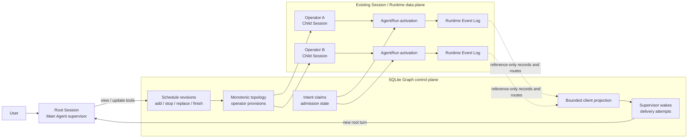
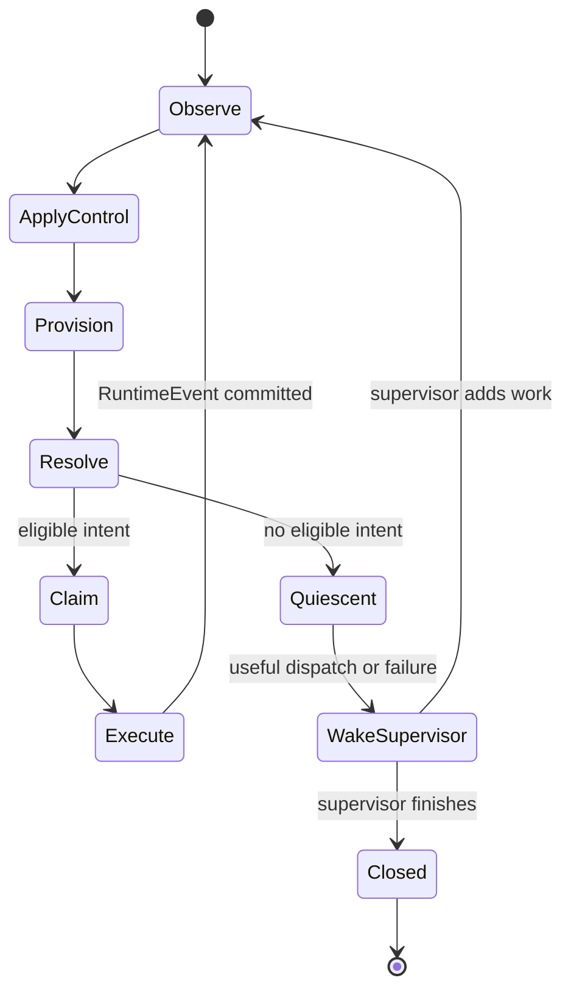
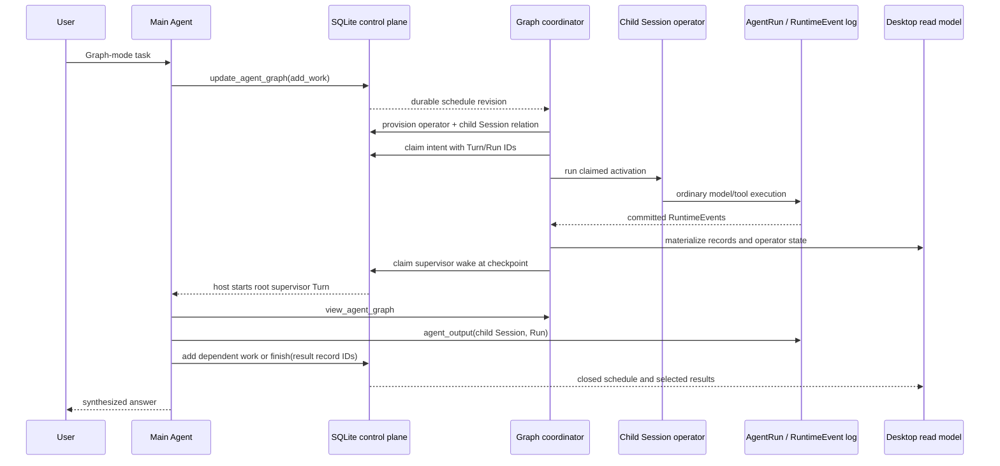

<!--
  Licensed to the Apache Software Foundation (ASF) under one
  or more contributor license agreements.  See the NOTICE file
  distributed with this work for additional information
  regarding copyright ownership.  The ASF licenses this file
  to you under the Apache License, Version 2.0 (the
  "License"); you may not use this file except in compliance
  with the License.  You may obtain a copy of the License at

      http://www.apache.org/licenses/LICENSE-2.0

  Unless required by applicable law or agreed to in writing,
  software distributed under the License is distributed on an
  "AS IS" BASIS, WITHOUT WARRANTIES OR CONDITIONS OF ANY
  KIND, either express or implied.  See the License for the
  specific language governing permissions and limitations
  under the License.
-->

# 第七章：Graph 是调度，不是第二套 Runtime——主 Agent 监督下的流式 Agent Work

> 本章回答一个问题：Maka 如何把相互依赖、运行中动态展开的 Agent work 组织成图，同时不再发明一套 Agent runtime？Maka 把每个 child Session 视为 operator 容器，把每次 Session-inline AgentRun 视为 activation，把每个已提交 RuntimeEvent 视为 reference-only stream record。SQLite control plane 保存 topology、schedule intent、admission 和 supervisor wake；已有的 Session 与 Runtime ledger 继续拥有运行事实。主 Agent 始终在图旁担任 supervisor：它观察和修改 schedule，但正常 record delivery 不等待它批准。**Graph 是建立在 Runtime 事实之上的持久调度，不是第二个运行宇宙。**

本章直接建立在第一章之上。Runtime Event Log 仍然是“Agent 实际做了什么”的语义 authority。Graph 只是增加了一组 identity 和 projection，用来回答另外几类问题：哪个 child Session 是一个 operator、哪些已提交 record 会流向另一个 operator、supervisor 请求了哪些 work、哪个 intent 被精确 admission 一次，以及何时应该唤醒 root Agent 检查一个稳定 checkpoint。

本文面向修改 Graph contract、child Session、调度、恢复或 Desktop 接线的工程师，描述截至 2026-08-23 已验证的实现。它不描述任意有环 workflow、分布式执行、图级资源优化，也不把当前实现说成可视化 workflow authoring system。

## 从运行中才逐渐显形的工作开始

假设用户让 Maka review 一个跨层改动：

1. 一个 specialist 检查 Runtime invariant；
2. 另一个 specialist 检查 storage 与 recovery；
3. 两者提交的 findings 暴露出还需要一次 Desktop 检查；
4. 主 Agent 再让一个 synthesis specialist 对比选中的 findings；
5. 主 Agent 读取权威 child output，并选择最终 result records。

这不只是一个 batch。后续 work 依赖前面产生的事实，而且有用的 topology 在一开始并不完全已知。但这也不是替换 Agent loop 的理由：每个 specialist 仍然需要普通的 model/tool loop、permission、history、context compaction、usage accounting、stop、recovery 和 inspection。

因此真正有用的抽象是：

```text
child Session              → operator 容器
Session-inline AgentRun    → operator activation
已提交 RuntimeEvent        → immutable stream record
record 沿 edge 可见         → route
确定性的 input state       → readiness intent
持久 admission row         → exactly-once execution identity
supervisor schedule update → control-plane decision
```

Graph layer 只协调这些既有对象，不复制它们。

## 先说结论

当前设计建立在六条边界上：

1. **Runtime 继续拥有执行 authority。** Graph 不引入 GraphRun event ledger，也不复制 model/tool loop。
2. **持久 child Session 是 operator 边界。** 后续 activation 复用它的 runtime snapshot、history、lifecycle、usage 和产品 identity。
3. **只有已提交 RuntimeEvent 才能成为 Graph record。** partial chunk 和进程内 callback 永远不是持久 dataflow fact。
4. **Readiness 是确定性 projection，admission 是 SQLite decision。** 重算 runnable intent 不会把同一工作执行两次。
5. **主 Agent 在 data path 旁监督。** observation callback、Desktop invalidation 和 supervisor turn 可以失败或重试，但不能阻塞 record projection。
6. **Schedule closure 与 runtime quiescence 是两回事。** “此刻没有 runnable work”不等于“supervisor 已完成 Graph”。

这些边界让 Graph 直接复用 Maka 已经解决的困难部分：Session 创建与生命周期、AgentRun identity、RuntimeEvent 持久化、permission、context compaction、child-output inspection、usage 和 tool activity、Desktop conversation component，以及重启恢复。

## Identity 模型

Graph 有意保留多种 identity，而不把它们压扁成一个泛化的“node status”。

| Identity | 含义 | 持久 authority |
|---|---|---|
| Root Session | 用户面对的会话，其主 Agent 监督 Graph | Session store |
| Graph | 由一个 root Session 派生的调度 namespace | SQLite Graph control plane |
| Work | 一条 supervisor instruction 与 input frontier | Schedule update log |
| Operator | 到一个 child Session 的稳定 Graph binding | Operator provision |
| Child Session | 一个 operator 可复用的执行与产品容器 | Session store 与 metadata control plane |
| Activation | 该 operator 的一次 Session-inline execution | AgentRun |
| Turn / Run | Child Session 内精确的输入与执行 identity | Session 与 AgentRun ledger |
| RuntimeEvent | canonical semantic execution fact | Runtime Event Log |
| Record | 引用一个已提交 RuntimeEvent 的有界 Graph projection | 可重建 projection |
| Route | Record 沿一条 direct edge 对下游可见 | 可重建 trace projection |
| Readiness intent | 由 route 和 policy 确定性派生的候选 | 可重建 readiness projection |
| Claim | 把一个 intent 持久 admission 到精确 Session、Turn、Run | SQLite Graph control plane |
| Supervisor wake | 请求运行一次 root-Agent checkpoint turn | SQLite Graph control plane |

最重要的层级是：

```text
root Session
└── graph
    ├── schedule revisions
    ├── operator
    │   └── child Session
    │       ├── activation / AgentRun
    │       │   └── committed RuntimeEvents → graph records
    │       └── later activation / AgentRun
    ├── operator
    │   └── child Session
    └── admission claims and supervisor wakes
```

Operator 不是 AgentRun。稳定的 operator-to-Session binding 才让 follow-up 自然成立：Session 保持不变，每次 activation 获得新的 Turn 与 Run identity。

## 同一套 Runtime 上的两个 plane

最容易理解当前实现的方法，是把它看成 data plane 旁边的一层 control plane。



Control plane 与 data plane 之间的箭头都是 typed boundary：

- provision 把 child Session relation 与 operator metadata 原子创建；
- claim 在执行前，把确定性 intent 绑定到预分配的 Turn 与 Run identity；
- Runtime 通过普通的 Session-inline child path 执行；
- observation 把 immutable RuntimeEvent fold 回 Graph record 与 client projection；
- durable wake 在有价值的 checkpoint 后启动一次普通 root Session turn。

任何 Graph callback 都不会成为 model output、tool result 或 terminal state 的 owner。

## 为什么 child Session 是 operator 容器

较早的 child-agent 设计可以把执行直接放在 parent Session 下，只用一个 child AgentRun 区分它。这足够支撑短暂的 foreground call，却不是长寿命 Graph work 的良好 operator 边界。

Linked child Session 可以自然复用：

- Session 创建、停止、归档与恢复；
- 冻结的 subagent runtime snapshot，包括 profile、system prompt、tool surface 和 permission ceiling；
- 后续 follow-up 所需的多次 Session-inline AgentRun；
- RuntimeEvent 与 message 持久化；
- context 构造与 compaction；
- usage、tool activity 与 artifact accounting；
- Desktop 与 TUI 的会话检查组件；
- 基于精确 child Session 和 current Run 的 `agent_output`；
- 未来通过同一 Runtime host 实现的多 client 观察。

Child 会持久保存回到 root 的 lineage：

```text
parentSessionId
spawnedBy.parentRunId
spawnedBy.parentTurnId
spawnedBy.toolCallId
graph.graphId
graph.workId
graph.operatorId
```

Parent 不需要维护可变 child ID 数组。反向查询与 Graph topology 是 read-model concern。Cross-Session provenance 也不会塞进 `AgentRun.parentRunId`，所以 child Session 内的 Runs 仍然保留普通 Session-inline history semantics。

## 从 RuntimeEvent 到 stream record

### Projection，而不是复制

`readCommittedAgentGraphProjection()` 读取每个 operator binding 的 immutable RuntimeEvents，产生有界的 `AgentGraphRecord`。Record 携带 identity、order、facet、supervisor signal，以及到 source Session、Run、RuntimeEvent 的引用；它不复制完整 message、tool arguments 或 tool result payload。

这层分离带来几个结果：

- Graph 可以用小而稳定的值做 route 与 schedule；
- 权威 child output 仍留在 Runtime ledger；
- access control 与 archive 继续附着在原始 resource 上；
- read model 不会悄悄变成竞争性的 event store。

主 Agent 需要读取某个 candidate record 背后的真实答案时，使用 operator 的
`childSessionId`、`currentRunId` 和 `view=result` 调用 `agent_output`。这个投影只返回
最终已提交的模型文本、对应的 Graph result/terminal record ID，以及有界的 artifact
引用。原始 Runtime events 仍可用于显式诊断，但不再属于 supervisor 的正常数据路径。

### Commit 是 stream boundary

只有 non-partial、immutable RuntimeEvent 才进入 Graph projection。Provider chunk 与已 yield 的 `SessionEvent` 可以更新 best-effort client view，但不是 Graph fact。Terminal history 只由 authoritative RuntimeEvent fold 写入，因为 stop race 仍可能在 Runtime durability barrier 把已 yield 的 completion 改写为 aborted terminal fact。

规则是：

> 只有当 Runtime 已提交 Graph 所引用的 semantic event，该事实才能进入 Graph。

### Record facet 与 signal

Record 暴露有界 facet，例如 message、thinking、error、tool call、tool dispatch、tool result、artifact update、permission request、permission decision、user-question request、transfer、usage、completed、failed、aborted、cancelled 和 generic runtime fact。

同一 record 还可以带 attention 或 terminal 等 supervisor-facing signal。它们是同一 record identity 上的 meta-stream，不是第二份事实。Supervisor signal 不能改变下游 operator 收到什么。

### 稳定 replay 顺序

Record 使用确定性的 total order：

1. event time；
2. Run creation time；
3. operator identity；
4. Run identity；
5. committed event ordinal；
6. RuntimeEvent identity；
7. record identity。

每个 activation 还链接前一个 record。Replay 验证每个 activation 只有一次 terminal transition，并拒绝终止后的 record。因此重启后可以从 Runtime ledger 重建 projection，而不把 callback arrival order 当成 authority。

## Topology 与 routing

### Existing operator binding 组成的 DAG

Trace topology 包含 operator 与 directed edge。校验会拒绝缺失 operator、self-loop、重复 endpoint 和 cycle，再派生确定性 topological order。

对每个已提交 source record，trace projection 都会在每条 direct outgoing edge 上创建 reference-only route。Edge 只拥有 visibility，不拥有 readiness policy。下游 adapter 决定一条 visible route、一个 settled activation frontier，还是 supervisor 显式选择，足以启动 work。

### 动态 topology 只做 monotonic add

当前产品路径支持单调增加：

- `agent_id` work provision 一个新 child Session 与新 operator；
- `operator_id` work 在已有 operator 上创建后续 activation；
- input record 的 producer 决定新 operator 的入边；
- provision、child Session、initial Turn 和 initial Run identity 都被确定性预分配；
- retry 要么观察到已有 provision，要么只创建一次。

首版不支持任意删边、删点、rewire 或 cycle。Supervisor 可以 stop 或 supersede work，但历史 topology 与事实保持可解释。

## Readiness 不是 admission

可复用 Runtime primitive 定义了两种 policy projection。

### `map`

`map` 对 operator 可见的每条 routed record 产生一个确定性 intent。没有 input route 时，operator 报告 `input_route` wait。

### `all_settled`

`all_settled` 为每个 direct upstream operator 指定一个 immutable activation。它等待 activation 出现并结束，然后在 sealed inputs 上产生一个 intent。

显式 activation frontier 很关键。如果同一个 child Session 后来执行 follow-up activation，新 Run 不能悄悄改变已声明 join 的含义。

两种 policy 都只产生确定性 intent ID 与 readiness-context fingerprint，不启动 Runtime work。Supervisor 可以观察相同的 waiting/runnable projection，但 readiness 派生过程不需要它批准。

当前 Desktop host profile 默认不安装自动 `map` 或 `all_settled` policy。主 Agent 通过 `add_work` 与已提交 `input_ids` 显式推进动态图。Policy primitives 可以被其它 host adapter 使用，而不需要修改 execution runtime。

## Supervisor schedule

Graph Mode 只给 root Agent 一组紧凑 control surface：

- `view_agent_graph` 读取持久 schedule state、runtime state、readiness、wait 与有界 recent activity；
- `update_agent_graph` 追加一条 idempotent schedule decision，包含 `add_work`、`stop`、`finish` 或允许的组合；
- `agent_output` 读取选定 child Session Run 的权威输出。

Child Session 永远不会获得 Graph supervisor tools。

### Revision-linearized intent

每条 schedule update 记录：

- source root Session、Run、Turn 和 tool call；
- stable update identity 与 fingerprint；
- 零到多个 work addition；
- 零到多个 stop decision；
- 可选 finish decision；
- 严格递增的 Graph revision 与 commit time。

SQLite 拥有 revision order。同 source 与内容的 tool retry 是幂等的；冲突 identity reuse 会失败，而不是产生含糊 control history。

### Work 与 input frontier

一个 work item 只会指向 catalog `agent_id` 或已有 `operator_id` 之一，并携带 instruction、已提交 input record IDs，以及可选的被替换 work 或 activation。

Input IDs 不是复制出来的 prompt，而是 durable frontier。默认 scheduled prompt 只携带有界 record reference——record、operator、activation、facet 与 RuntimeEvent source——不会复制 upstream payload。Host 可以提供其它 prompt renderer。真正需要 semantic source content 的 work，必须把内容写入 instruction，或使用显式授权的 Runtime retrieval path；edge 本身不授予 cross-Session payload access。

### Stop、replace 与 finish

Stop 可以指向 work 或 activation。尚未 admission 的 work 变成 cancelled；正在执行的 child Session 通过普通 Runtime stop path 停止；已终止执行继续作为历史事实存在。

`replaces` 显式表达 supersession，而不是修改旧 work row。

`finish` 选择已提交 Graph record IDs，并关闭 fresh admission。它不能与新 work 同时提交。已经 claim 的 work 仍然可恢复，因为 closure decision 不能把一个已经持久 admission、拥有精确 Run identity 的执行遗弃。

## 先 claim，再执行

Readiness 与 schedule reconciliation 可以重复计算很多次。Exactly-once execution identity 来自 claim protocol：

1. 计算确定性 intent 与 readiness-context fingerprint；
2. render 并 fingerprint execution prompt；
3. 预分配 target operator、child Session、Turn 与 Run identity；
4. 在 expected schedule revision 上 conditional claim；
5. conditional 把 admission 从 `claimed` 推进到 `executing`；
6. 调用已有 Session-inline child execution primitive；
7. 一旦 Run 存在，就以 AgentRun 与 RuntimeEvent ledger 为 authority。

如果 Run 创建后进程重试，`runClaimedAgentGraphIntent()` 会检查或恢复那个精确 Run，不会再次调用 provider。Claim 只是 admission authority，不与 Runtime terminal fact 竞争。

Child Session 会串行化自己的 claimed Graph activation。不同 operator 可以并发，同一 Session 的两个 activation 仍遵守普通 per-Session order。

## Reconciliation：推进到 quiescent，再请 supervisor 判断

Host coordinator 为每个 root Graph 维护一个进程内 single-flight driver。持久 row，而不是这个内存 driver，仍然是 restart authority。

一次 reconciliation 会：

1. 读取 schedule revision、provision、claim、AgentRun 与已提交 RuntimeEvent；
2. 重建 monotonic topology 与当前 observation；
3. 应用 stop 与 supersession decision；
4. 为尚无 operator 的 catalog-agent work 做 provision；
5. 解析 scheduled work 与已配置 readiness intent；
6. 拒绝或 defer 未提交 input；
7. 在当前 revision 上 claim 并 begin eligible activation；
8. 通过 child Session 并发 dispatch 不同 operator；
9. fold 新 RuntimeEvent，并重复直到 quiescent、cancelled、stale、failed 或达到 activation bound。



Quiescence 只描述当前事实与 policy：此刻没有更多 activation eligible。它不表示用户任务完成。只有持久 `finish` update 才会关闭 fresh Graph admission。

Structural reconciliation 也不拥有 resource permit 或 global fairness。Shared child-run capacity、provider backpressure 与 cross-Graph priority 属于 dispatcher 外围的 host admission layer。

## 主 Agent 始终在图旁

主 Agent 既不是每条 record 必经的 node，也不是 child execution 内部 callback。它是 external supervisor，承担三类职责：

1. **Observe：**检查紧凑 schedule、topology、operator state、wait、failure 与 candidate result record。
2. **Control：**添加 dependent work、follow up 已有 operator、stop/replace 失去价值的 work，并关闭 schedule。
3. **Synthesize：**读取权威 child output、选择已提交 result record，并回答用户。

这个位置同时保留自治与响应性。Operator 可以按照持久 control decision 推进，root Agent 仍然是普通 conversation participant。用户可以通过 host 观察或停止 Graph，而不把 supervisor 变成 data-delivery bottleneck。

Observer callback 只用于 presentation，并且 fire-and-forget。损坏的 Desktop listener 或 supervisor observation hook 不能让 operator activation 失败。

## 持久 supervisor wake

一个有用 checkpoint 即使没有新的用户消息，也必须最终把主 Agent 带回来。因此 host 会在 SQLite 中持久保存 supervisor wake。

Wake 状态流转为：

```text
pending → running → delivered
                  ↘ waiting_permission
                  ↘ retryable_failed → running
```

每次 delivery attempt 都预分配 root Turn identity，并以 `agent_graph` origin 启动一次普通 root Session turn。Prompt 要求主 Agent inspect Graph，在需要时读取 child output，然后继续 schedule 或 finish。

“Prompt 已持久化”不等于“wake 已 delivered”。只有 host 观察到 root AgentRun completed，delivery 才完成。Permission suspension 会被显式 parked。重启后，wake coordinator 会对比 stored attempt 与 AgentRun fact，把被中断 attempt 标记为 retryable，只恢复安全的 delivery。

Context overflow 与普通 transient failure 分开处理。Host 会记录 overflow diagnostic，
最多执行一次 aggressive compaction，并在可用时报告压缩前后 token 估算与 dropped event
数量。若第二次仍 overflow，会立即返回有界的 durable partial result；不会带着完全相同的
超长 context 再做第三次重试。

Session activity registry 会把这个 host-created turn 与其它 root Session activity 串行化。多个 client 可以观察同一个持久 Session 与 Graph state，但不会成为 scheduler owner。

## Persistence 与 authority

Graph 把 SQLite 用作 workspace/session metadata control plane，而不是 transcript 或 Runtime ledger 的替代品。

| 数据 | Authority | 原因 |
|---|---|---|
| Child Session 配置与 parent relation | Session storage 加 metadata transaction | 产品 identity 与冻结 runtime snapshot |
| Agent execution lifecycle | AgentRun ledger | 精确 Turn/Run state 与 terminal semantics |
| Message、tool、permission、usage、terminal fact | Runtime Event Log | Canonical interaction facts |
| Schedule revision | SQLite | 有序、幂等的 supervisor control decision |
| Operator provision 与 topology relation | SQLite | 原子的 child Session/operator identity |
| Intent claim 与 admission state | SQLite | Revision-linearized exactly-once admission |
| Supervisor wake 与 attempt | SQLite | 可恢复的 root-turn delivery |
| Graph record、route、readiness、replay timeline | 确定性 projection | 建立在持久事实上的可重建 view |
| Desktop snapshot 与 terminal activity page | SQLite materialized read side | 有界、高效的 client read |

权威 schedule、provision、claim 或 wake 操作发生 SQLite failure 时应直接报错。Coordinator 不会扫描 JSONL 来替代 Graph control plane。

Materialized Desktop projection 不同：它是 derived state。Incremental projection commit 可以失败，而不影响 Runtime 或 schedule authority。Coordinator 会把 projection 标记为 dirty，在 reconciliation 边界做 best-effort rebuild，并在 client read 前再次 repair；成功 rebuild 后才清除 dirty state。

## 三个 status plane 不能压扁

Client 可能同时观察到：

```text
work.status                       = requested
claim.admissionState              = executing
operator.currentActivation.status = completed
```

这不是矛盾。

- Work status 记录 supervisor intent，以及它是否被 stopped 或 superseded。
- Claim admission 记录某个确定性 intent 是否已 admission 或 cancelled。
- Activation status 记录 Runtime 实际发生了什么。

把三者压成一个 generic node state 会抹掉因果。Bounded client read model 可以派生 presentation status，但仍保留 work、claim、control decision 与 Run reference 供检查。

## 重建一条 replayable Graph timeline

Graph 还可以跨 control plane 与 data plane 重建一条统一的 reference-only timeline。`getTimeline()` 会 join：

- 一份 transactionally consistent SQLite snapshot，其中包含 schedule update、operator provision、current admission，以及 supervisor wake 与 attempt；
- 创建 schedule decision 或执行 wake turn 的 root Session AgentRuns；
- 每个 provisioned operator 的 committed child RuntimeEvent projection。

可分页 event stream 覆盖 supervisor-turn start/termination、schedule commit/finish、operator provision、intent claim、activation start、committed record、activation terminal、wake claim、wake attempt 和 wake settlement。Response 会在 page-level `currentState` 中单独返回 current admission 与 wake state；这些 mutable snapshot 不是携带 cursor 的 historical event。

Timeline event 有意不暴露 schedule instruction、finish reason、child message content 或 tool payload，只保留回答以下问题所需的 ID、facet、source RuntimeEvent reference 与 Run coordinate：

- 哪个 supervisor turn 创建了这项 work？
- 哪个 operator 和 child Session 接收了它？
- 哪个精确 activation 产生了 candidate record？
- Graph 是否在 final schedule decision 前唤醒了 supervisor？

重建顺序先按 event time，再按稳定 event-kind rank 与 type-specific identity tie-break 排序。公开的 `sequence` 是 deterministic reconstruction order，不表示 SQLite 与 Runtime ledger 共享一个物理 commit sequence。同一毫秒内的 Runtime record 保留 committed ledger order。

每页默认 100 个 event，上限 256。Opaque cursor 绑定 Graph、event identity 与 event time；页面同时报告 total event、前置 omission 与后置 omission。

Coverage 会被显式报告，而不是靠读者猜测。对于本次读取的 immutable ledger，Runtime record 是 complete 的；但当前 SQLite schema 只保留最新 admission state 与最新 wake state，不保留每个被覆盖的 transition。Reconciliation-loop iteration 也没有作为历史 event 持久化。Timeline 会报告全部三项限制：

```text
admission_transition_history_not_persisted
supervisor_wake_transition_history_not_persisted
reconcile_history_not_persisted
```

因此 timeline 可以 replay、可以用于诊断，却不会冒充新的 authority。每个 event 都能指回真正拥有 underlying fact 的 store。

## Client 访问与 Desktop 产品接线

Runtime Host 通过有界的 `agent.graph.query` 与 `agent.graph.operator.query` operation 暴露持久化 Graph projection。Client 通过 `agent.graph.stop` 显式控制 Graph；关闭连接或 Session subscription 永远不会停止 Graph。需要一致 live view 的 client，应先为 root Session 建立 subscription，再执行首次 query。此后，`subscription.agent_graph_changed` 与 Session update 共用该 subscription 的有序 sequence，并通知 client 重新查询 projection。它只是 invalidation hint，不是 replay log，也不是第二套 source of truth。Query result 通过 omitted data 与 continuation cursor 表达边界，而不会无限增长。

Desktop 组合了当前 host-managed Graph profile：

- Graph 可以是 Session orchestration mode，也可以是 one-turn override；
- `/graph on`、`/graph off` 与 `/graph <task>` 暴露这些选择；
- 只有 root Session 获得 `view_agent_graph`、`update_agent_graph` 与 `agent_output`；
- Electron main 拥有 coordinator、wake coordinator、SQLite store、Runtime adapter 与 startup recovery；
- renderer IPC 只暴露 bounded snapshot、operator inspection、stop 与 invalidation hint；
- Agent Graph panel 展示 aggregate state、visible operator、wait、selected result，并可打开 child Session；
- Stop Graph 会 abort reconciliation，并通过 Runtime 停止已知 child Session；
- Startup 先 repair interrupted Runtime state，再恢复 wake 与 Graph schedule。

Renderer invalidation 遵循同一契约。重新连接的 client 会重新查询持久化 projection，不把进程内 notification replay 成事实。

当前 panel 是 operational view，不是 node-and-edge authoring canvas。主 Agent 仍通过 typed schedule update 编写 topology。

## End-to-end sequence



注意 child result 不经过 supervisor callback 传输。Runtime 先提交它，Graph 再 projection 出一个引用；主 Agent 随后决定是否以及何时读取权威 payload。

## Failure 与 recovery invariant

当前实现保护这些 invariant：

- schedule update append-only、按 revision 排序，并按 source identity 幂等；
- operator provision 单调且 retry-safe；
- provisioned operator 永远解析到同一个 linked child Session；
- 一个 intent 最多对应一个 claim 与精确 Turn/Run identity；
- 已存在的 claimed Run 会被观察或恢复，不会盲目再次执行；
- record 只引用已提交 non-partial RuntimeEvent；
- callback 与 renderer failure 不能改变 Graph execution；
- closure 阻止 fresh admission，但不遗弃 existing claim；
- Graph stop 保留 durable schedule fact 与 historical Runtime fact；
- startup recovery 从 SQLite control row 与 Runtime ledger 派生工作，而不是依赖内存 registry；
- supervisor wake 只有在 root AgentRun completed 后才算 delivered；
- derived client projection 失败后可以 rebuild，而不改变 authority。
- replay timeline 不暴露 child 或 schedule payload，并显式报告不完整的 transition coverage。

这些 invariant 比任何单个 UI 或 prompt 的形状都重要。新的 host adapter 必须保留它们。

## 当前限制与 non-goal

当前 Graph 不能被误解为通用 distributed stream processor。

- Topology 是只做 monotonic add 的 directed acyclic graph；任意 deletion、rewire 与 cycle 尚未实现。
- Desktop 默认通过 supervisor schedule update 显式推进 dependent work，不会暗中推断自动 policy-driven topology。
- `map` 与 `all_settled` 是 structural readiness primitive，不是完整 window、watermark、keyed state 或 backpressure system。
- Structural scheduler 不拥有 global resource permit、fairness、provider rate limit 或 distributed lease。
- Quiescence 不是 graph completion；`finish` 是显式 supervisor decision。
- Read model 有界且 reference-only；完整 child content 必须走权威 Runtime read path。
- Desktop panel 是 inspection 与 stop surface，不是 visual graph editor。
- Coordinator 已暴露 paginated replay timeline，但 Desktop IPC 与当前 Agent Graph panel 尚未把它渲染成交互式 chronological visualization。
- Admission 与 wake row 目前只向 timeline reconstruction 暴露 latest state，reconcile-loop history 也没有持久化。

这些都是有意保留的边界。它们让 Graph 有用，同时不把 workflow semantic、resource management 或 product presentation 塞进 Agent runtime。

## Graph、Swarm、agent_spawn 与 Rive

四种机制解决不同的协调问题。

| 需求 | 机制 | Ownership model |
|---|---|---|
| 有限独立 fan-out，随后一次 synthesis | Swarm 模式 | 主 Agent 把独立 item 排进同一张 Graph，并异步监督 |
| 一次 linked specialist execution 或 follow-up | `agent_spawn` / child Session | Parent Agent 显式拥有 delegation |
| 从 root conversation 监督动态依赖 Agent work | Agent Graph | Child Session 与 Runtime record 之上的 SQLite schedule/control plane |
| 显式 workflow step、任意 resume policy 或分布式 workflow authority | Rive | Workflow runtime 拥有 workflow state |

Graph 位于 foreground fan-out 与独立 workflow runtime 之间：足够动态、持久，可以协调 dependent Agent work；同时 Session Runtime 仍是唯一 execution universe。

## 代码阅读地图

建议按以下顺序阅读：

1. `packages/core/src/orchestration.ts` 与 `graph-command.ts`：Session 与 one-turn Graph mode。
2. `packages/runtime/src/graph-mode.ts`：main-Agent supervisor contract。
3. `packages/core/src/agent-graph-schedule.ts`：work、stop、finish、revision 与 store protocol。
4. `packages/core/src/agent-graph-topology.ts`：monotonic operator provision。
5. `packages/runtime/src/stream-graph-projection.ts`：RuntimeEvent-to-record projection 与 replay。
6. `packages/runtime/src/stream-graph-trace.ts`：topology validation 与 reference-only route。
7. `packages/runtime/src/stream-graph-readiness.ts`：`map` 与 sealed `all_settled` readiness。
8. `packages/core/src/agent-graph-control.ts` 与 `packages/runtime/src/stream-graph-admission.ts`：durable intent claim。
9. `packages/runtime/src/stream-graph-dispatch.ts`：structural drive-to-quiescence loop。
10. `packages/runtime/src/stream-graph-schedule-reconcile.ts`：schedule、dynamic provision、stop、claim 与 dispatch convergence。
11. `packages/runtime/src/session-manager.ts`：child Session provision 与 claimed activation execution。
12. `packages/runtime/src/stream-graph-coordinator.ts`：host-owned single-flight lifecycle、client projection repair 与 root-only timeline access。
13. `packages/runtime/src/agent-graph-timeline.ts`：reference-only control/data-plane reconstruction、stable order、coverage 与 pagination。
14. `packages/runtime/src/agent-graph-supervisor-wake.ts`：回到 root Agent 的持久路径。
15. `packages/storage/src/sqlite-session-metadata-schema.ts` 与 `sqlite-session-metadata-store.ts`：Graph control-plane transaction 与 timeline metadata snapshot。
16. `apps/desktop/src/main/main.ts`、`runtime-host-session-domains-ipc-main.ts` 与 `apps/desktop/src/renderer/agent-graph-panel.tsx`：产品组合与 bounded UI。Graph 变更事件走通用 session-domains 桥接的 `agentGraphChanged`，没有 Graph 专属的主进程 IPC 模块。

最相关的 contract tests 位于：

- `packages/runtime/src/__tests__/stream-graph-*.test.ts`
- `packages/runtime/src/__tests__/agent-graph-timeline.test.ts`
- `packages/runtime/src/__tests__/agent-graph-supervisor-wake.test.ts`
- `packages/runtime/src/__tests__/session-manager.test.ts`
- `packages/storage/src/__tests__/sqlite-session-metadata-store.test.ts`
- `packages/storage/src/__tests__/agent-graph-timeline-metadata.test.ts`

## 总结

Maka Graph 从一个流处理视角出发：

```text
subagent work   表现得像 operator
Agent message  表现得像 stream record
dependency     表现得像 route 与 input frontier
coordination   表现得像 graph 上的 scheduling
```

实现把这个观察具体化，却没有改写 Agent runtime。Child Session 提供稳定 operator container；AgentRun 提供 activation；RuntimeEvent 提供 immutable fact；确定性 projection 提供 record、route 与 readiness；SQLite 提供 revision-linearized schedule、topology、admission、client materialization 与 supervisor wake；Desktop 提供 host 与 operational view。

主 Agent 是这个设计最有辨识度的部分。它始终在图旁：对用户保持可用，可以检查任意 operator，可以添加或停止 work，并负责选择和综合最终 record。Data path 无需等待模型批准即可推进，而 judgment 留在用户能够看见和影响的 conversation 中。

这就是该架构的承诺：**复用一套可信 Runtime，增加一层持久 Graph control plane，让监督 Agent 足够靠近 schedule、能够理解和修改它，同时不成为它的 bottleneck。**
