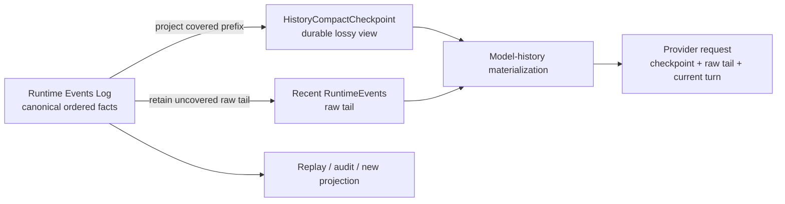
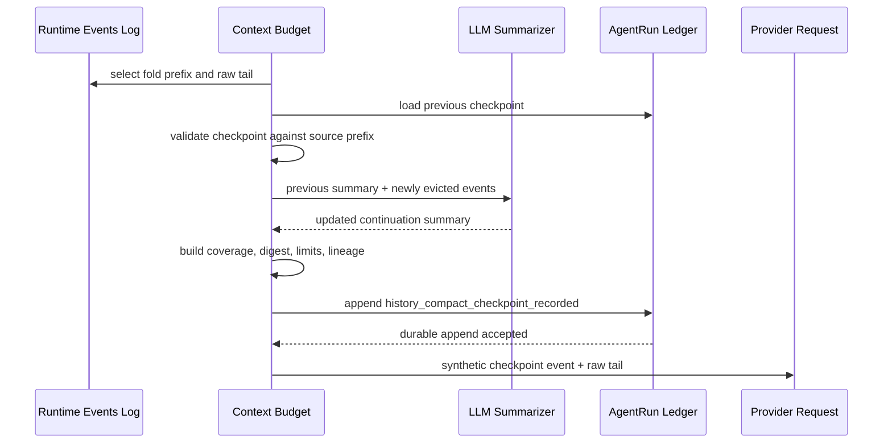
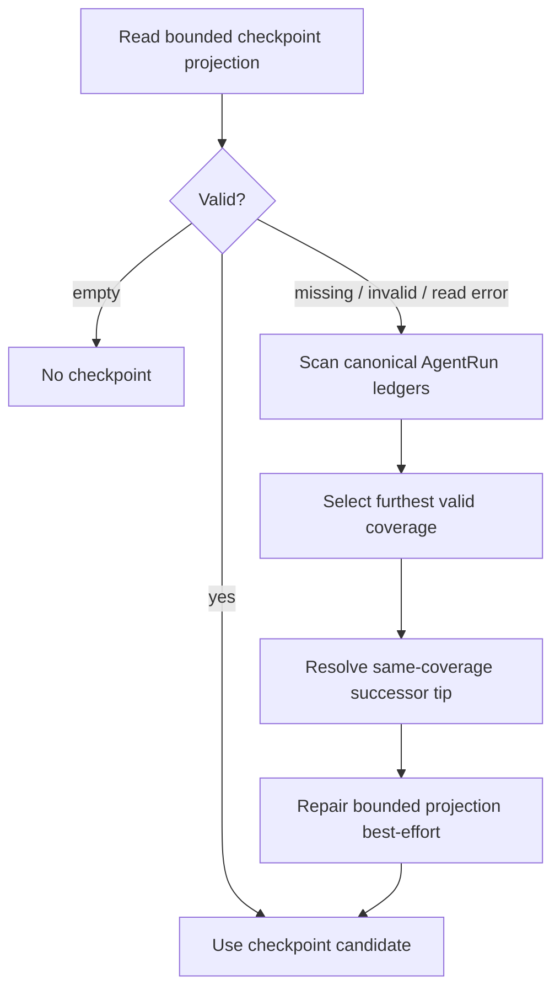

<!--
  Licensed to the Apache Software Foundation (ASF) under one
  or more contributor license agreements.  See the NOTICE file
  distributed with this work for additional information
  regarding copyright ownership.  The ASF licenses this file
  to you under the Apache License, Version 2.0 (the
  "License"); you may not use this file except in compliance
  with the License.  You may obtain a copy of the License at

      http://www.apache.org/licenses/LICENSE-2.0

  Unless required by applicable law or agreed to in writing,
  software distributed under the License is distributed on an
  "AS IS" BASIS, WITHOUT WARRANTIES OR CONDITIONS OF ANY
  KIND, either express or implied.  See the License for the
  specific language governing permissions and limitations
  under the License.
-->

# Chapter 3: Compaction Is a Projection—How Maka Lets the LLM Forget Without Losing History

> This chapter answers one question: when the complete Agent history no longer fits in the model context, how can Maka reduce what the LLM sees without damaging the fact space needed for replay, audit, and future projections? The answer is not “replace the log with a summary.” It is: **define compaction as a lossy projection of the Runtime Events Log. The log preserves facts, a checkpoint preserves a continuation view with an explicit coverage boundary, and each provider request consumes only the projection appropriate at that moment.**

This chapter builds on Chapter 1's log-first Runtime and Chapter 2's distinction between compressing context and compressing evidence. It is for Runtime engineers changing history compaction, context budgets, checkpoint persistence, or recovery. The first half establishes the mental model. The complete chapter should let a reader locate text-summary and provider-native checkpoint generation, validation, rolling updates, replay, and failure recovery.

The primary subject is **RuntimeEvent history compaction**: a compactor produces either a continuation summary or provider-native compact state, the checkpoint covers a safe prefix of RuntimeEvents, and later requests use that projection in place of the prefix. The same planner and checkpoint transaction serve manual, pre-turn, mid-turn, and overflow triggers. The chapter does not fully cover active or stale pruning of individual Tool Results; those reduce provider messages without creating another LLM compaction mechanism.

This chapter describes the implementation current as of 2026-08-30. Ledger-backed checkpoints use schema V2 for text summaries and schema V3 for provider-native state. OpenAI Codex subscription models prefer Codex remote compaction V2 and retain the text summarizer as a narrow liveness fallback; other providers use text-summary behavior directly.

## Start with a long-running Session

Imagine that a user has worked with Maka for two hours:

1. They explored the repository.
2. They ran tests and produced large outputs.
3. They changed several files.
4. They investigated and abandoned a wrong direction.
5. They completed the first fix.
6. They asked Maka to continue with the next failure.

The complete Runtime Events Log may now contain thousands of facts. Those facts still matter. An exact command, the Tool Result the model saw, a constraint the user emphasized, or even a clue that was dismissed too early all belong to the real history.

The next model call, however, neither needs nor may be able to reread all of it. It mainly needs to know:

- the current objective;
- what is already done;
- which decisions must remain in force;
- the current file and execution state;
- the next action;
- where to recover source facts when the summary is insufficient.

The dangerous implementation is to collapse those two requirements into one: generate a summary, then delete or overwrite the original events. That saves context in the short term but turns a fallible summary into an unverifiable second truth. If the model omits a constraint or misstates a Tool Result, no stable source remains to correct it.

Maka's problem is therefore not:

> How do we shorten a conversation?

It is:

> While retaining the complete event facts, how do we compute a smaller continuation view for the next model decision?

## The conclusion first: compaction is projection, not mutation

Maka's core relationship can be written as:

```text
Canonical history = RuntimeEvents[0..n]

Compact checkpoint = Project(
  RuntimeEvents[0..k],
  compaction policy,
  summarizer
)

Next model context = Materialize(
  compact checkpoint,
  RuntimeEvents[k+1..n],
  provider capabilities,
  current context budget
)
```

These are three different objects:

| Layer | What it preserves | Source of truth? | May lose detail? |
|---|---|---|---|
| Runtime Events Log | Semantic facts produced by the user, model, tools, and Runtime | Yes | No |
| History Compact Checkpoint | A continuation summary or provider-native state, plus coverage for a validated event prefix | No; it is a durable projection | Yes |
| Provider Request Messages | The working context consumed by this LLM call | No; it is an ephemeral projection | Yes |



Read the diagram left to right. A successful compaction does not rewrite the log on the left. The checkpoint and raw tail in the middle jointly form the historical prefix for the next request. The lower branch shows that a debugger or future compactor can still consume the same log. The diagram omits the system prompt, tool schemas, and current user message. They also shape the final request, but they are outside history-compaction source coverage.

In database terms, the checkpoint is closer to a materialized view or snapshot than to WAL truncation. It can accelerate reads, carry a version, become invalid, and be rebuilt from its source log. It cannot declare the source log obsolete.

## Why “summary” is too weak a name

An ordinary summary contains only text. A safe compaction projection must also answer:

- Which Session does it belong to?
- How many ordered RuntimeEvents and Turns does it cover?
- At which `runId / turnId / runtimeEventId` does its covered prefix end?
- What is the digest of those source events?
- Which high-water decision produced it?
- Is it a legitimate successor to the previous checkpoint?
- Does it still fit the current token policy?

Maka therefore persists more than a string. It persists a `HistoryCompactCheckpoint`:

```text
HistoryCompactCheckpoint
  identity
    checkpointId
    sessionId
    createdAt
  high water
    highWaterName
    highWaterSeq
  coverage
    eventCount
    turnCount
    through { runId, turnId, runtimeEventId }
    sourceDigest
  projection
    V2: summary
    V3: providerState { kind, connectionSlug, modelId, itemId, encryptedContent }
    limitations
    estimatedTokens
  lineage
    previousCheckpointId?
```

For V2, the model sees `summary`. For V3, the provider sees its own opaque compact item and never the checkpoint's diagnostic text. In both cases, `coverage` determines whether the checkpoint may replace history. A projection without coverage is only a note; without a source digest it cannot establish that it still corresponds to the current log; without a replay-budget check it may be less suitable than the working set it replaces.

## Current: every request still begins with RuntimeEvents

The prior-history path for a normal Send begins in `AiSdkBackend.buildPriorMessages()`. It does not reuse the provider messages assembled for an earlier request. Instead, it receives RuntimeEvents from earlier Runs and executes a projection pipeline:

1. Exclude the current `turnId` to obtain the prior Runtime context.
2. Prepare the context-budget policy.
3. Load the latest compatible ledger-backed checkpoint.
4. Validate and replay the existing checkpoint against the immutable RuntimeEvent sequence.
5. Apply stale oversized Tool Result pruning only to the uncovered projected remainder.
6. If the projected history still exceeds the budget, select a safe prefix and retained tail.
7. If the old checkpoint does not cover the new fold, call a compactor to create a rolling successor.
8. Validate and durably record the successor before using it.
9. Project a V2 checkpoint as a synthetic text RuntimeEvent, or carry a V3 checkpoint as explicit projection metadata, then append the uncovered raw tail.
10. Build the provider replay plan and only then materialize `ModelMessage[]`.

The ordering reveals three properties.

First, checkpoint source matching always sees the immutable RuntimeEvent ledger. Stale Tool Result pruning shapes only the uncovered replay remainder, so a moving recent-turn window cannot invalidate an otherwise matching checkpoint by changing the bytes used for its digest.

Second, compaction happens inside **model-history projection**, not inside the RuntimeEvent append path. Events already produced by the model and tools do not change when a later context budget changes.

Third, the checkpoint is not itself a canonical RuntimeEvent. Coverage and tail selection return the selected checkpoint explicitly alongside the projected RuntimeEvents. A V2 checkpoint also materializes as the familiar system-authored text block so ordinary replay planning can consume it. A compatible V3 checkpoint creates no synthetic text: the provider materializer prepends its assistant `openai.compaction` custom part directly. Neither representation is written back to the RuntimeEvent ledger as though it were an original interaction fact.

## Triggering ends before compaction begins

Runtime derives one capacity from the selected model's metadata. For a known context window it reserves one quarter of the window, capped at 16,384 tokens; most providers without a known window use a 32,000-token history budget plus the classic 16,384-token reserve.

Trigger owners use that capacity but do not participate in compaction:

- the pre-turn and active-turn evaluators emit a Compact command when the projected request crosses the derived capacity;
- provider-overflow recovery emits the same command after a real overflow;
- manual `context.compact` emits it directly, without manufacturing a high-water crossing.

Once emitted, the command always enters the same transaction. The planner receives no force flag, context window, reserve, next-request estimate, high-water ratio, or minimum-recent-Turn policy:

```text
trigger owner emits Compact command
  → select the largest safe completed prefix
  → generate and validate one rolling replacement
  → append one checkpoint or leave durable state unchanged
```

Safe-prefix selection never crosses a partial event, pinned live event, or Tool Call/Result pair. Trigger-specific callers may reserve a small verbatim successor tail, but one completed Turn remains compactable regardless of how many Agent Loop steps it contains. Context management has no environment-variable policy surface; model facts and these Runtime invariants are the only inputs.

## What the LLM does—and does not do

The LLM compactor produces a structured summary that another LLM can use to continue the task. The current summarizer prompt asks it to retain:

- Goal;
- Done and In Progress work;
- Key Decisions;
- Next Steps;
- Critical Context, including exact paths, function names, commands, results, and errors.

The summarizer sees newly folded user/model text and Tool Calls/Results. Thinking is intentionally omitted. Runtime Host reuses the Session's selected connection, model, and provider options without imposing a compaction-only output-token cap. An output-length finish is rejected rather than admitted as a partial summary. The checkpoint builder preserves the complete accepted summary; the replay gate evaluates its full model-visible size instead of truncating it after generation.

The text prompt and validator share one section template. A new V2 summary must contain substantive `Goal`, `Progress`, `Next Steps`, and `Critical Context` sections in order, must not end inside an open fence or other truncation marker, and must not be disproportionately small: a fold above 10,000 estimated tokens requires at least 200 estimated summary tokens. A malformed first completion gets exactly one stricter repair request, and the checkpoint write gate validates the result again.

Malformed retries are bounded beyond that repair. Runtime remembers up to 16 exact malformed-input fingerprints per Session backend, covering the connection, model, route, policy and input budgets, request shape, previous checkpoint, and folded source events. The same unchanged input fails open without another provider dispatch; changed source or configuration is eligible again. Cancellation does not arm this circuit. Granular `malformed_summary_*` reasons survive into compaction diagnostics and terminal context-budget detail.

The LLM does not decide:

- which RuntimeEvents belong to the covered prefix;
- the source digest;
- whether the checkpoint may replace the current log;
- which raw tail must remain;
- whether the checkpoint is durable;
- whether the current provider request may still use it.

Deterministic Runtime code owns all of those decisions.

The LLM is therefore the generator of the projection value, not the projection authority. It decides how to summarize. Runtime decides what was summarized, whether the result may be used, and when it is invalid.

## Codex subscription remote compaction V2

When the selected connection has `providerType: openai-codex`, Maka uses Codex's server-side compactor by default instead of asking the model for a text summary. The provider request is still built from the validated RuntimeEvent prefix. The dedicated compactor sets `providerOptions.openai.compactionTrigger: true`, which appends one terminal `{ "type": "compaction_trigger" }` input item. The compactor uses the streaming Responses path and consumes the full stream because a compaction-only response has no ordinary generated-text result. Ordinary Codex requests do not set this option and are unchanged.

The portable text summarizer remains a bounded liveness fallback. Maka retries once through it when the native request receives a non-retryable protocol `RequestRejected`, returns no unique valid compact state, or cannot fit its native history projection. Cancellation, authentication, billing, rate-limit, and provider-availability failures retain their original outcome instead of doubling traffic through the same unhealthy connection. The two physical attempts share one logical compaction call but record `provider_native` and `text_summary` independently in telemetry.

Compaction input preserves assistant-step chronology. Because the Responses converter cannot resend provider-executed tool results under `store:false`, a settled hosted call/result is lowered only for this compaction request into a paired ordinary function call and output, followed by the grounded assistant text. This keeps the available tool evidence in the request without producing an orphan output.

The compaction call receives the active history-input budget. If its RuntimeEvent projection exceeds that estimate, Maka replaces older Tool Result payloads with a fixed omission marker while retaining every call/result pair and all later grounded text. If the remaining non-tool history still cannot fit, Runtime does not dispatch an already over-capacity native request and gives the text summarizer its one fallback opportunity before following the normal fail-open path.

This is deliberately a history-only contract. Maka does not send the current system prompt or tool catalog to the remote compactor, unlike the Codex CLI's whole-request assembly. Those values are neither part of checkpoint source coverage nor frozen into the checkpoint; the subsequent model request always applies its current system prompt and tools. This keeps provider-native and text-summary compactors behind the same small contract, at the cost of not giving the compactor that extra request-shape context.

Maka accepts exactly one `openai.compaction` output with both `itemId` and `encryptedContent`, then persists it in a schema-V3 checkpoint. The state is bound to the connection slug and model ID. A different provider, connection, or model rejects that checkpoint and reprojects from raw RuntimeEvents. Matching checkpoints replay as provider custom parts across pre-Turn compaction, mid-Turn capacity compaction, and reactive overflow retry.

The V3 schema is a compatibility boundary: older binaries that only understand schema V2 reject it and fall back to raw history. Provider state is redacted from request-capture telemetry and omitted from conversation copies; copied Sessions retain raw RuntimeEvents and may compact them again. The explicit trigger is an observed Codex subscription protocol used by the Codex client, not a claim about the public Responses API contract.

## Rolling checkpoints: do not repeatedly summarize the entire world

A long-lived Session crosses high water more than once. Resending all older events to the summarizer every time would make compaction itself increasingly expensive and repeatedly rewrite the interpretation of old facts.

Schema V2 text checkpoints use rolling checkpoints:

```text
Checkpoint N
  summary = S(events[0..k])

Newly evicted events = events[k+1..m]

Checkpoint N+1
  summary = S(Checkpoint N.summary, events[k+1..m])
  coverage = events[0..m]
  previousCheckpointId = Checkpoint N.checkpointId
```

Schema V3 uses the same coverage and predecessor rules. The remote compactor receives the prior provider state plus only `events[k+1..m]`, and returns one successor provider state.

For schema V2, the summarizer receives only the previous summary and newly folded events. Raw events already covered by the previous checkpoint are not sent to the LLM again. Both schemas recalculate coverage and `sourceDigest` over the complete covered prefix.



Read this diagram from top to bottom. The critical commit point is `history_compact_checkpoint_recorded`. A new summary enters the same provider request as a replacement checkpoint only after the durable recorder succeeds. The diagram omits final replay-plan materialization.

Rolling does not mean a summary can only advance forever. The same coverage may be explicitly rewritten, but the candidate must name the current checkpoint in `previousCheckpointId` and preserve the same source digest, through boundary, and Turn/Event counts. This is a compare-and-swap rewrite of one materialized view, not permission for an arbitrary late writer to overwrite it.

## Why coverage must be an ordered prefix

A checkpoint is not a search summary over an arbitrary event set. It covers an ordered prefix of compactable RuntimeEvents.

The prefix constraint gives Maka three properties:

1. Replay is simple: `checkpoint + uncovered raw suffix`.
2. High water moves forward, so “furthest coverage” is well defined.
3. A rolling update can identify newly folded events precisely.

`matchHistoryCompactCheckpointPrefix()` verifies:

- enough events exist for the claimed event count;
- the last covered event has the matching `runId / turnId / runtimeEventId`;
- the SHA-256 digest over stable ordered serialization matches exactly.

If any check fails, the checkpoint cannot replace the current source prefix. Maka reports `coverage_miss` or `source_hash_mismatch`; it does not accept a projection merely because it resembles the current history.

This also explains why a checkpoint ID alone is not proof of validity. The ID identifies a projection. Source coverage establishes the relationship between that projection and the canonical log.

## The durable projection is itself recorded in a log

Two related logs must remain distinct:

- the `RuntimeEvent` ledger preserves model-interaction and Runtime semantic facts and is the source for compaction;
- the `AgentRunEvent` ledger preserves Run-level operational facts, including `history_compact_checkpoint_recorded` for an accepted checkpoint.

In other words, **the projection is also persisted as an event**. This is not circular. The checkpoint event is not one of the source events it covers. It records the fact that the system accepted this projection during a particular Run. The original RuntimeEvents remain independently durable.

AgentRunStore also maintains a bounded event projection for fast checkpoint lookup. The canonical event and its derived projection are written in one SQLite transaction:

```text
BEGIN write transaction
  → insert canonical AgentRunEvent
  → update bounded checkpoint projection
COMMIT both
```

The SQL statement order remains log first, but there is no partial durability boundary between the two writes: if either statement fails, the transaction rolls back both. The AgentRunEvent ledger remains authoritative because an uninitialized, legacy, or damaged projection can still be rebuilt from it, not because current writes intentionally allow the event and projection to commit separately.

This is the familiar log-first rule under an atomic commit: the derived row may be rebuilt, and it may never describe a fact absent from the canonical ledger.

## Cold-start recovery: rebuild a damaged projection from the log

Runtime first attempts to read the bounded projection, avoiding enumeration of every Run ledger on the normal path.

If the projection is uninitialized, structurally invalid, or unreadable, recovery scans the Session's AgentRun events:

1. Find schema-valid `history_compact_checkpoint_recorded` events.
2. Prefer the checkpoint with the largest `coverage.eventCount`, not a later write with stale coverage.
3. For equal coverage, follow valid `previousCheckpointId` successor chains and choose their tip.
4. Resolve remaining ties by event timestamp and ID.
5. Repair the bounded projection on a best-effort basis.



This diagram explains checkpoint-lookup recovery; it does not imply that the RuntimeEvent ledger itself needs repair. Failure to repair the bounded projection does not remove the source of an already selected checkpoint. If the canonical ledger is also unreadable, however, Runtime does not continue by guessing from a damaged cache.

## Replay: current policy judges the checkpoint again

A checkpoint that was once valid is not guaranteed to fit every future request. The selected model may change, its context window may shrink, or Runtime may derive a smaller `maxHistoryEstimatedTokens` from current model facts.

`evaluateHistoryCompactCheckpointReplay()` is the single current-policy fit gate through which a source-matched checkpoint enters model history. It recomputes the V2 model-visible checkpoint estimate (or uses the V3 estimate) and checks that:

- checkpoint plus replay tail is within the current history budget;
- when the source projection is available for comparison, the replacement is strictly smaller than that source.

A projection may replay only when both source matching and current-policy fit succeed.

During replay, the covered raw prefix does not enter the provider request. Uncovered folded events and retained recent events remain raw RuntimeEvents. A V2 text checkpoint produces:

```text
<maka_history_compact_checkpoint ...>
  summary: ...
  coverage: ...
  limitations: ...
</maka_history_compact_checkpoint>

+ uncovered raw events
+ recent raw tail
+ current user turn
```

The checkpoint's `limitations` state that it is only a replay-time summary of a covered RuntimeEvent prefix and that exact wording remains in the RuntimeEvent ledger.

A compatible V3 checkpoint instead produces an assistant `openai.compaction` custom part followed by the same raw tail and current Turn. Its opaque fields are never rendered as user/system text. If identity, source coverage, shape, or current-policy fit fails, Runtime keeps or recompresses the raw source-derived projection.

## Failure semantics: less context is safer than false history

Compaction crosses token estimation, an LLM call, schema construction, durable append, source matching, and provider replay. Failure is a normal path, not an edge-case fantasy.

| Failure point | Current behavior | What must not happen |
|---|---|---|
| Below high water | Keep the existing projection or apply ordinary budget selection | Create an unsourced summary as a speculative optimization |
| LLM returns an empty summary | Record no new checkpoint. Automatic pre-turn compaction keeps the original source-derived projection and, if it remains over budget, terminates with `context_budget_exhausted` without writing a failure note; manual compaction records one visible `context_compaction_failed_open` note | Treat an empty projection as covered history |
| Text summary is malformed | Spend one stricter repair attempt, then fail open with a granular reason; do not redispatch an unchanged failed fingerprint | Persist incomplete structure or loop on the same doomed compaction input |
| Codex returns no unique valid compact item | Try one portable text-summary checkpoint, then fail open if that also fails | Persist partial or ambiguous provider state |
| Native compaction input cannot fit after bounded Tool Result omission | Do not dispatch the native request; try one bounded text-summary checkpoint | Ask the provider to compact an already over-capacity request |
| Rolling summarizer fails | Reuse the old checkpoint if it still matches and fits, then add the newest complete raw Turns that fit | Pretend the old checkpoint covers newly evicted events |
| Durable checkpoint append fails | Do not use the candidate; fall back to the old checkpoint or safe tail | Put an uncommitted projection into the model and later claim it is recoverable |
| Prefix or digest mismatch | Reject the checkpoint | Replace canonical events through approximate matching |
| Checkpoint exceeds current budget | Do not replay it | Bypass current policy because an earlier request accepted it |
| Bounded projection is damaged | Recover from canonical AgentRun ledgers and repair the projection | Treat the cache as the only source of truth |
| User stops manual compaction | Abort the summarizer/write path without poisoning the next Turn | Persist a late result or reuse aborted state |

Fail-open here does not mean “always send the complete raw history.” Once history exceeds the model budget, the full raw prefix may itself be impossible to send. An automatic pre-turn initial V2 summary failure leaves the original source-derived projection untouched; if that projection still exceeds the budget, the backend terminates with `context_budget_exhausted` before the failure-note path. Manual compaction records one visible `context_compaction_failed_open` note for the same failed outcome. A rolling failure may reuse the old checkpoint, but it never expands that checkpoint's coverage claim.

The correct interpretation is:

> Fail open to a safe source-derived context, not to an invented summary.

The model may temporarily see fewer old details, but the source log remains intact. Maka can compact again or build a new projection under another policy later.

## Manual compaction is also a Runtime operation

Desktop `sessions:compact` does not silently rewrite a database. It creates a Turn/Run and executes backend compaction through `RuntimeKernel.compactSession()`:

- it refuses to start while an ordinary Turn is active, avoiding concurrent high-water writes;
- it participates in the shared stop lifecycle;
- it does not write a fabricated user chat message;
- success or fail-open diagnostics become a token-usage Runtime fact;
- the Run ends through normal terminal events and completed/cancelled state;
- a new checkpoint still commits through the same `history_compact_checkpoint_recorded` path.

Manual compaction emits the same Compact command directly. It does not create a special policy or alter a high-water threshold; only the trigger differs from automatic and overflow recovery.

## V2 and V3: one bounded checkpoint with two projection values

V2 `HistoryCompactCheckpoint` uses fixed-size prefix metadata: Event/Turn counts, a through boundary, and one digest over the complete ordered prefix. The canonical ledger already preserves the original RuntimeEvents; a second fan-out JSON copy is not required to prove source identity.

V3 keeps the same bounded source, coverage, lineage, durability, and replay checks. It changes only the projection value from a text summary to a closed provider-state variant. The union currently contains one variant, `openai_codex_remote_v2`; adding another provider requires a concrete validated variant, not an arbitrary JSON registry.

The current state is:

- schema V2 and V3 checkpoints load from the AgentRun ledger and their bounded projection;
- the latest compatible durable checkpoint is the only checkpoint authority;
- V1 block/source artifact paths have been removed rather than retained as a second representation;
- a failed generation, validation, or append leaves the RuntimeEvent ledger unchanged.

This evolution does not reduce provenance. It puts provenance at the correct layer: the RuntimeEvent ledger preserves source facts, while the checkpoint preserves only the bounded identity required to validate a source prefix.

## One compaction mechanism, one adjacent prune

Maka has one LLM compaction mechanism and one adjacent current-request rewrite:

| Mechanism | Source | When it runs | Durable result | Role in this chapter |
|---|---|---|---|---|
| History LLM compaction | Safe RuntimeEvent prefix | Manual request, pre-turn capacity, active-turn capacity, or provider overflow | Schema V2 or V3 checkpoint recorded in the AgentRun event ledger | Primary subject |
| Active Tool Result Prune | Provider-visible Tool Result in the current Turn | Before the next step in the same Turn | Raw result is archived first; placeholder changes only current messages | Primary subject of Chapter 2 |

Both preserve canonical source, but they do not create parallel compaction authorities. History compaction always selects a safe RuntimeEvent prefix, generates and validates one replacement, then persists one checkpoint before replay. Trigger-specific code may pin the live head or reserve a verbatim tail; it does not own another planner, summary format, controller, or durable block.

Active Tool Result Prune remains a deterministic non-LLM rewrite. It archives an eligible raw Tool Result before replacing that result in the current provider request. It neither summarizes a span nor creates a checkpoint, and the later history-compaction planner reads the canonical RuntimeEvents rather than treating prune placeholders as source authority.

The placeholder carries a bounded `maka://archive/...` address and instructions for `ArchiveRead`; model replay deterministically reconstructs that address for legacy placeholders. Runtime does not eagerly expand the archived body back into every request. The model calls `ArchiveRead` only when it needs the detail, and the Host validates the Session, hash, and byte size before returning a bounded inspect or query result. A later checkpoint replaces covered placeholders with its summary and intentionally carries no archive roots. The complete Tool Result remains in the canonical RuntimeEvent ledger, but model reachability does not become a permanent cross-checkpoint authority.

## What compaction is not

### It is not Memory

A checkpoint continues one Session and covers a specific event prefix. Long-term user preferences, cross-Session knowledge, and explicit memory policies belong to another system.

### It does not delete history

Covered RuntimeEvents disappear only from the current provider working set, not from the canonical ledger.

### It is not lossless semantic encoding

A summary is inherently lossy. The coverage digest proves which source a checkpoint claims to cover; it does not prove that the natural-language summary omitted or misunderstood nothing.

### It is not bit-exact replay

The checkpoint does not fully snapshot the summarizer implementation, system prompt, tool schemas, provider options, and request bytes. The same RuntimeEvents preserve a reconstructable semantic source, but they do not guarantee regeneration of an identical summary byte for byte.

### It is not an official conclusion

If an LLM writes “tests passed” in a summary, that remains a projection of source events. The authority of an official verifier, Tool Result, or terminal fact does not increase or decrease because it appears in a checkpoint.

## Architectural invariants the current system must protect

Any history-compaction change must preserve these invariants:

1. **Source immutability**: compaction does not modify or delete canonical RuntimeEvents.
2. **Projection coverage**: every checkpoint binds to an ordered source prefix, through boundary, and digest.
3. **No durability, no replacement**: a new checkpoint cannot replay as the accepted replacement before durable append.
4. **Monotonic high water**: a new checkpoint normally covers more events; an equal-coverage rewrite must be an explicit successor.
5. **Current-policy validation**: historical validity does not imply fitness for the current request.
6. **Raw recent tail**: the model retains the newest source-derived raw context allowed by the budget.
7. **No false coverage**: a rolling failure cannot let an old summary claim new events.
8. **Projection is rebuildable**: damage to a bounded cache or projection can be repaired from canonical ledgers.
9. **Failure is observable**: skips, fail-open paths, coverage mismatches, and token decisions enter diagnostics.
10. **Authority is preserved**: a summary does not change the authority of source events, Tool Evidence, verifiers, or terminal results.

These invariants are more stable than a prompt template or token default. Prompts can change, models can switch, and checkpoint schemas can evolve. As long as these invariants hold, compaction remains a projection instead of hidden data destruction.

## Costs and remaining boundaries

The design has real costs.

First, storage does not immediately shrink when the prompt becomes shorter. Maka keeps the source log and targets inference context rather than fact storage for savings.

Second, the system must maintain coverage, digests, lineage, policy gates, recovery projections, and diagnostics. A bare summary implementation is shorter but cannot provide the same auditability.

Third, current V2 checkpoints validate source identity, shape, and budget—not the semantic completeness of the summary. Non-empty, bounded, well-structured text is not necessarily correct. A future quality gate should use source-bearing checks and record validator output as projection metadata; it should not turn the validator into a new source of truth.

Fourth, V2 checkpoints do not currently record a complete summarizer model identity, prompt version, or request-shape hash. They are sufficient to replay an accepted projection safely, but not to promise deterministic regeneration. If Maka later needs compactor-version comparisons, offline regressions, or explanation of summary drift, those identities should enter an explicitly versioned projection manifest.

Fifth, rolling summaries can accumulate lossy error. The original log still allows a new projection to be generated from an earlier high water, but the main path currently favors incremental updates to control cost. Any future full re-compaction should be triggered by quality signals rather than an arbitrary interval.

## Code map and verification entry points

Read the current implementation from these locations:

1. `packages/runtime/src/context-budget.ts`: checkpoint-before-prune orchestration and context diagnostics;
2. `packages/runtime/src/history-compaction.ts`: high-water estimation, safe prefix/tail selection, planning, and replay policy;
3. `packages/runtime/src/history-compact-checkpoint.ts`: V2/V3 schemas, provider identity, digest, prefix match, lineage, and replay materialization;
4. `packages/runtime/src/history-compact-summary-validation.ts`: the shared section, truncation, and large-fold size gates;
5. `packages/runtime/src/history-compact-summarizer.ts`: LLM continuation-summary prompt, bounded repair, and rolling input;
6. `packages/runtime/src/ai-sdk-compaction.ts`: compaction orchestration, malformed-input circuit, writes, and fallback semantics;
7. `packages/runtime/src/ai-sdk-backend.ts`: prior-history request projection and provider materialization;
8. `packages/runtime/src/agent-run.ts`: durable `history_compact_checkpoint_recorded` event;
9. `packages/runtime/src/history-compact-ledger.ts`: bounded-projection lookup, ledger recovery, and checkpoint selection;
10. `packages/runtime/src/runtime-kernel.ts`: serialized checkpoint writes and manual-compaction lifecycle;
11. `packages/storage/src/agent-run-store.ts`: atomic canonical-event and bounded-projection persistence;
12. `packages/runtime/src/context-budget-policy.ts`: model-capacity derivation and fixed Runtime policy;
13. `packages/runtime/src/openai-codex-history-compactor.ts`: Codex compact-output validation and rolling provider-state input;
14. `packages/runtime-host/src/server/execution-model-composition.ts`: default provider-specific compactor selection.

Important tests include:

- `history-compact-checkpoint.test.ts`: coverage metadata, prefix digest, summary admission, ledger recovery, projection repair, and policy replay;
- `history-compaction.test.ts`: high-water estimation, safe prefix/tail selection, Tool pair preservation, rolling updates, and write gates;
- `history-compact-summarizer.test.ts`: provider options, input fitting, structured-summary validation and repair, and rolling input;
- `context-budget.test.ts`: canonical-ledger retention and checkpoint replay before stale Tool Result pruning;
- `context-budget-mid-turn-policy.test.ts`: model-capacity derivation and fixed Runtime defaults;
- `mid-turn-capacity-backend.test.ts`: persist-before-apply, fail-open/exhaustion detail, and active-turn retry bounds;
- `openai-codex-history-compactor.test.ts`: unique complete provider-native compact-item admission;
- `ai-sdk-backend.test.ts`: checkpoint reuse, malformed-input fingerprinting, fail-open, and manual compaction;
- `session-manager.test.ts`: manual-compaction Run lifecycle, stop, and concurrency;
- `sqlite-core-execution-store.test.ts`: SQLite AgentRun event durability and in-transaction derived-state ordering.

## Summary

Maka's LLM compaction is not a destructive rewrite of a conversation table. It is a projection chain rooted in the canonical Runtime Events Log:

```text
RuntimeEvent prefix
  → deterministic coverage and high-water selection
  → LLM continuation summary
  → durable HistoryCompactCheckpoint event
  → source/digest/current-policy validation
  → synthetic checkpoint RuntimeEvent + raw recent tail
  → provider-specific ModelMessage projection
```

The elegant part is not that an LLM can write a good summary. It is that the system never mistakes that summary for history itself.

The log answers “what happened.” The checkpoint answers “from this high water, how may the next inference continue?” The provider request answers “what does this model need to see for this call?” Each has a different lifecycle and explicit authority.

Therefore, **compaction is the Events Log's projection** is more than a design slogan. It means the source cannot be overwritten by a summary, a projection must carry coverage, accepted replacement must be durable, replay must pass current policy again, and every projection must be disposable, verifiable, or rebuildable from the log.
