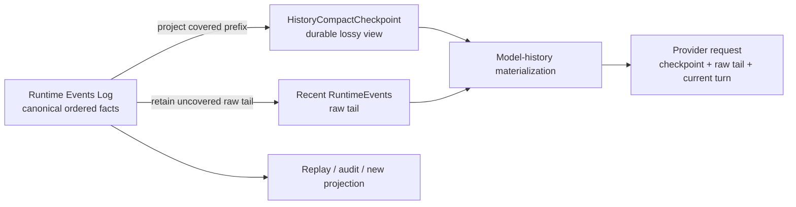
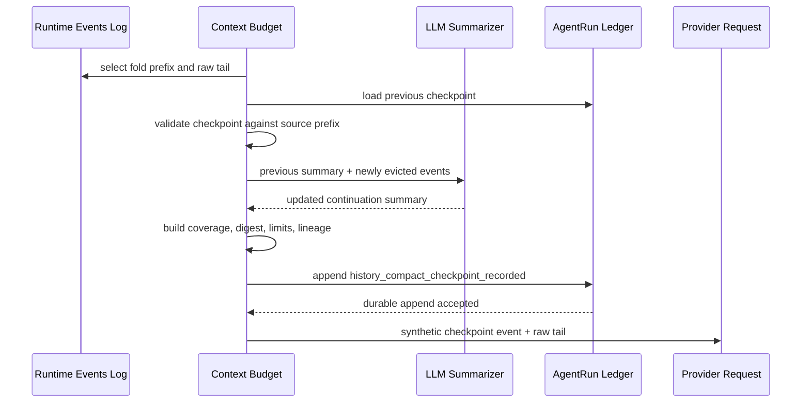
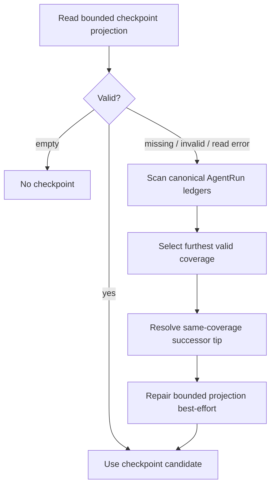

<!--
  Licensed to the Apache Software Foundation (ASF) under one
  or more contributor license agreements.  See the NOTICE file
  distributed with this work for additional information
  regarding copyright ownership.  The ASF licenses this file
  to you under the Apache License, Version 2.0 (the
  "License"); you may not use this file except in compliance
  with the License.  You may obtain a copy of the License at

      http://www.apache.org/licenses/LICENSE-2.0

  Unless required by applicable law or agreed to in writing,
  software distributed under the License is distributed on an
  "AS IS" BASIS, WITHOUT WARRANTIES OR CONDITIONS OF ANY
  KIND, either express or implied.  See the License for the
  specific language governing permissions and limitations
  under the License.
-->

# 第三章：Compaction Is a Projection——Maka 如何让 LLM 忘记而不丢失历史

> 本章回答一个核心问题：当完整 Agent 历史已经大到无法继续放进模型上下文时，Maka 如何缩小 LLM 看到的历史，同时不破坏可以回放、审计和重新投影的事实空间？答案不是“用摘要替换日志”，而是：**把 compaction 定义成 Runtime Events Log 的一个有损投影。日志保存事实，checkpoint 保存一个带覆盖边界的 continuation view，provider request 只消费当下适用的投影。**

本文承接第一章的 log-first Runtime，也承接第二章“压缩上下文、不要压缩证据”的区分。本文面向需要修改 history compaction、上下文预算、checkpoint 持久化或恢复链路的 Runtime 工程师。读完前半部分，读者应该能建立正确心智模型；读完整章，应该能定位文本摘要与 provider-native checkpoint 的生成、校验、滚动更新、回放与故障恢复路径。

本文主要讨论 **RuntimeEvent history compaction**：compactor 生成 continuation summary 或 provider-native compact state，checkpoint 覆盖一段安全的 RuntimeEvent 前缀，并在以后请求中用该投影替代前缀。手动、pre-turn、mid-turn 与 overflow 触发器共用同一个 planner 和 checkpoint transaction。本文不完整展开单个 Tool Result 的 active/stale prune；它们会缩小 provider messages，但不会形成另一套 LLM compaction 机制。

本文描述截至 2026-08-30 的当前实现。ledger-backed checkpoint 中，schema V2 保存文本摘要，schema V3 保存 provider-native state。OpenAI Codex 订阅模型优先使用 Codex remote compaction V2，并保留文本 summarizer 作为范围严格的 liveness fallback；其他 provider 直接使用文本摘要行为。

## 从一个长期会话开始

假设用户和 Maka 连续工作了两小时：

1. 先阅读项目结构；
2. 运行测试并得到大量输出；
3. 修改几个文件；
4. 讨论一个错误方向并回退；
5. 完成第一轮修复；
6. 又要求继续处理下一个失败案例。

完整 Runtime Events Log 也许有几千条事实。它们仍然有价值：某个精确命令、模型当时看到的 tool result、用户曾经强调的约束，以及一条被误判但后来可能重新有用的线索，都属于真实历史。

但下一次模型调用不需要、也未必能够重新读取全部历史。它真正需要的是：

- 当前目标是什么；
- 已完成什么；
- 哪些决策不能推翻；
- 当前文件与运行状态怎样；
- 接下来应该做什么；
- 如果摘要不够，去哪里找原始事实。

最危险的实现是把这两种需求混成同一件事：生成一段摘要，然后删除或覆盖原始事件。这样做短期看节省上下文，长期却让摘要变成无法核验的第二真相。模型漏掉一条约束、错误概括一次工具结果，系统就再也没有稳定来源纠正它。

Maka 的问题因此不是：

> 怎样把一段聊天压缩得更短？

而是：

> 怎样在保留完整事件事实的前提下，为下一次模型决策计算一个更小的 continuation view？

## 先说结论：Compaction 不是 mutation，而是 projection

Maka 的核心关系可以写成：

```text
Canonical history = RuntimeEvents[0..n]

Compact checkpoint = Project(
  RuntimeEvents[0..k],
  compaction policy,
  summarizer
)

Next model context = Materialize(
  compact checkpoint,
  RuntimeEvents[k+1..n],
  provider capabilities,
  current context budget
)
```

这里有三个不可互换的对象：

| 层 | 保存什么 | 是否是事实源 | 是否允许丢失细节 |
|---|---|---|---|
| Runtime Events Log | 用户、模型、工具与 Runtime 已经发生的语义事实 | 是 | 否 |
| History Compact Checkpoint | 一段已校验事件前缀的 continuation summary 或 provider-native state，以及覆盖信息 | 否，是 durable projection | 是 |
| Provider Request Messages | 本次 LLM 调用实际消费的工作上下文 | 否，是 ephemeral projection | 是 |



这张图从左向右读。左侧的日志不会因为 compaction 成功而被改写；中间 checkpoint 与 raw tail 共同形成下一次请求的历史前缀。右下角说明同一日志仍可被调试器、历史搜索或未来的新 compactor 重新消费。图中省略了 system prompt、tool schema 和当前用户消息，它们同样参与最终 request，但不是 history compaction 的 source coverage。

用数据库语言说，checkpoint 更接近一个 materialized view 或 snapshot，而不是 WAL truncation。它可以加速读取，可以有版本，可以失效，也可以从 source log 重建；它不能反过来宣布 source log 不再重要。

## 为什么“摘要”这个词不够准确

普通摘要只有 text。安全的 compaction projection 至少还需要回答：

- 它覆盖哪一个 Session？
- 它覆盖多少条有序 RuntimeEvents、多少个 Turn？
- 覆盖前缀结束在哪个 `runId / turnId / runtimeEventId`？
- 这些源事件的 digest 是什么？
- 它由哪一个 high-water decision 产生？
- 它是否是上一 checkpoint 的合法 successor？
- 它在当前 token policy 下仍然能否进入 prompt？

所以，Maka 持久化的不是一个裸字符串，而是 `HistoryCompactCheckpoint`：

```text
HistoryCompactCheckpoint
  identity
    checkpointId
    sessionId
    createdAt
  high water
    highWaterName
    highWaterSeq
  coverage
    eventCount
    turnCount
    through { runId, turnId, runtimeEventId }
    sourceDigest
  projection
    V2: summary
    V3: providerState { kind, connectionSlug, modelId, itemId, encryptedContent }
    limitations
    estimatedTokens
  lineage
    previousCheckpointId?
```

V2 中模型主要看到 `summary`；V3 中 provider 看到自己的 opaque compact item，不会看到 checkpoint 的诊断文本。两者都由 `coverage` 决定有没有资格替代历史。没有 coverage 的 projection 只是笔记；没有 source digest 就无法证明它仍对应当前日志；没有 replay budget 校验，它可能比被替代的工作集更不适合当前请求。

## Current：完整请求仍从 RuntimeEvents 开始

每次普通 Send 的 prior-history 路径从 `AiSdkBackend.buildPriorMessages()` 开始。它不会先读取上次已经拼好的 provider messages，而是优先接收此前 Run 的 RuntimeEvents，再执行一条投影流水线：

1. 排除当前 `turnId`，得到 prior Runtime context；
2. 准备 context budget policy；
3. 加载最新且兼容的 ledger-backed checkpoint；
4. 在 immutable RuntimeEvent 序列上校验并 replay 已有 checkpoint；
5. 只对未覆盖的 projected remainder 执行 stale oversized Tool Result prune；
6. 如果 projected history 仍超出预算，选择 safe prefix 与 retained tail；
7. 如果旧 checkpoint 不足以覆盖新的 fold，调用 compactor 滚动生成 successor；
8. successor 通过校验并 durable record 后才能使用；
9. V2 checkpoint 投影为 synthetic text RuntimeEvent；V3 checkpoint 则作为显式 projection metadata 传递，然后拼接未覆盖 raw tail；
10. 建立 provider replay plan，最后才物化成 `ModelMessage[]`。

这条顺序说明三件事。

第一，checkpoint source matching 始终面对 immutable RuntimeEvent ledger。Stale Tool Result prune 只塑造未覆盖的 replay remainder，因此 recent-turn window 的移动不会改变 digest 所依据的字节，进而错误地让本来匹配的 checkpoint 失效。

第二，compaction 发生在 **model-history projection** 内，而不是 RuntimeEvent append path 内。模型和工具已经产生的事件不会因为以后预算变化而改变。

第三，checkpoint 也不是 canonical RuntimeEvent。coverage 与 tail selection 会把选中的 checkpoint 和投影后的 RuntimeEvents 一起显式返回。V2 checkpoint 还会物化为熟悉的 system-authored 文本块，供普通 replay planning 使用；兼容的 V3 checkpoint 不创建任何 synthetic 文本，由 provider materializer 直接在请求头部加入 assistant `openai.compaction` custom part。两种表示都不会伪装成原始交互事件写回 RuntimeEvent ledger。

## Trigger 在 compaction 开始前结束

Runtime 从所选模型的 metadata 推导唯一 capacity。已知 context window 时，reserve 取 window 的四分之一且上限为 16,384 tokens；无法得到 window 时，多数 provider 使用 32,000-token history budget 加经典的 16,384-token reserve。

Trigger owner 使用这个 capacity，但不参与 compaction：

- pre-turn 与 active-turn evaluator 在 projected request 越过推导出的 capacity 时发出 Compact command；
- provider-overflow recovery 在真实 overflow 后发出同一 command；
- 手动 `context.compact` 直接发出 command，不伪造 high-water crossing。

Command 一旦发出就进入同一个 transaction。Planner 不再接收 force flag、context window、reserve、next-request estimate、high-water ratio 或 minimum-recent-Turn policy：

```text
trigger owner emits Compact command
  → select the largest safe completed prefix
  → generate and validate one rolling replacement
  → append one checkpoint or leave durable state unchanged
```

Safe-prefix selection 不会跨越 partial event、pinned live event 或 Tool Call/Result pair。Trigger-specific caller 可以保留一小段 verbatim successor tail，但一个 completed Turn 无论包含多少 Agent Loop steps 都可以 compact。Context management 不再提供环境变量 policy surface；模型事实与这些 Runtime invariant 是唯一输入。

## LLM 在这里做什么，也不做什么

LLM compaction 的任务是生成一份“让另一个 LLM 继续工作”的结构化 summary。当前 summarizer prompt 要求保留：

- Goal；
- Done 与 In Progress；
- Key Decisions；
- Next Steps；
- Critical Context，包括精确路径、函数名、命令、结果和错误。

Summarizer 会看到被新折叠的用户/模型文本与 tool call/result。Thinking 被有意排除。Runtime Host 复用当前 Session 选中的 connection、model 与 provider options，不额外设置 compaction-only output-token cap。如果 provider 以 output-length 结束，这份不完整 summary 会被拒绝。Checkpoint builder 保留完整的已接受 summary；replay gate 按完整 model-visible size 判断，而不是在生成后截断。

文本 prompt 与 validator 共用一份 section template。新的 V2 summary 必须依次包含有实质内容的 `Goal`、`Progress`、`Next Steps` 与 `Critical Context`，不能结束在未闭合 fence 或其他 truncation marker 上，也不能相对 fold 过小：fold 超过 10,000 estimated tokens 时，summary 至少需要 200 estimated tokens。第一份 malformed completion 只有一次更严格的 repair request，checkpoint write gate 随后还会再次校验结果。

Repair 之外的 malformed retry 也有上限。Runtime 为每个 Session backend 最多记住 16 个精确 malformed-input fingerprint，其中覆盖 connection、model、route、policy 与 input budget、request shape、previous checkpoint 和 folded source events。输入不变时直接 fail open，不再 dispatch provider；source 或配置变化后可以重试。Cancellation 不会触发这个 circuit。细分的 `malformed_summary_*` reason 会一直保留到 compaction diagnostics 与 terminal context-budget detail。

但是 LLM 不决定以下事实：

- 哪些 RuntimeEvents 属于 covered prefix；
- source digest 是什么；
- checkpoint 是否能替代当前日志；
- 哪些 raw tail 必须保留；
- checkpoint 是否已 durable；
- 当前 provider request 是否仍允许使用它。

这些都由 deterministic Runtime code 决定。

因此，LLM 是 projection value 的生成器，不是 projection authority。它负责“怎样概括”；Runtime 负责“概括了什么、能否使用、何时失效”。

## Codex 订阅 remote compaction V2

当所选 connection 的 `providerType` 为 `openai-codex` 时，Maka 默认使用 Codex 服务端 compactor，不再让模型生成文本摘要。provider request 仍由已校验的 RuntimeEvent prefix 构建。专用 compactor 会设置 `providerOptions.openai.compactionTrigger: true`，从而追加唯一一个位于 input 末尾的 `{ "type": "compaction_trigger" }` item。compactor 使用流式 Responses 路径并消费完整 stream，因为只有 compaction output 的响应不存在普通 generated-text result；普通 Codex 请求不会设置这个选项，因此行为不变。

可移植的文本 summarizer 仍作为有界的 liveness fallback。当 native request 收到不可重试的协议级 `RequestRejected`、没有返回唯一合法的 compact state，或无法容纳 native history projection 时，Maka 会通过文本 summarizer 重试一次。Cancellation、鉴权、计费、限流和 provider 不可用仍保留原始结果，不会向同一个异常连接发送双倍流量。两次物理请求属于同一个逻辑 compaction call，但 telemetry 会分别记录 `provider_native` 与 `text_summary`。

Compaction input 会保留 assistant step 的时序。由于 Responses converter 在 `store:false` 下无法重新发送 provider-executed tool result，已经完整结算的 hosted call/result 只在这次 compaction request 中降级为成对的普通 function call 与 output，之后再放 grounded assistant text。这样既保留了现有 tool evidence，也不会生成悬空 output。

Compaction call 会收到当前 history input budget。若 RuntimeEvent projection 超出该估算值，Maka 会把较旧的 Tool Result payload 替换为固定 omission marker，同时保留每一组 call/result 配对和之后的 grounded text。若剩余的非工具历史仍无法容纳，Runtime 不会发送一条已经超出容量的 native request，而是先给文本 summarizer 一次 fallback 机会，再进入正常 fail-open 路径。

这是有意设计成 history-only 的契约。与 Codex CLI 的 whole-request assembly 不同，Maka 不会把当前 system prompt 或 tool catalog 发给 remote compactor；它们既不属于 checkpoint source coverage，也不会被冻结进 checkpoint，后续模型请求始终使用当时最新的 system prompt 和 tools。这样 provider-native 与 text-summary compactor 可以共享同一份小契约，代价是 compactor 无法利用这部分额外的 request-shape context。

Maka 只接受唯一一个同时带有 `itemId` 与 `encryptedContent` 的 `openai.compaction` output，并把它持久化为 schema-V3 checkpoint。state 绑定 connection slug 与 model ID；provider、connection 或 model 不匹配时，checkpoint 会被拒绝，并从 raw RuntimeEvents 重新投影。匹配的 checkpoint 在 pre-Turn compaction、mid-Turn capacity compaction 和 reactive overflow retry 中都以 provider custom part 回放。

V3 schema 也是兼容边界：只理解 schema V2 的旧 binary 会拒绝它并回退 raw history。provider state 会从 request-capture telemetry 中脱敏，也不会进入 conversation copy；复制后的 Session 仍保留 raw RuntimeEvents，需要时可以重新 compact。这里的显式 trigger 是 Codex client 已使用的 Codex 订阅协议，不代表对公开 Responses API contract 的宣称。

## Rolling checkpoint：不要反复总结整个世界

长期 Session 会多次越过 high water。如果每次都把所有旧事件重新发送给 summarizer，compaction 自身会变成越来越昂贵的请求，也会让旧事实被反复改写。

Schema V2 文本 checkpoint 使用 rolling checkpoint：

```text
Checkpoint N
  summary = S(events[0..k])

Newly evicted events = events[k+1..m]

Checkpoint N+1
  summary = S(Checkpoint N.summary, events[k+1..m])
  coverage = events[0..m]
  previousCheckpointId = Checkpoint N.checkpointId
```

Schema V3 沿用相同的 coverage 与 predecessor 规则。remote compactor 接收上一份 provider state 与 `events[k+1..m]`，并返回唯一一份 successor provider state。

Schema V2 中，summarizer 只接收 previous summary 和 newly folded events；已经被 previous checkpoint 覆盖的 raw events 不会再次发送给 LLM。两种 schema 都会重新对完整 covered prefix 计算 coverage 和 `sourceDigest`。



这张图从上向下读，关键提交点是 `history_compact_checkpoint_recorded`。新 summary 只有在 durable recorder 成功之后，才会作为 replacement checkpoint 进入同一次 provider request。图中省略了后续 replay-plan materialization。

Rolling 并不意味着 summary 永远只进不退。同一 coverage 可以被明确重写，但 candidate 必须把当前 checkpoint 放在 `previousCheckpointId`，并保持相同 source digest、through boundary 与 Turn/Event 计数。这相当于对同一 materialized view 做 compare-and-swap，而不是让任意迟到写入覆盖它。

## Coverage 为什么必须是“有序前缀”

Checkpoint 不是对任意事件集合的搜索摘要。它覆盖的是 compactable RuntimeEvents 的一个有序前缀。

前缀约束带来三个好处：

1. replay 很简单：`checkpoint + uncovered raw suffix`；
2. high-water 只向前推进，容易比较谁覆盖得更远；
3. rolling update 可以明确知道哪些事件是 newly folded。

`matchHistoryCompactCheckpointPrefix()` 会检查：

- event count 是否足够；
- covered prefix 的最后一条 `runId / turnId / runtimeEventId` 是否匹配；
- 按稳定序列化计算的 SHA-256 digest 是否完全相同。

任何一项失败，都不能把 checkpoint 当成当前 source prefix 的替代物。系统会记录 `coverage_miss` 或 `source_hash_mismatch`，而不是“看起来像同一段历史”就继续使用。

这也解释了为什么 checkpoint ID 不能单独充当真实性证明。ID 标识一个 projection；source coverage 才建立它和 canonical log 的关系。

## Durable projection 也记录在 log 中

这里存在两种相关但不能混同的日志：

- `RuntimeEvent` ledger 保存模型交互与 Runtime 语义事实，是 compaction 的 source；
- `AgentRunEvent` ledger 保存 Run 级运行事实，其中 `history_compact_checkpoint_recorded` 记录一个已接受的 checkpoint。

换句话说，**projection 本身也以事件形式持久化**。这不是循环定义：checkpoint event 不是被它覆盖的 source event，它记录的是“在某次 Run 中，系统接受了这个 projection”。原始 RuntimeEvents 仍然独立存在。

AgentRunStore 还维护一个 bounded event projection，用于快速找到最近 checkpoint。Canonical event 与 derived projection 在同一个 SQLite transaction 中写入：

```text
BEGIN write transaction
  → insert canonical AgentRunEvent
  → update bounded checkpoint projection
COMMIT both
```

SQL statement 仍遵守 log-first 顺序，但两次写入之间不存在 partial durability boundary：任一 statement 失败，transaction 都会回滚两者。AgentRunEvent ledger 仍是 authority，是因为未初始化、legacy 或损坏的 projection 可以从中重建，而不是因为当前写入故意允许 event 与 projection 分开提交。

这是 atomic commit 下的 log-first 规则：derived row 可以重建，也绝不能描述 canonical ledger 中不存在的事实。

## 冷启动恢复：Projection 坏了就从 Log 重建

读取最新 checkpoint 时，Runtime 先尝试 bounded projection，避免每次枚举所有 Run ledger。

如果 projection 未初始化、格式无效或读取失败，恢复路径会扫描 Session 下的 AgentRun events：

1. 找出所有 schema-valid `history_compact_checkpoint_recorded`；
2. 优先选择 `coverage.eventCount` 最大的 checkpoint，而不是时间最新但 coverage 更旧的写入；
3. 对相同 coverage，沿合法 `previousCheckpointId` successor chain 找到 tip；
4. 再以 event timestamp 和 ID 解决剩余并列；
5. best-effort 修复 bounded projection。



这张图解释 checkpoint lookup 的恢复关系，不代表 RuntimeEvent ledger 本身需要修复。Projection repair 失败不会让已经选出的 checkpoint 失去来源；但如果 canonical ledger 也无法读取，系统不会凭损坏缓存继续猜测。

## Replay：Checkpoint 必须再次接受当前 policy 审判

一个曾经合法的 checkpoint 不保证永远适合所有请求。所选模型可能切换，context window 可能变小，Runtime 也可能根据当前 model facts 推导出更小的 `maxHistoryEstimatedTokens`。

`evaluateHistoryCompactCheckpointReplay()` 是 source-matched checkpoint 进入模型历史的统一 current-policy fit gate。它重新计算 V2 model-visible checkpoint estimate（V3 使用已记录的 estimate），并检查：

- checkpoint 与 replay tail 合计不超过当前 history budget；
- 如果有 source projection 可供比较，replacement 必须严格小于该 source。

只有 source match 与 current-policy fit 同时成立，projection 才能 replay。

Replay 时，covered raw prefix 不进入 provider request；未覆盖的 folded suffix 与 retained recent events 继续以 raw RuntimeEvents 存在。V2 文本 checkpoint 会让模型看到：

```text
<maka_history_compact_checkpoint ...>
  summary: ...
  coverage: ...
  limitations: ...
</maka_history_compact_checkpoint>

+ uncovered raw events
+ recent raw tail
+ current user turn
```

Checkpoint 的 `limitations` 会明确提醒：它只是 covered RuntimeEvent prefix 的 replay-time summary；精确措辞仍应回到 RuntimeEvent ledger。

兼容的 V3 checkpoint 则产生 assistant `openai.compaction` custom part，后面拼接同一份 raw tail 与 current Turn；opaque 字段绝不会被渲染为 user/system 文本。identity、source coverage、shape 或 current-policy fit 任一失败时，Runtime 会保留或重新压缩 source-derived raw projection。

## Failure semantics：宁可少看，也不要看一份假历史

Compaction 跨越 token estimation、LLM call、schema construction、durable append、source matching 和 provider replay，失败是正常路径而不是异常想象。

| 失败位置 | 当前行为 | 不允许发生的事 |
|---|---|---|
| 未超过 high water | 保持原投影或普通预算裁剪 | 为了“提前优化”制造无来源摘要 |
| LLM 返回空 summary | 不记录新 checkpoint。自动 pre-turn compaction 保留原有的 source-derived projection；如果它仍然超出预算，则以 `context_budget_exhausted` 结束且不写入失败 note；手动 compaction 则记录一次可见的 `context_compaction_failed_open` note | 把空 projection 当作 covered history |
| Text summary 格式不合法 | 只进行一次更严格的 repair，之后以细分 reason fail open；同一失败 fingerprint 不再 dispatch | 持久化不完整结构，或在相同 doomed input 上循环 |
| Codex 没有返回唯一且合法的 compact item | 尝试一次可移植文本摘要 checkpoint；若仍失败再 fail open | 持久化残缺或有歧义的 provider state |
| Native compaction input 在有界省略 Tool Result 后仍无法容纳 | 不发送 native request，尝试一次有界文本摘要 checkpoint | 要求 provider 压缩一条已经超出容量的请求 |
| Rolling summarizer 失败 | 若旧 checkpoint 仍匹配且符合当前限制，则复用它并拼接能容纳的最新完整 raw Turns | 假装旧 checkpoint 已覆盖 newly evicted events |
| Durable checkpoint append 失败 | 不使用 candidate；回退旧 checkpoint 或安全 tail | 让未提交 projection 进入模型后再声称可恢复 |
| Prefix 或 digest 不匹配 | 拒绝 checkpoint | 用近似匹配替代 canonical events |
| Checkpoint 超出当前 budget | 不 replay 它 | 因为过去接受过就绕过当前 policy |
| Bounded projection 损坏 | 从 canonical AgentRun ledger 恢复并修复 projection | 把缓存当成唯一事实源 |
| 用户停止 manual compaction | 中止 summarizer/write 链路，不污染下一 Turn | 让迟到结果写入或复用 abort state |

这里的 fail-open 不是“无论如何发送完整历史”。当历史已经超过模型预算时，完整 raw prefix 本身可能不可发送。自动 pre-turn 的 V2 初次 summary 失败会原样保留 source-derived projection；如果该 projection 仍然超出预算，backend 会在失败 note 路径之前以 `context_budget_exhausted` 结束。手动 compaction 对同一失败结果写入一次可见的 `context_compaction_failed_open` note。Rolling failure 可以复用旧 checkpoint，但绝不会扩大它的 coverage claim。

正确理解是：

> Fail open to a safe source-derived context, not to an invented summary.

模型可能暂时少看到一些旧细节，但 source log 没有丢。以后可以重新 compact，或在不同 policy 下生成新 projection。

## Manual compaction 也是一次 Runtime operation

桌面端 `sessions:compact` 不会偷偷修改数据库。它创建一个新的 Turn/Run，通过 `RuntimeKernel.compactSession()` 执行 backend compaction：

- 有普通 Turn 正在运行时拒绝启动，避免并发 high-water 写入；
- 受统一 stop lifecycle 控制；
- 不写一条伪造的 user chat message；
- 成功或 fail-open diagnostics 进入 token-usage Runtime fact；
- Run 最终以正常 terminal event 与 completed/cancelled 状态收尾；
- 新 checkpoint 仍通过同一 `history_compact_checkpoint_recorded` durable path 提交。

Manual compaction 直接发出同一个 Compact command。它不创建特殊 policy，也不修改 high-water threshold；与 automatic 和 overflow recovery 的差别只在 trigger。

## V2 与 V3：一种 bounded checkpoint、两种 projection value

V2 `HistoryCompactCheckpoint` 使用固定大小的 prefix metadata：event/Turn count、through boundary 和一个覆盖完整有序前缀的 digest。原始 RuntimeEvents 已经在 canonical ledger 中，不必为了证明来源再复制一份 fan-out JSON。

V3 保持完全相同的 bounded source、coverage、lineage、durability 与 replay check，只把 projection value 从文本摘要换成 closed provider-state variant。当前 union 只有 `openai_codex_remote_v2`；未来新增 provider 必须加入具体、可校验的 variant，而不是引入任意 JSON registry。

当前状态是：

- schema V2 与 V3 checkpoint 从 AgentRun ledger 与 bounded projection 加载；
- latest compatible durable checkpoint 是唯一 checkpoint authority；
- V1 block/source artifact 路径已经删除，不再保留第二种表示；
- generation、validation 或 append 任一失败时，RuntimeEvent ledger 保持不变。

这次演进不是减少 provenance，而是把 provenance 放回正确层次：source facts 由 RuntimeEvent ledger 保存，checkpoint 只保存验证 source prefix 所需的 bounded identity。

## 一套 compaction 机制，一个相邻 prune

Maka 只有一套 LLM compaction 机制，以及一个相邻的 current-request rewrite：

| 机制 | Source | 发生时机 | Durable result | 本章定位 |
|---|---|---|---|---|
| History LLM compaction | 安全的 RuntimeEvent prefix | 手动请求、pre-turn capacity、active-turn capacity 或 provider overflow | Schema V2 或 V3 checkpoint 记录进 AgentRun event ledger | 本章主体 |
| Active Tool Result Prune | 当前 Turn 的 provider-visible tool result | 同一 Turn 的下一 step 前 | raw result 先归档；placeholder 只改当前 messages | 第二章主体 |

两者都保留 canonical source，但不会形成并行的 compaction authority。History compaction 始终选择安全 RuntimeEvent prefix，生成并校验一个 replacement，再先持久化一个 checkpoint、后进入 replay。trigger-specific 代码可以固定 live head 或保留 verbatim tail，但不再拥有另一套 planner、summary format、controller 或 durable block。

Active Tool Result Prune 仍是 deterministic、非 LLM 的 rewrite。它先归档 eligible raw Tool Result，再替换 current provider request 中的该结果。它既不总结 span，也不创建 checkpoint；后续 history-compaction planner 读取 canonical RuntimeEvents，不会把 prune placeholder 当成 source authority。

Placeholder 携带 bounded `maka://archive/...` 地址和 `ArchiveRead` 指令；model replay 会为 legacy placeholder 确定性补回这个地址。Runtime 不再把 archived body eager-expand 回每次请求。只有模型确实需要细节时才调用 `ArchiveRead`，Host 在返回 bounded inspect/query 结果前校验 Session、hash 与 byte size。后续 checkpoint 会用 summary 替换已覆盖的 placeholder，并且有意不携带 archive roots。完整 Tool Result 仍在 canonical RuntimeEvent ledger 中，但 model reachability 不会变成永久的 cross-checkpoint authority。

## Compaction 不是什么

### 它不是 Memory

Checkpoint 为继续当前 Session 服务，覆盖的是一段具体事件前缀。长期用户偏好、跨 Session 知识和显式 memory policy 属于不同系统。

### 它不是删除历史

Covered RuntimeEvents 只从本次 provider working set 中消失，不从 canonical ledger 中删除。

### 它不是语义无损编码

Summary 天生有损。Coverage digest 可以证明“它声称覆盖的是哪段 source”，不能证明自然语言 summary 没有遗漏或误解。

### 它不是 bit-exact replay

Checkpoint 没有完整快照 summarizer 模型实现、system prompt、tool schema、provider options 和所有 request bytes。相同 RuntimeEvents 可以重建语义来源，但不保证重新生成逐字相同 summary。

### 它不是官方结论

LLM 在 summary 中写“测试已通过”仍然只是对 source events 的概括。官方 verifier、tool result 和 terminal fact 的 authority 不会因为进入 checkpoint 而升级或降级。

## 当前必须保护的架构不变量

任何修改 history compaction 的实现，都必须保护以下不变量：

1. **Source immutability**：compaction 不修改或删除 canonical RuntimeEvents。
2. **Projection coverage**：每个 checkpoint 都绑定一个有序 source prefix、through boundary 和 digest。
3. **No durability, no replacement**：新 checkpoint 未 durable append 时，不得作为 accepted replacement replay。
4. **Monotonic high water**：新 checkpoint 通常必须覆盖更多 events；同 coverage rewrite 必须是显式 successor。
5. **Current-policy validation**：历史上合法不代表当前 request 可以使用。
6. **Raw recent tail**：模型始终获得当前预算允许的最新 source-derived raw context。
7. **No false coverage**：rolling failure 不得让旧 summary 声称覆盖新 events。
8. **Projection is rebuildable**：bounded cache/projection 损坏时，可以从 canonical ledger 恢复。
9. **Failure is observable**：skip、fail-open、coverage mismatch 和 token decision 必须进入 diagnostics。
10. **Authority is preserved**：summary 不改变 source event、tool evidence、verifier 或 terminal result 的权威等级。

这十条比某个 prompt 模板或 token 默认值更稳定。Prompt 可以升级，模型可以切换，checkpoint schema 也可以演进；只要这些不变量仍成立，compaction 就仍然是 projection，而不是隐蔽的数据破坏。

## 代价与仍然存在的边界

这种设计的成本是真实的。

第一，存储不会因为 prompt 变短而立刻缩小。Maka 选择保留 source log，把节省目标放在推理上下文而不是事实存储。

第二，系统需要维护 coverage、digest、lineage、policy gate、recovery projection 与 diagnostics。一个裸 summary 实现更短，但无法提供相同的可审计性。

第三，当前 V2 checkpoint 只验证 source identity、shape 与预算，不验证 summary 的语义完备性。非空、bounded、结构清晰不等于内容正确。未来如果引入 summary quality gate，应当使用 source-bearing checks，并把 validator 结果作为 projection metadata，而不是把 validator 变成新的事实源。

第四，V2 checkpoint 当前没有完整记录 summarizer model identity、prompt version 或 request-shape hash。它足以安全 replay 已接受 projection，却不足以承诺确定性再生成。若未来需要比较 compactor 版本、做离线回归或解释摘要漂移，这些字段值得进入明确版本化的 projection manifest。

第五，rolling summary 会积累有损误差。原始日志仍然允许重新从更早 high water 生成新 projection，但当前主路径优先增量更新以控制成本。什么时候触发 full re-compaction，应由质量信号而不是任意时间间隔决定。

## 代码地图与验证入口

当前实现可以从以下位置阅读：

1. `packages/runtime/src/context-budget.ts`：checkpoint-before-prune orchestration 与 context diagnostics；
2. `packages/runtime/src/history-compaction.ts`：high-water estimation、safe prefix/tail selection、planning 与 replay policy；
3. `packages/runtime/src/history-compact-checkpoint.ts`：V2/V3 schema、provider identity、digest、prefix match、lineage 与 replay materialization；
4. `packages/runtime/src/history-compact-summary-validation.ts`：共用的 section、truncation 与 large-fold size gate；
5. `packages/runtime/src/history-compact-summarizer.ts`：LLM continuation-summary prompt、bounded repair 与 rolling input；
6. `packages/runtime/src/ai-sdk-compaction.ts`：compaction orchestration、malformed-input circuit、write 与 fallback 语义；
7. `packages/runtime/src/ai-sdk-backend.ts`：prior-history request projection 与 provider materialization；
8. `packages/runtime/src/agent-run.ts`：`history_compact_checkpoint_recorded` durable event；
9. `packages/runtime/src/history-compact-ledger.ts`：bounded projection lookup、ledger recovery 与 checkpoint selection；
10. `packages/runtime/src/runtime-kernel.ts`：checkpoint write serialization 与 manual compaction lifecycle；
11. `packages/storage/src/agent-run-store.ts`：canonical event 与 bounded projection 的 atomic persistence；
12. `packages/runtime/src/context-budget-policy.ts`：model-capacity derivation 与固定 Runtime policy；
13. `packages/runtime/src/openai-codex-history-compactor.ts`：Codex compact output 校验与 rolling provider-state input；
14. `packages/runtime-host/src/server/execution-model-composition.ts`：默认 provider-specific compactor 选择。

重点测试包括：

- `history-compact-checkpoint.test.ts`：coverage metadata、prefix digest、summary admission、ledger recovery、projection repair 与 policy replay；
- `history-compaction.test.ts`：high-water estimation、safe prefix/tail selection、Tool pair preservation、rolling update 与 write gate；
- `history-compact-summarizer.test.ts`：provider options、input fitting、structured-summary validation/repair 与 rolling input；
- `context-budget.test.ts`：canonical-ledger retention，以及 checkpoint 在 stale Tool Result prune 前 replay；
- `context-budget-mid-turn-policy.test.ts`：model-capacity derivation 与固定 Runtime defaults；
- `mid-turn-capacity-backend.test.ts`：persist-before-apply、fail-open/exhaustion detail 与 active-turn retry bound；
- `openai-codex-history-compactor.test.ts`：只接受唯一且完整的 provider-native compact item；
- `ai-sdk-backend.test.ts`：checkpoint reuse、malformed-input fingerprint、fail-open 与 manual compact；
- `session-manager.test.ts`：manual compaction 的 Run lifecycle、stop 与 concurrency；
- `sqlite-core-execution-store.test.ts`：SQLite AgentRun event durability 与 in-transaction derived-state ordering。

## 总结

Maka 的 LLM compaction 不是一次对 conversation table 的 destructive rewrite。它是一条从 canonical Runtime Events Log 出发的投影链：

```text
RuntimeEvent prefix
  → deterministic coverage and high-water selection
  → LLM continuation summary
  → durable HistoryCompactCheckpoint event
  → source/digest/current-policy validation
  → synthetic checkpoint RuntimeEvent + raw recent tail
  → provider-specific ModelMessage projection
```

这条链的精妙之处不在于 LLM 能写出多漂亮的摘要，而在于系统从未把摘要误认为历史本身。

日志回答“发生过什么”；checkpoint 回答“在这个 high water 上，下一次推理可以怎样继续”；provider request 回答“这个模型在这一次调用里实际需要看到什么”。三者各自有不同生命周期，也各自有明确的 authority。

所以，**compaction is the Events Log's projection** 不只是一句设计口号。它具体意味着：source 不可被摘要覆盖，projection 必须带 coverage，accepted replacement 必须 durable，replay 必须重新通过当前 policy，而任何 projection 都应该能够被丢弃、校验或从日志重建。
