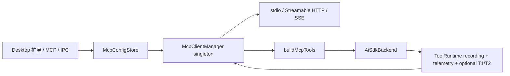

<!--
  Licensed to the Apache Software Foundation (ASF) under one
  or more contributor license agreements.  See the NOTICE file
  distributed with this work for additional information
  regarding copyright ownership.  The ASF licenses this file
  to you under the Apache License, Version 2.0 (the
  "License"); you may not use this file except in compliance
  with the License.  You may obtain a copy of the License at

      http://www.apache.org/licenses/LICENSE-2.0

  Unless required by applicable law or agreed to in writing,
  software distributed under the License is distributed on an
  "AS IS" BASIS, WITHOUT WARRANTIES OR CONDITIONS OF ANY
  KIND, either express or implied.  See the License for the
  specific language governing permissions and limitations
  under the License.
-->

# Maka MCP runtime architecture

状态：remote 与 stdio dual-era V3 implemented（2026-08-25）

跟踪：[MCP 2026-07-28 dual-era rollout #1650](https://github.com/apache/maka/issues/1650)

## 1. 目标与边界

Maka 的 MCP 接入必须复用现有 `MakaTool` execution boundary，而不是建立第二套 agent loop。MCP manager 负责连接、发现和调用；runtime adapter 把远端 tool 投影成动态 `MakaTool[]`。因此 MCP tool 复用 ToolRuntime 的 pre-implementation recording、abort、telemetry、result normalization 和 loop gate；这不代表当前普通路径存在 per-call PermissionEngine，也不代表每次调用都具有 durable T1/T2。

当前支持：

- local `stdio` 与 remote Streamable HTTP 都可选择 legacy、自动协商或精确 pin `2026-07-28`；legacy SSE 只允许 legacy。
- 旧配置省略 `stdio.protocol` 时仍只启动一个 legacy server。用户显式选择 stdio `auto` 或 `2026-07-28` 后，官方 SDK 才获准先启动同 command/args/cwd/env 的一次性探测进程，再在探测进程完全退出后启动实际 server。
- 自动 transport 仅在 Streamable HTTP 尚未产生协议证据、SDK 返回精确 404/405 not-implemented 分类且调用未 abort 时，才 fallback 到 legacy SSE。
- `tools/list` pagination、tool call timeout 和 abort；legacy 使用 unsolicited `notifications/tools/list_changed`，modern 使用经 server acknowledgement 的 `subscriptions/listen`。
- modern server 未声明 tools capability 时不发送 `tools/list`；list-change 由 Maka 做 bounded/coalesced refresh，不把 SDK auto-refresh 作为第二份 snapshot authority。
- modern Streamable HTTP 对 SEP-2243 `x-mcp-header` 做 bounded validation；非法定义只排除对应 Tool，unsafe integer argument 在发送前本地失败。
- text、image、audio、embedded resource、resource link content；MCP `isError` 进入 Maka error path。
- workspace-scoped `mcp.json` 使用 version 3；version 1/2 wrapper 读取时保持各自 legacy 语义，只有显式 mutation 才迁移落盘。
- 首页侧边栏「扩展 > MCP」模块，提供市场模板、搜索、JSON import、CRUD、test、status/tool list，以及配置变化后的 backend cache invalidation。
- bundled catalog 对 executable package 固定已核验版本；需要 credential、OAuth 或路径选择的模板默认 `enabled: false`，setup 完成前不启动 server。
- market install 是可取消 transaction：renderer 展示明确的 installing/cancelling 状态，main process abort 对应 connect、等待未完成的 config write settle，再 rollback config 并 reconcile tool snapshot。

当前 rollout 不包含 resources UI、resource subscription 和给 subprocess 使用的 loopback proxy。协议层保留 transport 和 content contracts，后续按独立 PR 扩展。

## 2. 调研结论

### 本地桌面客户端

逆向调研的成熟桌面客户端使用官方 MCP SDK，并支持 stdio、Streamable HTTP、SSE fallback、tools、resources/templates、resource notifications/subscription 和 OAuth 2.1 + PKCE。值得采用的是 transport fallback、分阶段 timeout、stderr tail 和丰富 content block；不采用 stop-all/start-all refresh、base64 token fallback、未经约束的 stdio env inheritance 和不完整的 JSON Schema 转换。

### 开源 agent 客户端

调研的开源实现使用 centralized client pool，backend 共享 source connection，并通过 stable proxy tool name 暴露 tools。它的 stdio validation（单 process、idle watchdog、hard ceiling、stderr tail 和具体错误诊断）值得采用。Maka 不照搬其 sensitive-env denylist、缺少 SSE、把 result 全部扁平化为 text，以及只比较少数字段的 config reconciliation。

## 3. 组件与数据流



- `@maka/core/mcp`：无 I/O 的 config、status、tool/content contract。
- `@maka/storage`：owner-only atomic `mcp.json` store。
- `@maka/mcp`：官方 SDK client lifecycle、transport、pagination、notifications、diagnostics。
- `@maka/runtime/mcp-tools`：MCP schema/content/annotations 到 `MakaTool` 的适配。
- Desktop main：唯一 manager 实例；renderer 永不持有 MCP client 或 child process。

## 4. 配置 contract

```json
{
  "version": 3,
  "mcpServers": {
    "filesystem": {
      "enabled": true,
      "command": "npx",
      "args": ["-y", "@modelcontextprotocol/server-filesystem", "/tmp"],
      "env": {},
      "cwd": "/tmp",
      "protocol": "auto"
    },
    "remote-service": {
      "enabled": true,
      "url": "https://mcp.example.com/mcp",
      "transport": "streamable-http",
      "protocol": "auto",
      "headers": {}
    }
  }
}
```

Server id 是稳定 identity。配置 reconciliation 使用完整 normalized config fingerprint；新增/删除/修改只影响对应连接。`protocol` 可出现在 stdio 或 remote config，省略始终表示兼容旧配置的 legacy。新建 Desktop remote 显式写 `auto`，新建 Desktop stdio 显式写 `legacy`；SSE 则收敛为 legacy。

version 1、缺失 version 或 version 2 的 wrapper 可单向读取为 version 3 projection，但 `get()` 不静默改写文件；`transform`、`upsert` 或 `remove` 才持久化 version 3。version 1 不接受任何 `protocol`，version 2 只接受 remote `protocol`，version 3 才允许 stdio `protocol`。当前客户端遇到显式未知/未来 wrapper 或 malformed JSON 必须拒绝，不能用一次导入绕过原文件的读取失败并覆盖其原始字节。Desktop renderer 只提交原始 JSON；main process 在 storage normalizer 内解释 wrapper/direct-map、与当前配置合并并持久化，因此导入和正常写入不会形成两套 schema authority。remote headers 仍位于 `mcp.json`，文件和目录分别强制 `0600`/`0700`；后续迁移到 Keychain-backed credential store。

stdio `protocol` 不只是 wire-format 偏好，也是进程副作用授权：

- `legacy`（包括旧配置省略字段）直接启动一个实际 server，不产生探测进程。
- `auto` 先启动一次性 sibling probe；若 command 支持 modern，则等待 probe 退出后再启动 actual child；否则 SDK 按 legacy 连接。探测进程的 stderr 被忽略，不能污染 actual child 的诊断。
- `2026-07-28` 同样使用 sibling probe，但只接受 modern；不匹配时失败，不启动 actual child。

探测和实际连接的协议判断由官方 SDK client v2 独占。Maka manager 只传递偏好、持有当前 actual transport，并在 abort/timeout 时关闭 candidate；它不复制 probe 状态机、不维护 PID registry，也不缓存另一份 negotiated-protocol truth。

Bundled catalog 不是第二份 runtime truth：点击安装只把选中的模板写入同一个 `mcpServers` map。需要 setup 的模板以 disabled snapshot 落盘，用户补齐配置并主动启用后才参与连接；不允许用“已写入配置”冒充“已授权”或“已连接”。

## 5. 安全与权限

- stdio 默认只继承运行所需 allowlist：`PATH`、`HOME`、`USER`、`SHELL`、`LANG`、`LC_*`、`TMPDIR`、`XDG_*` 和 Windows system variables。配置中的显式 `env` 最后覆盖。
- 普通配置型 MCP tool 默认为 `categoryHint: network_send`，用于 trace 分类和 Plan-mode exclusion；它本身不是用户审批机制。`readOnlyHint` 是不可信的 server advisory，不能降低这个分类。受信任的 host composition 可以显式选择更严格的 category/recovery policy，但该 authority 来自 Maka composition，而不是 server annotation。
- Direct/Code Mode 的 managed execution 在 provider dispatch 前由 runtime adapter 检查 `ExecutionBoundary`；network 尚未启用时必须先通过 `requestSandboxBoundary`。协议协商只改变 manager 内部 wire codec，不能绕过这条授权路径。
- manager 只提供 generation-bound tool snapshot 和远端调用。ToolRuntime 总是在 implementation 前投影 `tool_call` / `tool_start`；只有 host 配置 `runtimeCommitSink` 时，才要求 durable T1 在 provider side effect 前成功，并在结果后写 T2。没有 sink 的路径不得声称拥有 durable operation id 或 T1/T2 recovery authority。
- main-process store boundary 对 IPC payload 做 runtime validation，不接受 prototype keys、空 command、非 HTTP(S) URL、非法 headers/env。
- catalog 中的 executable package 必须 pin 到 reviewed version；stdio credential 优先走显式 env，不进入 process args。当前显式 env 仍受 owner-only 文件边界保护，不能等同于 encrypted secret storage。
- tool 名为 `mcp__{serverId}__{toolName}`；仅允许 provider-safe characters，超过 64 chars 时使用 stable hash suffix，并检测 collision。
- rich output 对 model text、image count/总 base64 大小和 summary block 数量做 aggregate bounds；audio、resource blob 和 unknown payload 不直接注入 model context。

## 6. Lifecycle 与错误语义

每个 server 只有一个 active connection promise，避免并发重复 spawn。manager 在 candidate 创建时就持有取消权：即使 SDK 的 remote `server/discover` 或 stdio sibling probe 尚未消费 caller signal，abort 也会关闭 candidate transport，不允许迟到握手继续产生网络或进程行为。stdio probe 必须先完全退出，actual child 才能启动；connect 失败必须关闭半连接 client/transport；disconnect 并发启动 subscription、client 和 transport teardown，不能先等待一个可能永不返回的远端 cancellation response。

modern tool-list subscription 只有在 server 声明 capability 且 acknowledgement honor 对应 filter 时才成为 live refresh source。missing、rejected、unhonored 或 non-local close 会进入独立 subscription diagnostic，但不会伪装成 transport disconnect，也不会丢弃上一份可调用 tool snapshot。普通 client/tool 错误不能冒充 subscription 错误；refresh 与 subscription diagnostics 使用独立生命周期槽，成功 refresh 只清除 refresh failure，reconnect 才重建两者。

每个 connection generation 只有一个 `ToolDiscoveryState`。initial discovery、显式 refresh、legacy notification 与 modern subscription signal 都推进同一个 change epoch，并共享同一个 in-flight promise；只有仍拥有当前 client、generation、discovery state 和最新 epoch 的 transaction 才能发布。发布结果仍是唯一的 immutable `ToolSnapshot { revision, tools }`，subscription、status 和 renderer 都不维护第二份 callable registry 或 revision。

install operation 以 server id 串行化。取消时先标记 operation 并 abort active connect，再等待已经开始的 store write 完成；只有随后执行 remove + manager reconcile，才能避免迟到的 upsert 让已取消条目“复活”。renderer 也保留 cancellation marker，防止旧 install promise 覆盖 rollback 后的新 UI state。

timeout 默认值：remote connect 30s、stdio connect 60s、list 15s、call 10min。caller abort 优先于 timeout。协议 `isError` 转为带 server/tool context 的异常；modern `input_required` 不由 manager 自动满足或重试；transport/timeout/validation 分别保留可诊断 message，stdio error 附带最多十行经过 redaction/truncation 的 stderr tail。

配置变更或任一 era 的 tool-list change 后 manager 先 reconcile，再使 cached backends 失效；正在执行的 turn 不被强杀，invalidation 会在最后一个 active run 完成时释放旧 backend，确保下个 turn 创建包含新 tool snapshot 的 backend。connected status 只展示本次 SDK 实际协商出的 era/revision；connecting、error 和 disconnected 不复用过期协商结果。

## 7. 当前验收标准

1. stdio fixture 可完成 connect → paginated discovery → call → structured content projection → disconnect。
2. `isError`、timeout、abort、startup failure 和经过 secret redaction 的 stderr diagnostics 有自动化覆盖。
3. config store 能拒绝非法输入、并发写不损坏、POSIX mode 为 `0600`。
4. tool name 在 64 chars 内稳定、无 collision；不可信 annotations 无法降低普通 MCP tool 的 `network_send` 分类或让它进入 Plan mode，model output aggregate bounds 有测试。
5. Desktop 首页侧边栏仅在「扩展」分组下提供「技能」和「MCP」；MCP 模块可搜索市场模板、JSON import、添加、编辑、启停、测试和删除 server，状态与 tools 可见。
6. market `+` 在安装中变为 progress indicator，hover/focus 变为可访问的取消操作；取消后 config 不复活、server 不残留、tools 不可见。
7. 更新配置后新 turn 看见新 tools，删除后 tools 消失。
8. targeted tests、workspace typecheck/build、full tests 和 Electron smoke 必须通过。
9. remote legacy/auto/exact pin、modern missing-tools、structured JSON、`input_required`、窄 SSE fallback 和无响应 probe cancellation 有真实 HTTP fixture 覆盖。
10. modern subscription acknowledgement、initial-list race、burst coalescing、独立 diagnostics、non-local close 和无响应 cancellation teardown 有真实 SDK/event-bus fixture 覆盖。
11. SEP-2243 定义 partition、bounded warning、safe integer 和 wire 前失败有自动化覆盖；legacy 路径不误启用 modern header 语义。
12. stdio 省略 protocol 只启动一个 legacy child；`auto`、legacy/modern exact pin、probe/actual 顺序、probe stderr 隔离，以及 probe 前或进行中的 abort 都有真实 child-process fixture 覆盖。

## 8. 后续 backlog

- OAuth 2.1 authorization server metadata、PKCE、dynamic client registration 和 Keychain token persistence。
- resources/templates browse、read、subscribe/unsubscribe 及 host UI。
- authenticated loopback MCP proxy，供受控 subprocess client 共享 pool。
- per-server health/backoff/automatic crash recovery 与 finer-grained permission policy。
- signed remote catalog、last-known-good cache、guided setup schema、package provenance 与 update permission diff。
