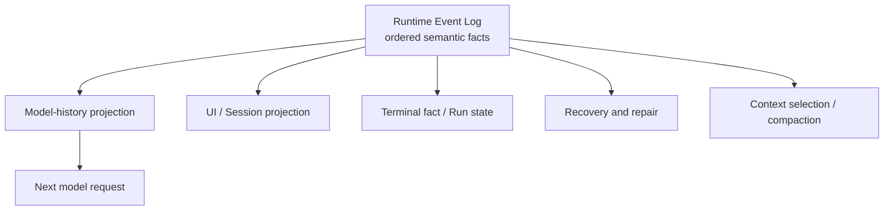
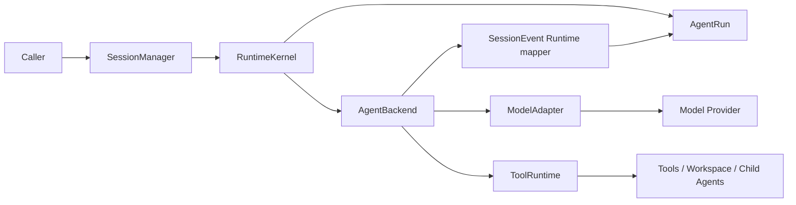
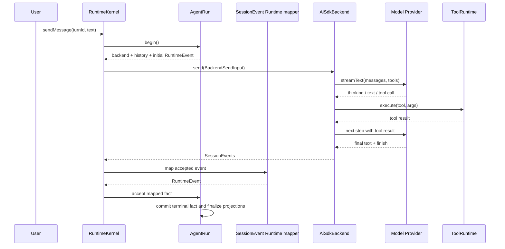

<!--
  Licensed to the Apache Software Foundation (ASF) under one
  or more contributor license agreements.  See the NOTICE file
  distributed with this work for additional information
  regarding copyright ownership.  The ASF licenses this file
  to you under the Apache License, Version 2.0 (the
  "License"); you may not use this file except in compliance
  with the License.  You may obtain a copy of the License at

      http://www.apache.org/licenses/LICENSE-2.0

  Unless required by applicable law or agreed to in writing,
  software distributed under the License is distributed on an
  "AS IS" BASIS, WITHOUT WARRANTIES OR CONDITIONS OF ANY
  KIND, either express or implied.  See the License for the
  specific language governing permissions and limitations
  under the License.
-->

# 第一章：Log Is the Runtime——Maka 如何回放 Agent 的状态空间

> 本章回答一个核心问题：Maka 如何保存一次 Agent 运行真正经历过的状态空间，并在下一轮、进程重启或新投影中重新得到它？答案是 Runtime Event Log。模型循环负责产生事实；Event Log 保存事实；Session、Run、UI、模型上下文和恢复逻辑都是这份日志的消费者或投影。

本文面向第一次进入 Maka Runtime 的工程师，也面向需要修改运行主链的维护者。读完前半部分，你应该能说清一次运行经过哪些边界；读完整章，你应该能定位主链代码，并理解修改终止、工具或持久化逻辑时必须保护哪些不变量。

本文描述的是截至 2026-08-23 已在生产主链中落地的实现。历史设计文档中的阶段性计划不作为当前事实。

## 从一个看似简单的请求开始

假设用户对 Maka 说：

> 找出这个项目里失败的测试，修复问题，然后重新运行测试。

如果 Maka 只是一个聊天应用，执行路径可能只有三步：把文字发给模型、等待回复、把回复显示出来。但 Agent 的真实执行过程更像这样：

1. 模型先阅读项目和测试输出。
2. 模型调用文件、搜索或终端工具。
3. 某些工具需要用户授权，运行暂时停住。
4. 工具可能持续输出，也可能失败、超时或被取消。
5. 工具结果回到模型，模型决定下一步。
6. 这组“模型 → 工具 → 模型”的步骤重复多次。
7. 最后，系统必须明确判断这次运行究竟完成、失败，还是被用户中止。

过程中，界面需要实时显示文本和工具活动；下一轮模型需要读到可信历史；应用崩溃重启后，系统不能永远停在“运行中”；用户按下停止按钮后，迟到的 provider 事件也不能把状态重新写成“完成”。

所以，Runtime 真正解决的不是“怎样调用一次 LLM API”，而是：

> 如何把一个包含流式输出、工具副作用、用户介入和进程故障的开放式循环，记录成一段可以重新解释和回放的事实历史。

## 先说结论：状态不是一张表，而是日志的函数

Maka Runtime 最核心的设计判断，不是选择了哪个模型 SDK，也不是把执行逻辑拆成了多少层，而是：

> **Runtime Event Log 才是 Agent 交互的语义事实源。系统在某一时刻的状态，是这段有序日志经过某种投影之后的结果。**

可以把它写成一个简单的关系：

```text
State(t) = Project(RuntimeEvents[0..t], policy, runtime configuration)
```

同一段日志可以被不同消费者解释成不同状态：

- Model History Projector 得到下一次模型调用需要看到的 messages；
- Runtime Read Model 得到 UI 需要展示的对话、工具活动和 Turn 状态；
- Terminal Fact Classifier 得到一次 Run 的最终结果；
- Recovery 逻辑判断进程退出前哪些事实已经 durable；
- Context Budget 与 compaction 策略得到一个更小、但保留关键语义的工作上下文；
- 未来的调试器可以把读取位置停在任意事件边界，观察当时的 Agent 状态空间。



这张图从中间开始读：`Runtime Event Log` 是稳定事实，其余节点是可以演进、重建或替换的派生视图。它刻意省略了事件生产路径；事件由哪些组件产生，会在后文解释。

这与普通 application log 有本质区别。普通日志通常是在业务执行之后描述“代码做过什么”，主要供人排障；RuntimeEvent 本身就是业务语义的一部分。用户消息、模型回复、thinking、function call、function response、权限动作、usage 和 terminal status 都以强类型事实进入日志。删除这份日志，系统就失去了可靠重建交互状态的基础。

## 一条 RuntimeEvent 保存了什么

`RuntimeEvent` 不只是 `role + text`。它把一条事实拆成几组正交信息：

| 维度 | 关键字段 | 意义 |
|---|---|---|
| Identity | `sessionId`, `invocationId`, `runId`, `turnId`, `branch` | 这条事实属于哪段会话、调用、执行尝试和分支 |
| Ordering | `id`, `ts` 与 ledger 顺序 | 这条事实在因果历史中的位置 |
| Source | `role`, `author` | 它在模型历史中扮演什么角色，由谁产生 |
| Content | text, thinking, function call/response, error | AI 交互本身的语义内容 |
| Actions | state delta, permission, artifact, usage, end invocation | 它要求 Runtime 怎样改变控制状态或记录副作用 |
| Correlation | tool call、provider event、step 与 artifact refs | 怎样把跨系统的同一件事重新配对 |
| Lifecycle | `partial`, `status` | 它是可替换的流式片段，还是持久事实或终止事实 |

这种结构保留的不是 UI 已经格式化好的聊天文本，而是模型交互的原始语义。尤其是：

- thinking 可以带 provider 需要的 signature；
- tool call 与 tool result 通过稳定 ID 配对；
- tool call 还能指向它所属的 assistant step；
- sandbox boundary 请求与决定是 action，而不是一段伪装成聊天的文字；
- terminal event 明确关闭一次 Invocation，而不是靠“最后一条消息看起来像回答”来猜测。

因此，模型历史不需要从 UI transcript 反向解析。它可以从 RuntimeEvent 中选择 non-partial、model-visible 的事件，保持顺序，再根据 provider 能力物化成 text-only 或 provider-native messages。UI 同样不需要成为事实源，它只是另一种 projection。

## “回放状态空间”究竟意味着什么

这里的 replay 有三个层次，需要精确区分。

### 语义回放：当前已经成立

给定 RuntimeEvent ledger，Maka 可以重建用户/模型文本、thinking、工具调用与结果、权限动作、usage 和 terminal fact。下一轮模型历史与 completed Session read model 都已经优先从这份 ledger 构造。

这意味着我们能回答：在某个事件边界之前，模型已经看到了哪些交互？它调用过什么工具？工具返回了什么？哪些权限被请求或决定？一次 Invocation 是否已经结束？

### Provider-native 回放：有能力门控

不同 provider 对 tool history 和 signed thinking 的要求不同。Maka 不会把所有事件盲目塞回模型，而是先建立 replay plan：检查 partial、tool call/result 配对、step ID、thinking signature 和 provider 支持，再决定走 provider-native、text-only，还是明确降级。

这一步很重要。可回放不等于“把 JSONL 原样发给任何模型”；它意味着保留足够丰富的事实，让投影器能够为具体 provider 生成合法的历史，同时显式报告语义损失。

### Bit-exact wire replay：不能只靠 message log 宣称

RuntimeEvent 保存了 AI 交互的 canonical message semantics，但当前并不等于完整快照每次 provider HTTP 请求的原始字节。System prompt、工具 schema、provider options、模型实现版本以及 context selection/compaction policy 仍参与最终 request 的生成；当前系统记录了其中一些 identity、diagnostic 和 hash，但没有把整个 wire request 都复制进 RuntimeEvent ledger。

因此，本章所说的“状态空间回放”首先是**交互语义与 Runtime 状态的可重建性**。如果未来要承诺 bit-exact deterministic replay，还需要对运行配置、prompt、tool catalog、投影策略和 provider request shape 做版本化或快照化。这不是削弱 Event Log 的价值，反而说明它提供了正确的基础：message facts 保持稳定，request materialization 可以独立演进。

## 两条思想来源

这个设计有两条明确的思想脉络。

第一条来自 Google ADK。ADK 把 Session 看作带有时间顺序 Events 的事实容器；Event 同时承载 content、author、invocation identity、partial 标记与 actions，Session state 通过事件中的 state delta 更新，模型工作上下文则从事件历史选择和转换得到。Maka 借鉴的关键不是字段长得相似，而是：**Session history 是事实，working context 是计算出来的 projection。**

第二条来自分布式数据系统中的 log-first 思想。数据库 WAL、replicated log、event sourcing 和 Kafka 共享一个重要直觉：不要把每个下游视图都当作独立真相；先保存有序、不可含糊的变化事实，再让消费者重建自己的状态。只要事件顺序和提交边界可信，缓存、索引、搜索视图乃至部分损坏的状态表都可以重新生成。

Maka 并不是在进程内实现了 Kafka，也没有声称 RuntimeEventStore 是一个分布式共识日志。借鉴的是更基础的设计原则：

> **Log is the source of truth; state is a materialized view.**

这一原则直接解释了后文最重要的 terminal invariant：Run header 不能凭自己宣布完成，它必须得到 terminal RuntimeEvent 的支持。

## 三种生命周期身份，加一个关联字段

理解主链之前，需要先分清三个经常被口语化混用的生命周期概念。

| 概念 | 它回答的问题 | 当前实现中的身份 |
|---|---|---|
| Session | 这些对话和运行属于哪段长期交互？ | `sessionId` |
| Turn | 用户界面中的这一轮问答是哪一轮？ | `turnId` |
| Run | 这一次具体执行尝试是谁？状态是什么？ | `runId` / `AgentRun` |

RuntimeEvent 仍保留 `invocationId` 作为兼容与事件关联字段。生产主链把它绑定到 Run 身份；它不再对应单独的 Invocation 生命周期对象或 Runner 层。

这里最重要的判断是：**Turn 不是 Run，聊天消息也不是执行状态。** 一个用户可见的回合需要一个系统可追踪的执行封套；否则，系统只能知道“出现过一些消息”，却无法可靠回答“这次执行是否真正结束”。

## 围绕 Event Log 运转的执行主链

所有 hosted execution 路径共用下面这条 Runtime 主链：



从左向右读这张图：越靠左，越接近产品入口和长期 Session；越靠右，越接近一次 provider 请求和具体工具副作用。图中省略了存储投影和事件账本，它们会在后文单独解释。

这不是为了把一个函数拆成很多类。更准确地说，这些组件分担了 Event Log 的生产、规范化、提交和消费责任；每一层都在保护一种不同的稳定性：

### `SessionManager`：稳定的产品入口

`SessionManager.sendMessage()` 是外部调用者看到的门面。它现在很薄：读取和管理 Session 的公共能力保留在这里，而真正的执行直接委托给 `RuntimeKernel.startTurn()`。

这个边界让桌面端、CLI、Bot 和 Eval 调用者通过 Runtime Host 工作，不必理解 Run ledger、Flow 或 terminal fact。Runtime 内部可以在 Host 协议后演进。

### `RuntimeKernel`：活跃执行的控制面

`RuntimeKernel` 把一条 Session 请求组织成一次可运行的 Run。它负责：

- 创建 `AgentRun`；
- 创建或复用绑定到 Session 的 Backend；
- 注册活跃 Run，并维护 `turnId → runId` 映射；
- 把停止和权限响应路由到正在运行的 Backend；
- 驱动 Backend 事件流并映射 RuntimeEvent；
- 统一处理 abort 路由、单终态、终态后静默排空和缺失终态失败；
- 让 RuntimeEvent 落盘后，再把原有 `SessionEvent` 流交还调用者；
- 在 Backend 流收尾时确保 `AgentRun.finalize()` 被执行。

它是 orchestration boundary，而不是模型循环本身。Backend 不应该负责“这个 Session 目前有哪些活跃 Run”，产品入口也不应该负责“终止 RuntimeEvent 是否已经持久化”。这些跨层协调都收敛在 Kernel。

### `AgentRun`：一次执行的 Durable Envelope

`AgentRun` 让一次执行在持久世界里有身份和生命周期。开始运行时，它会：

1. 创建 `AgentRunHeader`，初始状态为 `created`；
2. 对顶层 Run 写入用户消息和 `running` Turn 投影；
3. 写入本轮初始用户 `RuntimeEvent`；
4. 锁定本 Session 的连接配置；
5. 确保 Backend 已创建并注册为活跃 Run；
6. 将 Run 标记为 `running`；
7. 从此前的 RuntimeEvent ledger 构造模型历史。

运行过程中，`AgentRun` 同时接收旧的 `SessionEvent` 与新的 `RuntimeEvent`，并把它们写入各自所属的投影或账本。结束时，它注销活跃 Run、收敛 Session/Turn 状态，并提交最终 Run 状态。

可以把 `AgentRun` 理解成一次执行的“耐久封套”：它不决定模型下一步调用哪个工具，但它保证这次执行是谁、发生了什么、最后以什么状态结束。

### `RuntimeKernel`：一个执行所有者，一套终态协议

Runtime 不再在 `AgentRun` 和 `AgentBackend` 之间插入通用 Runner/Flow 壳。`RuntimeKernel` 直接拥有生产主链的协议：

- `AgentRun.begin()` 在 Backend dispatch 前持久化初始用户 RuntimeEvent；
- `AgentBackend.send()` 前重新校验精确的活跃 Run；
- abort signal 路由到绑定具体 Backend generation 的 stop 函数；
- Backend 事件先映射并由 `AgentRun` 耐久接收，再作为 `SessionEvent` 暴露；
- 第一个被接受的 terminal fact 获胜，随后静默排空 Backend；
- Backend 抛错或流结束时缺少终态，都会收敛成结构化失败；
- durable continuation 消费一次性 start-admission proof，并且不伪造新的 user event。

### `SessionEvent Runtime mapper`：旧事件流与 Runtime 事实之间的桥

当前模型/工具循环仍然由 `AgentBackend.send()` 产生 renderer-facing `SessionEvent`。`session-event-runtime-mapper.ts` 把被接受的事件逐个映射成 canonical `RuntimeEvent`：

- 模型文本和 thinking 变成 model content；
- `tool_start` / `tool_result` 变成 function call / response；
- 权限请求和决定变成一等 runtime actions；
- token usage 变成 runtime action；
- error、abort 和 complete 变成明确的失败或终止事实。

mapper 是确定性的，不拥有 streaming、stop、dispose 或 admission。生命周期决策全部属于 `RuntimeKernel`；mapper 只负责 Backend 事件入口的词汇转换。

### `AgentBackend`：模型与工具循环真正发生的地方

对默认的 `AiSdkBackend` 来说，核心循环仍在 `send()` 内部。它会：

1. 解析模型并准备本轮可见的工具集合；
2. 从 RuntimeEvent 历史构造 provider messages，并应用上下文预算策略；
3. 组合 system prompt、当前用户输入和附件；
4. 通过 `ModelAdapter` 启动 AI SDK `streamText()`；
5. 读取 text、thinking、step boundary、finish reason 和 usage；
6. 让 AI SDK 在模型发起 tool call 时进入 `ToolRuntime`；
7. 将工具结果交回下一步模型请求；
8. 重复模型/工具 step，直到模型结束、达到上限、发生错误或被中止。

step 上限是可选的：`maxSteps` 为 `undefined` 时不设限，由模型自己决定何时收尾。若设置了上限而模型在上限处仍要求继续调用工具，Runtime 会保留已经产生的工具结果，并在没有最终文本时补充一条确定性的提示，让用户可以在新 Turn 中继续，而不是留下一个没有收尾文本的界面。

`ModelAdapter` 隔离 provider 与 AI SDK 差异，包括模型创建、stream 启动、chunk 归一化、usage 归一化和错误分类。`ToolRuntime` 则隔离工具执行的高风险部分，包括工具可用性防守、权限、超时/中止传递、重复失败拦截、工具输出、遥测和 artifact 记录。

## 模型循环是怎样向前推进的

下面这张时序图聚焦一次包含工具调用的正常运行。它刻意省略了部分遥测和兼容投影，只展示控制权如何在模型与工具之间转移。



AI SDK 的 step 是这个循环的自然节拍。Maka 会按 step 持久化 assistant text/thinking，而不是把整个 Turn 压成一条最终 assistant message。工具调用会携带对应的 step ID，使 thinking、文本和工具调用在 replay 时仍能重新组成原来的执行顺序。

工具运行期间，模型 provider 不会继续输出。`ToolRuntime` 会暂停模型流的 idle watchdog，因为这段安静是预期行为；具体工具仍然可以有自己的超时，而更外层的 Run 或评测系统继续充当最终 backstop。

## 权限不是弹窗，而是 Runtime 控制流

当一次工具调用越过当前沙箱边界时，工具不会静默失败，Runtime 也不会由 UI 自行弹一个对话框把执行挂起。工具返回一个带 `sandbox_boundary_required` 与具体 `expansion` 的失败结果；模型据此调用 `request_sandbox_boundary` 发起一次**边界扩张请求**，运行停在一个有身份的位置上等待答复。

等待期间，Session 投影为 `waiting_for_user`，但 Run 仍然保留自己的执行身份 —— 它没有结束，只是停住了。用户的决定通过 `RuntimeKernel.respondToSandboxBoundary()` 路由回当前 Backend；同一条路径上还有 `respondToUserQuestion()`，用于模型主动向用户提问的场景。两类请求在未答复期间都由 `RuntimeKernel` 登记为 active interaction，因此一个错过了实时事件的界面可以重新拉取待答项，而不会把运行晾在那里。

这个设计的关键是：权限不是 UI 自己暂停了一下。请求和决定都作为带类型的事实进入 Runtime 事实模型 —— 它们没有 `content`，而是带 `actions.stateDelta` 的系统事件。因此重放、诊断和恢复都能解释运行为什么停住，以及控制权如何回来。决定那条事实的 `role` 是 `system`、`author` 是 `user`：它在模型历史里属于系统泳道，但产生它的是人，这一对正交字段把这件事表达出来，而不需要把用户决定伪装成一条聊天消息。

`RuntimeKernel` 在映射和持久化前丢弃 `permission_request` / `permission_answer_ack` / `permission_closure_ack` / `permission_decision_ack` 这组遗留词汇：它们已被 sandbox boundary 事件取代，不能再成为活的运行时事实。

## 一份语义事实，两类辅助状态

Maka 当前同时维护三类持久数据。它们不是三个地位相同的“真相”，也不是重复保存同一份聊天。`RuntimeEventStore` 是 AI 交互的 canonical semantic log；另外两类存储承担产品投影与运行运维状态。

| 存储 | 主要内容 | 它最适合回答的问题 |
|---|---|---|
| `SessionStore` | 用户、assistant、工具和 turn-state 等 `StoredMessage` | UI 与兼容接口要展示什么？活跃流有哪些即时投影？ |
| `AgentRunStore` | Run header 与 operational Run events | 这次 Run 何时开始、当前状态、在哪个模型或工具阶段失败？ |
| `RuntimeEventStore` | canonical RuntimeEvent 与有界 partial snapshots | Agent 交互发生过哪些语义事实，其他状态应如何重建？ |

当前实现由 SQLite 承载，而不是每个 Run 一个目录：`AgentRunStore` 与 `RuntimeEventStore` 都建立在同一份 operational state 数据库之上，RuntimeEvent 落在 `runtime_events` 表。顺序由该表的 `event_seq` 承担，并以 `(invocation_id, event_seq)` 唯一约束保证一次 Invocation 内序号不重复——“有序日志”在存储层就是这条约束。四个身份各占一列，因此“这个 Session 的这次 Run 的这个 Turn 发生了什么”是一次索引查询。

`AgentRunStore` 的事件更像 operational index：model stream 开始、tool started、边界请求、usage recorded。它帮助快速诊断和管理 Run，但不替代模型交互日志。`RuntimeEventStore` 的事件才是可重建的语义事实：用户内容、模型内容、function call/response、边界与提问动作，以及 terminal fact。

对于已经完成且 ledger 完整的 Run，读取与下一轮模型 replay 优先依赖 RuntimeEvent。`SessionStore` 仍然承担兼容投影和 in-flight 展示，不能简单删除；但它不再是 completed runtime 语义的唯一权威。

流式 text/thinking partial 不会被无限追加进账本。RuntimeEventStore 为可替换的流维护有界 partial snapshot，最终 non-partial 事件到达后覆盖其语义位置。这既保留崩溃时已经展示的部分输出，也避免 10,000 个 delta 变成 10,000 条长期账本记录。

## Log-first 的关键不变量：先有终止事实，再提交终止状态

Runtime 最容易出现的一类故障，是不同存储对“是否结束”给出不同答案。例如：

- Run header 写成 completed，但 RuntimeEvent ledger 没有 terminal event；
- 用户已经 stop，但迟到的 complete 又把 Session 写回 active；
- Backend 流耗尽，却从未说明它是成功还是失败；
- terminal event 已写入，但进程在更新 Run header 前崩溃。

Maka 当前保护的核心不变量是：

> 一个终止的 Run 必须有且只有一个有效 terminal RuntimeEvent；终止的 Run header 必须能够由这个 terminal fact 支撑。

因此，`AgentRun` 在提交 terminal Run header 前，先要求 terminal RuntimeEvent 成功落盘。没有终态的 Backend stream 会被合成为 `missing_terminal_event` 失败；重复终态由 Kernel 合并；状态不匹配、来自其他 Run 或标记为 partial 的 terminal event 都会被拒绝。

如果 terminal RuntimeEvent 已经存在，但 Run header 因中断仍是 `running`，read model 可以把 terminal event 作为更强事实来解释运行结果，并在恢复时修复 header。反过来，如果 header 声称已经结束却没有可信 terminal fact，系统不会盲目信任 header，而会保守地修复为 `missing_terminal_event` 失败。

这条不变量让恢复不必“猜模型当时准备做什么”。系统只需要判断哪些事实已经 durable，然后把各个投影收敛到同一个可解释终态。

## Stop、错误与崩溃如何收敛

### 用户停止

`RuntimeKernel.stopSession()` 会先把所有活跃 `AgentRun` 标记为 stopped，再调用 Backend 的 `stop()`。`AiSdkBackend` 会中止 provider stream、结束正在等待的 sandbox boundary 或用户提问，并产生 abort/complete 事件。即使 provider 随后发送迟到的 complete 或 error，RuntimeKernel 与 AgentRun 也不会允许它覆盖已经确定的 aborted 语义。停止来源，例如 renderer stop button，会进入 terminal fact 与 Run header，供诊断使用。

### Provider 或 Runtime 错误

错误首先被规范化为非终止 error content，随后由 failed terminal event 关闭 Run。`RuntimeKernel` 不允许后续的 completed event 掩盖之前已经观察到的错误。若 Backend 直接抛出异常或流没有终态，Kernel 会产生结构化失败，而不是留下悬空运行。

### 应用崩溃和启动恢复

启动恢复不会重新执行模型请求或工具副作用。它扫描非终止 Run 与 RuntimeEvent ledger，识别 stale model stream、tool tail、未答复的 interaction、损坏的 operational event 等情况，然后保守地提交失败或取消状态，并修复 Session/Turn 投影。

这是“状态修复”，不是 checkpoint resume：它保留已经产生的部分输出，把状态收敛到一个可解释的终态，但不会在进程重启后自动从某个工具调用的下一行继续执行。

继续执行是另一条路径。`safe_boundary_continuation` 从一个经过校验的安全边界接着跑——边界之前的事实全部可信，边界之后的不予采信。它同样不从被打断的那一行开始，区别在于它有一个可验证的起点，而崩溃收敛只是给一次执行下结论。

## 这套设计换来了什么，又付出了什么

### 得到的能力

- 产品入口不依赖具体 provider 或工具循环实现；
- 不同 Backend 通过 Kernel 共享 Run 与 terminal 语义；
- UI 事件与模型可重放事实被明确区分；
- 用户停止、权限和工具副作用进入可诊断的控制流；
- 崩溃后可以依据 durable facts 收敛状态；
- Runtime Host client、子 Agent 和调度器复用同一执行核心。

### 当前代价

- 迁移期同时存在 `SessionEvent`、`StoredMessage`、`RuntimeEvent` 和 operational Run events，事件映射的维护成本较高；
- `AiSdkBackend` 仍然很重，同时组织 history、context budget、tool availability、step loop、usage 与 telemetry；
- `SessionEvent Runtime mapper` 仍承担 legacy-to-canonical adapter 角色，而不是 Backend 原生产 canonical events；
- `SessionStore` 与 RuntimeEvent projection 需要在 active/in-flight 场景中协同；
- 启动恢复是确定性终结与修复，不是从任意位置热续跑。续跑走另一条路：`safe_boundary_continuation` 从一个经过校验的安全边界接着跑，Run header 上是 `continuationSource`，由 `RuntimeKernel` 完成准入和 dispatch；两者的区别见[第八章](./runtime-resume-architecture.zh-CN.md)。

这些不是应该隐藏的实现细节，而是当前架构的真实边界。未来拆分 Backend 或加入 checkpoint 时，首要目标不是减少文件行数，而是保持 request shape、工具可见性、事件顺序和 terminal invariant 不变。

## 代码阅读地图

建议按照下面的顺序阅读当前实现：

1. `packages/runtime/src/session-manager.ts`：公共入口与恢复入口。
2. `packages/runtime/src/runtime-kernel.ts`：Run/Backend 的活跃控制与主链组装。
3. `packages/runtime/src/agent-run.ts`：Durable lifecycle、历史构造和终态提交。
4. `packages/runtime/src/session-event-runtime-mapper.ts`：纯 `SessionEvent → RuntimeEvent` 映射。
5. `packages/runtime/src/ai-sdk-backend.ts`：AI SDK 模型/工具 step loop。
6. `packages/runtime/src/model-adapter.ts`：provider stream 适配。
7. `packages/runtime/src/tool-runtime.ts`：沙箱边界、工具执行和副作用边界。
8. `packages/core/src/runtime-event.ts`：canonical RuntimeEvent 契约。
9. `packages/core/src/agent-run.ts` 与 `packages/storage/src/agent-run-store.ts`：Run 与 RuntimeEvent 的账本契约与 SQLite 实现。

对应的关键测试集中在：

- `packages/runtime/src/__tests__/session-event-runtime-mapper.test.ts`
- `packages/runtime/src/__tests__/session-manager.test.ts`
- `packages/runtime/src/__tests__/session-manager-terminal-ledger.test.ts`
- `packages/runtime/src/__tests__/runtime-ledger-repair.test.ts`

## 小结

Maka Runtime 的核心不在某一个类，也不只是 AI SDK 的多步工具循环。核心是一个可以保留并回放 Agent 交互状态空间的 Runtime Event Log；执行协议围绕这份日志产生事实、提交事实并构造派生状态：

```text
model/tool stepping engine
  → canonical RuntimeEvents
  → durable semantic log
  → model history / UI / Run state / recovery projections
```

`SessionManager` 稳住入口，`RuntimeKernel` 管理活跃执行，`AgentRun` 提交耐久事实，`SessionEvent Runtime mapper` 把 Backend 事件翻译成 canonical facts，而 `AiSdkBackend`、`ModelAdapter` 与 `ToolRuntime` 真正推进模型和工具循环。它们都围绕 Runtime Event Log 协作，而不是各自保存一份局部真相。

这套结构最终保护的是一件很朴素的事：无论一次 Agent 工作经历多少模型 step、工具副作用、等待用户答复和异常，Maka 都要先忠实记录发生过什么。只要这份有序事实仍在，系统就能重新构造当时的交互状态，生成新的视图，并让下一轮从可信历史继续。

## 延伸阅读

- [Google ADK: Architecting an efficient context-aware multi-agent framework](https://developers.googleblog.com/architecting-efficient-context-aware-multi-agent-framework-for-production/)
- [Google ADK Python: Runner lifecycle and event persistence](https://github.com/google/adk-python/blob/main/AGENTS.md)
- [Apache Kafka Design: replicated logs, state machines, and event sourcing](https://kafka.apache.org/36/design/design/)
