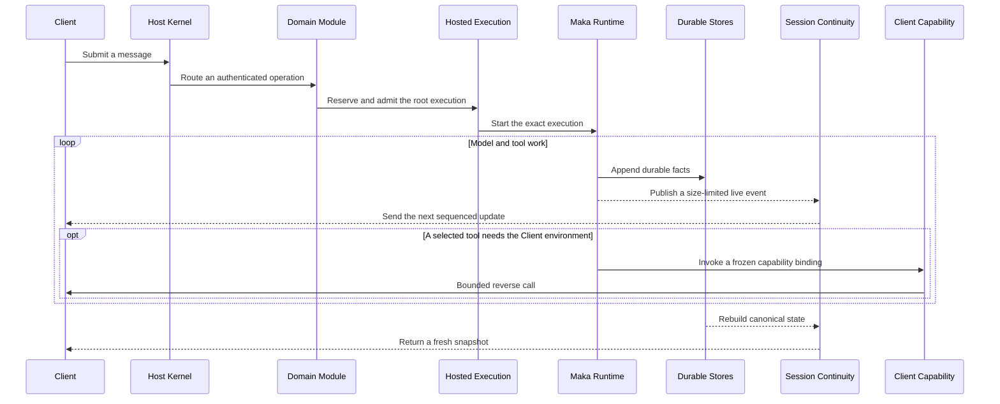

<!--
  Licensed to the Apache Software Foundation (ASF) under one
  or more contributor license agreements.  See the NOTICE file
  distributed with this work for additional information
  regarding copyright ownership.  The ASF licenses this file
  to you under the Apache License, Version 2.0 (the
  "License"); you may not use this file except in compliance
  with the License.  You may obtain a copy of the License at

      http://www.apache.org/licenses/LICENSE-2.0

  Unless required by applicable law or agreed to in writing,
  software distributed under the License is distributed on an
  "AS IS" BASIS, WITHOUT WARRANTIES OR CONDITIONS OF ANY
  KIND, either express or implied.  See the License for the
  specific language governing permissions and limitations
  under the License.
-->

# Runtime Host architecture

> Runtime Host is the long-lived process that owns one State Root and the Runtime work using it. Desktop, TUI, CLI, bots, and evaluation code are Clients. They ask the Host to do work; they do not own a second Runtime.

This chapter explains the stable boundaries needed to maintain Runtime Host or connect a product feature to it. It does not repeat individual protocol schemas or coordinator internals.

In this document, an **owner** or **authority** is the only component allowed to make a particular state transition while the Host is online. It is not necessarily the Client or user that initiated the work.

## Why Runtime Host exists

Runtime work outlives a request connection. A model call may continue after a Desktop window reloads, an authenticated remote Client may disconnect, and a process may restart while durable work is active. The State Root is the directory containing the durable state that must survive those events.

If each Client owns its own Runtime and recovery path, the system gains multiple writers, conflicting Session state, and connection-dependent execution. Runtime Host removes that ambiguity:

- one process owns writes for one State Root;
- Local IPC and authenticated WebSocket use the same durable state;
- business code decides what work means;
- one execution authority admits and stops top-level Session work, tracks its final result, and waits for cleanup.

## Parts in plain language

| Part | Plain meaning |
|---|---|
| Host Kernel | The process gate: owns the State Root's exclusive lease and connections, stops new work, and shuts the process down |
| Host Composition | The fixed startup recipe: creates Stores, shared authorities, and the Module list |
| Domain Module | A static record assigning a group of protocol operations and startup/shutdown duties to one owner |
| Hosted Execution | The traffic controller for top-level Session work: accepts one exact execution, stops or recovers it, and distinguishes its final result from finished cleanup |
| Run Composer | Records the unchanging prompt and tool basis before a provider call |
| Session Continuity | Gives Clients a canonical Session snapshot plus size-limited live updates |
| Client Capability | Lets the Host invoke a capability published by a connected Client without transferring Runtime ownership |

Durable Stores are the recovery source of truth. In the rest of this document, **canonical state** means state rebuilt from those Stores, and a **projection** is a read-oriented view derived from that state.

**Bounded** means that the protocol sets explicit schema, size, count, or time limits instead of accepting arbitrary work or payloads.

The execution names also describe different scopes:

| Name | Scope |
|---|---|
| Session | The durable conversation and workspace context |
| Turn | One top-level unit of work represented in that Session, whether started by a user or by the Host |
| Run | The durable execution entity that performs model and tool work for a Turn |
| Root execution | The one top-level execution currently admitted for a Session |

## One Turn through the system



Before requests arrive, the Host Composition has already constructed these parts and assigned each business operation to one Domain Module. Process, diagnostics, upgrade, and access-credential operations remain Kernel-owned. Composition is the startup plan, not an extra service called on every request.

For a user message, the Kernel authenticates and routes the request but does not interpret it. The owning Domain applies message and Session rules, then uses Hosted Execution when root work can start. Before the first provider request, Run Composer freezes and persists the prompt and tool basis. Runtime writes canonical facts, and Session Continuity projects those facts back to every Client.

A Scheduled Task follows the same execution path but starts inside its Domain rather than from a connected Client. This is why Client disconnects do not control execution lifetime.

## Host identities

These values answer different questions and must not be used as substitutes for one another:

| Identity | Plain meaning | Lifetime |
|---|---|---|
| State Root | The directory containing durable Host state; one process holds its exclusive writer lease | Survives Host processes |
| Host Epoch | The identity of the process currently holding that lease | Ends with that process |
| Composition ID | The kind of Host program allowed to interpret the State Root | Persistently bound to the root |
| Composition Revision | The revision of that Composition expected by a Client | Changes when startup wiring or compatibility changes |
| Host Generation | The replacement generation requested by a local owner Client | Shared by one product version, or unique to one development Client process |

A restart changes the Host Epoch. A Composition change may change its Revision. A product-version update or development Client restart may change the Host Generation. None of those changes implicitly moves the State Root or changes its persistently bound Composition ID.

For example, a State Root bound to the interactive Composition cannot be opened by a different kind of Composition. The interactive Composition may evolve to a new revision without changing that persistent identity.

## What each part owns

### Host Kernel owns process lifecycle

The Kernel acquires the State Root's exclusive writer lease, starts listeners, and authenticates connections. Authentication produces an immutable set of permissions for that connection. The Kernel also tracks active operations and **residencies**—explicit reasons the process must remain alive—and drives Composition recovery, drain, and close.

The Kernel does not interpret business state such as messages, tools, Goals, or Scheduled Tasks. New business behavior enters through a Domain Module rather than another Kernel branch.

### Host Composition is the fixed startup plan

The Composition ID, revision, and construction function are chosen before listeners start. Modules are created once during startup and remain fixed after the Host becomes Ready. Diagnostics read the actual Module IDs from that created Composition instead of maintaining a second list.

Each business operation has exactly one Module owner. Composition combines those owners; it does not keep a parallel implementation of their handlers or lifecycle. Kernel operations stay outside Domain Modules.

For example, the interactive Composition constructs Session and Scheduled Task Modules, among others, along with their Stores and shared execution authority. That list is chosen once for the Host process. Composition is not a dynamic plugin registry or per-Session configuration.

Recovery runs through five fixed phases:

1. `state`
2. `resources`
3. `executions`
4. `domains`
5. `schedulers`

This order makes durable state and resources available before executions and business domains recover, and starts schedulers last.

Close runs in reverse Module order. Drain and close attempt every owner and aggregate failures.

### A Domain Module groups operation and lifecycle ownership

A Domain Module is a static record that answers four questions:

- which protocol operations does this group handle;
- what must it recover in each startup phase;
- what new work must it reject during drain;
- which resources and connection-scoped state must it release.

For example, the Scheduled Task Module owns Scheduled Task operations, restores durable scheduling state, starts its scheduler only after recovery, and stops and closes that scheduler during shutdown. When a task fires, the Module still asks the shared Hosted Execution authority to run it; it does not create another Runtime.

A Module does not have to be a separate process, package, or source directory. It may represent one focused feature or a closely related lifecycle group. Construction code passes dependencies directly; Modules do not look them up by name at runtime.

The Domain decides what an execution result means and what should happen next. Hosted Execution only owns the execution lifecycle.

### Hosted Execution controls top-level work in a Session

**Admission** is the atomic decision that reserves a Session for one exact root execution, preventing two top-level Turns from running concurrently.

Successful admission returns three related values:

- `snapshot`: the state observed when the execution was admitted;
- `completion`: a terminal snapshot with completed, failed, or cancelled status, or an explicit `authority_error`;
- `settled`: a signal that execution cleanup has also finished and its temporary resources have been released.

A Domain uses `completion` to decide the business result and `settled` to know that cleanup is over. It keeps the handles returned for that exact execution rather than reconstructing them later from a Session ID or Turn ID.

Hosted Execution subscriptions only tell same-Epoch observers that something may have changed. They are not proof of the new state; recovery always rereads durable facts.

### Session Continuity owns Client observation

Session Continuity is the public read model for a live Session. Opening a subscription returns a canonical snapshot, the next expected sequence number, and the identities of assistant streams that are still active. The potentially larger transcript is read through a separate size-limited snapshot.

Live projection, assistant, and tool updates have explicit size limits and sequence numbers. After a connection loss, Host Epoch change, sequence gap, or expired transcript snapshot, a Client opens a new subscription and rereads canonical state. For example, a Desktop reload during model output restores the current transcript and active stream identities; it does not resend the user message. Stream delivery is never a recovery authority.

### Run Composer freezes what the model sees

Run Composer freezes the model-visible basis for one Run: base system prompt, tool catalog, tool availability policy, base provider options, and the revisions of inputs used to construct them.

Before the first real provider request:

1. build the immutable Run Composition snapshot;
2. commit it to the AgentRun Store;
3. call the provider only after the commit succeeds.

If composition or persistence fails, the provider is not called. A Run that never reaches provider dispatch does not invent a composition snapshot.

### Client Capability keeps Client-local effects bounded

An authenticated Client may publish size-limited, versioned tool or service **offers** describing what it can do. Runtime Host selects an exact provider **binding**, and a Run records selected model tools through its normal Run Composition path. The Host may then make a bounded reverse call for an effect that must execute in the Client environment—for example, an OS-facing capability published by Desktop.

Publishing or invoking a capability does not transfer Session, Run, or execution ownership to the Client. Connection loss makes that provider unavailable; the owning Domain handles capability loss or an explicit result-unknown outcome through its normal durable contract.

### Host profiles describe connection targets

A Host profile is Client-owned connection configuration, not Host state. The built-in `local` profile keeps the existing zero-configuration Local IPC and candidate-spawn path. A remote profile contains a display name, one explicit transport (direct TLS, SSH tunnel, or acknowledged plaintext), and a required State Root identity; its access credential is stored separately and bound to that exact profile target. A profile ID names an immutable target: changing its connection method, endpoint, or root requires a new profile ID. Its display name and credential may be updated in place.

Enabling a profile connects a Client to that Host. One Desktop enables at most one profile for a given State Root, so a Host cannot appear twice under different connection settings. Enabling does not move a Project or Session, change the Host Epoch, or mutate the Host. Every remote transport ends in the same authenticated WebSocket connector and never falls back to local discovery or candidate spawning. A tunnel is a connection-scoped resource: reconnect creates a new tunnel, and closing or losing it closes that connection. Every remote connection pins the profile's State Root identity and fails if the endpoint presents a different root.

Desktop keeps `local` and any enabled remote profiles connected independently. One profile is the default for creating new Sessions and other operations without an existing Host scope; changing it neither reconnects Hosts nor moves existing Sessions. A remote connection failure does not interrupt Local or another remote Host.

Desktop Settings uses an explicit Host selector for Host-owned configuration. Client-owned preferences such as appearance and locale remain a single Desktop setting and do not change with that selector.

Desktop aggregates Session summaries from its connected Hosts. A Session is identified in the product by the pair `(Host rootId, Session id)`, so equal Session IDs from different Hosts remain distinct. Requests, events, and persistent Client-local resources are routed back to the owning Host. Their transport scope also includes the Client target Epoch (`targetEpoch`), which fences out a late request or event after Desktop replaces that profile's connection lifecycle. The Client target Epoch is not the Host Epoch and is not an authentication boundary.

Enabled profiles and the default profile are persisted preferences, not proof that a connection is ready. Desktop keeps an unavailable remote profile visible so the user can retry or disable it. TUI and CLI remain single-Host Clients: they resolve one profile when they start and report an unavailable profile as an error.

A remote Desktop generation cannot submit arbitrary Host paths. It reads Project summaries, submits Project IDs, and keeps Client-local capabilities from receiving remote Host paths. Local filesystem actions such as directory picking, Git review, workspace search, and opening Skill files remain available only for `local`.

The operator and Client setup flow is documented in [Connect to a remote Runtime Host](../runtime-host-remote-access.md).

### Runtime Host resolves workspaces

Clients identify a workspace with exactly one of two target forms:

```ts
type WorkspaceTarget =
  | { kind: "project"; projectId: string }
  | { kind: "host_path"; path: string };
```

`project` is the portable form. Runtime Host resolves it through its Project Catalog and returns the canonical target plus `hostCwd`, the absolute directory on the Host. `host_path` is for a Client explicitly permitted to name Host paths, such as a local CLI started in a checkout.

Project summaries do not expose their registered locations. `canUseHostPaths` controls whether a Client may name a Host path in an operation; it is not a path-confidentiality boundary. Canonical Session projections may include the resolved `hostCwd`, which remote Clients treat as Host metadata rather than a path on the Client filesystem. Reading or changing Project locations and asking the Host to reveal a path remain separate operations, while submitting `host_path` requires Host-path authority.

Clients do not combine a path with a Project ID or resolve a Host path themselves. Desktop remembers the selected Project locally for each State Root; selecting it does not mutate global Host state. A remote Desktop may browse directories that the Host explicitly publishes, using an opaque root ID and validated path segments, and ask the Host to register the selection through the Project Catalog. It cannot name or inspect paths outside those roots. Desktop never opens a Client-local directory picker as though it named a Host directory, and CLI/TUI do not reinterpret, validate, relocate, or autocomplete Host paths through the Client filesystem.

## Lifecycle

Two Host lifetimes use the same Kernel and Composition:

| Host kind | Who manages its lifetime |
|---|---|
| Ephemeral Host | A local Client launches it; it may exit when no connection, operation, or residency keeps it alive |
| Service Host | A deployment owner runs it; Client generations do not replace it and it does not use Client-driven idle exit |

| Stage | Contract |
|---|---|
| Startup | Acquire the State Root lease, bind Composition identity, build Composition, recover Modules, start schedulers, then publish Ready |
| Request | Authenticate, enforce input limits and connection permissions, then route to the Kernel or the unique Domain Module handler |
| Execution | Reserve and admit through Hosted Execution, then reread durable facts to confirm the final state |
| Drain | Stop accepting new work while already accepted work finishes or reaches a recoverable state |
| Close | Stop listeners from accepting connections, drain operations, close Modules in reverse order, clean up listeners, then release the State Root lease |

A Client disconnect releases only connection-scoped resources. It does not cancel an admitted execution.

### Local ephemeral upgrade handoff

A Host Generation is separate from protocol compatibility: two local Client generations can speak the same protocol but still request process replacement so the requested Runtime generation becomes authoritative. A local owner Client names the Host Epoch it observed when asking that process to drain; a stale Client therefore cannot drain a replacement process. The next Host waits for the existing State Root lease to be released.

When startup finds another generation, the Host may return limited counts of active connections, operations, and residencies. These counts explain why it remains alive but do not permit the Client to kill it. Only local ephemeral Hosts support replacement, and interrupting active work requires an explicit Client decision. Service Host upgrades remain the responsibility of their deployment owner. A waiting Client stops connection attempts until the observed Host exits, so waiting does not keep an otherwise idle Host alive.

## Rules that must remain true

1. One State Root has at most one writer owner.
2. One Session has at most one root Hosted Execution or pending root admission.
3. Local IPC and WebSocket share one routing table, permission model, and canonical state.
4. Transport frames and authenticates messages; it does not own business state.
5. Composition identity is fixed before listeners start, and its Module set is fixed before Ready.
6. One business operation has one Module owner; process and access operations remain Kernel-owned.
7. Notifications and streams do not replace Stores as the recovery authority.
8. Provider dispatch waits for a durable Run Composition commit.
9. Domain lifecycle and execution lifecycle remain separate.
10. Shutdown continues closing other owners after one owner fails.
11. Runtime Host is the only resolver from `WorkspaceTarget` to a canonical Host path.
12. Client-local capability execution does not transfer Runtime ownership out of the Host.
13. Clients rebuild observation from canonical snapshots after a stream discontinuity.

## How failures converge

| Failure | Required behavior |
|---|---|
| Composition mismatch | Fail before listeners or Domain Store mutation; report terminal incompatibility instead of repeatedly starting candidates |
| Host crash | The next Host rereads Stores and safely repeats recovery until execution and Domain state converge |
| Lost notification | Reread the canonical projection; never infer terminal state from callback delivery |
| Lost Session stream | Open a new subscription and reread its snapshot and transcript |
| Run Composition failure | Do not call the provider |
| Client disconnect | Keep admitted work under Host ownership |
| Client Capability loss | Surface bounded capability-loss or outcome-unknown state; do not silently retry an uncertain effect |
| Partial shutdown failure | Aggregate the error while continuing to release remaining resources |

Runtime Host does not promise that an arbitrary external side effect happens exactly once. If a connection is lost after dispatch, the Host may know only that the outcome is unknown. The Tool or resource contract must preserve that uncertainty and must not retry automatically unless the operation explicitly permits it.

## Protocol and security boundary

- Protocol messages use closed schemas that reject unknown fields, explicit size and count limits, and stable error codes.
- Authentication completes before protocol connection admission.
- Local IPC grants Local Owner authority only after its OS endpoint establishes a same-user trust boundary.
- Authentication fixes the principal, allowed operations, and path or capability access for the lifetime of a connection.
- Client Capability offers and reverse calls remain authenticated, size-limited, and tied to that connection.
- Adding a protocol operation does not expand an existing credential grant.
- Status and diagnostics expose only bounded, redacted lifecycle and composition facts.

## Code-reading map

- [`host-kernel.ts`](../../packages/runtime-host/src/server/host-kernel.ts): process ownership, listeners, connection lifecycle, drain, and shutdown
- [`host-composition.ts`](../../packages/runtime-host/src/server/host-composition.ts): composition identity, Module contract, recovery, and close order
- [`execution-composition.ts`](../../packages/runtime-host/src/server/execution-composition.ts): static coordinator and Module assembly
- [`hosted-execution-authority.ts`](../../packages/runtime-host/src/server/hosted-execution-authority.ts): root execution contract
- [`session-continuity-coordinator.ts`](../../packages/runtime-host/src/server/session-continuity-coordinator.ts): canonical Client observation and live stream continuity
- [`client-capability-coordinator.ts`](../../packages/runtime-host/src/server/client-capability-coordinator.ts): capability publication, binding, and reverse-call lifecycle
- [`workspace-resolver.ts`](../../packages/runtime-host/src/server/workspace-resolver.ts): Project and Host-path workspace resolution
- [`run-composition.ts`](../../packages/core/src/run-composition.ts): durable Run Composition schema
- [`state-root-composition.ts`](../../packages/storage/src/state-root-composition.ts): persistent Composition binding

## Summary

Runtime Host keeps one ownership path. The Kernel controls the process. Composition builds a fixed set of Modules. Modules own business behavior, while Hosted Execution controls top-level work. Run Composer records what the model sees, Session Continuity rebuilds what Clients see, and Client Capability allows limited callbacks into a Client. Durable Stores let all of them recover after a process restart without creating a second Runtime owner.
