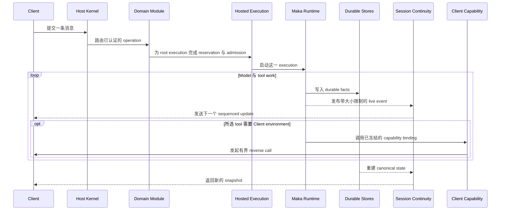

<!--
  Licensed to the Apache Software Foundation (ASF) under one
  or more contributor license agreements.  See the NOTICE file
  distributed with this work for additional information
  regarding copyright ownership.  The ASF licenses this file
  to you under the Apache License, Version 2.0 (the
  "License"); you may not use this file except in compliance
  with the License.  You may obtain a copy of the License at

      http://www.apache.org/licenses/LICENSE-2.0

  Unless required by applicable law or agreed to in writing,
  software distributed under the License is distributed on an
  "AS IS" BASIS, WITHOUT WARRANTIES OR CONDITIONS OF ANY
  KIND, either express or implied.  See the License for the
  specific language governing permissions and limitations
  under the License.
-->

# Runtime Host 架构

> Runtime Host 是一个长期运行的进程，负责一个 State Root 以及使用该 State Root 的 Runtime work。Desktop、TUI、CLI、bot 和 Eval 都是 Client；它们请求 Host 执行工作，不拥有第二套 Runtime。

本文解释维护 Runtime Host 或接入产品功能时需要理解的稳定边界，不重复每个 protocol schema 或 coordinator 的实现细节。

本文所说的 **owner** 或 **authority**，是指 Host 在线时唯一有权改变某类状态的组件，不一定是发起操作的 Client 或用户。

## 为什么需要 Runtime Host

Runtime work 的生命周期长于一次连接。模型调用可能在 Desktop window reload 后继续，authenticated remote Client 可能断开，进程也可能在 durable work 尚未结束时重启。State Root 是保存这些持久状态的目录。

如果每个 Client 都拥有自己的 Runtime 与恢复路径，系统会出现多个 writer、冲突的 Session state，以及依赖连接存活的 execution。Runtime Host 消除这些歧义：

- 一个进程拥有一个 State Root 的写权限；
- Local IPC 与 authenticated WebSocket 使用同一份持久状态；
- 业务代码决定一项工作的含义；
- 一个 execution authority 负责顶层 Session work 的 admission 与 stop，跟踪最终结果，并等待 cleanup 结束。

## 用普通语言理解各组件

| 组件 | 直观含义 |
|---|---|
| Host Kernel | 进程入口：拥有 State Root 的排他 lease 与 connections，停止接收新工作，并负责关闭进程 |
| Host Composition | 固定的启动方案：创建 Stores、共享 authorities 与 Module 列表 |
| Domain Module | 一条静态记录，把一组 protocol operations 与 startup/shutdown 职责分配给一个 owner |
| Hosted Execution | Session 顶层工作的调度入口：接收一个确切 execution，负责停止或恢复它，并区分最终结果与 cleanup 完成 |
| Run Composer | 在 provider call 前记录不会再变化的 prompt 与 tool 基线 |
| Session Continuity | 向 Client 提供 canonical Session snapshot 与带大小限制的 live updates |
| Client Capability | 允许 Host 调用已连接 Client 发布的能力，但不转移 Runtime ownership |

Durable Stores 是 recovery 的事实来源。下文所说的 **canonical state**，是指从这些 Stores 重建的状态；**projection** 则是从该状态派生、便于读取的视图。

**Bounded** 表示 protocol 对 schema、大小、数量或时间设有明确限制，而不是接受任意 work 或 payload。

下面几个 execution 名称也表示不同范围：

| 名称 | 范围 |
|---|---|
| Session | 持久存在的对话与 workspace context |
| Turn | Session 中一项被记录的顶层工作，可以由用户或 Host 发起 |
| Run | 为一次 Turn 执行 model 与 tool work 的持久实体 |
| Root execution | 一个 Session 当前唯一被 admit 的顶层 execution |

## 一次 Turn 如何穿过系统



请求到来前，Host Composition 已经创建这些组件，并把每个业务操作分配给一个 Domain Module。进程状态、diagnostics、upgrade 与 access credential 操作仍由 Kernel 拥有。Composition 是启动方案，不是每次请求都要调用的一层 service。

以用户消息为例：Kernel 负责认证和路由，但不解释消息；拥有该操作的 Domain 应用 message 与 Session 规则，并在 root work 可以开始时使用 Hosted Execution。第一次 provider request 之前，Run Composer 会冻结并持久化 prompt 与 tool 基线。Runtime 写入 canonical facts，Session Continuity 再把这些事实投影给所有 Client。

Scheduled Task 使用同一条 execution path，只是它从自己的 Domain 内部启动，而不是由已连接的 Client 发起。这也是 Client disconnect 不会决定 execution lifetime 的原因。

## Host 的几种身份

这些值回答不同的问题，不能相互替代：

| Identity | 直观含义 | 生命周期 |
|---|---|---|
| State Root | 保存 Host 持久状态的目录；同一时刻只有一个进程持有其排他写 lease | 跨 Host 进程存在 |
| Host Epoch | 当前持有该 lease 的进程 identity | 随该进程结束 |
| Composition ID | 允许解释该 State Root 的 Host program 类型 | 持久绑定到 root |
| Composition Revision | Client 期望连接的 Composition revision | startup wiring 或 compatibility 改变时更新 |
| Host Generation | 由本地 owner Client 请求的 replacement generation | 一个 product version 共用，或仅属于一个 development Client process |

重启会改变 Host Epoch；Composition 变化可能改变其 Revision；product version 更新或 development Client 重启可能改变 Host Generation。这些变化都不会隐式移动 State Root，也不会改变持久绑定的 Composition ID。

例如，绑定到 interactive Composition 的 State Root 不能被另一种 Composition 打开；interactive Composition 自身可以演进到新 revision，而不改变这项持久 identity。

## 各组件分别负责什么

### Host Kernel 拥有进程生命周期

Kernel 取得 State Root 的排他写 lease，启动 listeners，并认证连接。认证会为该 connection 生成一组不可变的 permissions。Kernel 还会跟踪 active operations 与 **residencies**——让进程必须继续存活的明确原因——并驱动 Composition recovery、drain 与 close。

Kernel 不解释 message、tool、Goal 或 Scheduled Task 等业务状态。新增业务行为通过 Domain Module 接入，而不是给 Kernel 状态机增加分支。

### Host Composition 是固定的启动方案

Composition ID、revision 与 construction function 在 listener 启动前选定。Modules 在启动期间只创建一次，并在 Host Ready 后保持不变。Diagnostics 直接读取已创建 Composition 的实际 Module IDs，不维护第二份列表。

每个业务操作只有一个 Module owner。Composition 组合这些 owner，不保留平行的 handler 或 lifecycle 实现。Kernel operations 不属于 Domain Module。

例如，interactive Composition 会创建 Session、Scheduled Task 等 Modules，以及它们使用的 Stores 与共享 execution authority。这个列表在 Host process 内只选择一次。Composition 不是 dynamic plugin registry，也不是每个 Session 各自拥有的配置。

Recovery 使用五个固定 phase：

1. `state`
2. `resources`
3. `executions`
4. `domains`
5. `schedulers`

这个顺序保证 durable state 与 resources 先就绪，随后恢复 executions 与 business domains，最后才启动 schedulers。

Close 按 Module 反序执行。Drain 与 close 会尝试每个 owner，并聚合失败。

### Domain Module 负责一组操作及其生命周期

Domain Module 是一条静态记录，用于回答四个问题：

- 这一组职责处理哪些 protocol operations；
- 每个 startup phase 需要恢复什么；
- drain 时必须拒绝哪些新工作；
- close 时需要释放哪些 resources 与 connection-scoped state。

例如，Scheduled Task Module 拥有 Scheduled Task operations，恢复 durable scheduling state，只在 recovery 完成后启动 scheduler，并在 shutdown 时停止和关闭 scheduler。Task 触发后，Module 仍然请求共享的 Hosted Execution authority 执行它，不会创建另一套 Runtime。

Module 不一定对应独立 process、package 或源码目录。它可以表示一个聚焦功能，也可以表示生命周期紧密相关的一组职责。Construction code 直接传入依赖；Module 不会在 runtime 按名称查找依赖。

Domain 决定 execution result 的业务含义和下一步动作。Hosted Execution 只拥有 execution lifecycle。

### Hosted Execution 控制 Session 的顶层工作

**Admission** 是为一个确切 root execution 原子保留 Session 的决策，用来防止两个顶层 Turn 并发运行。

Admission 成功后返回三个相关值：

- `snapshot`：execution 被 admit 时观察到的状态；
- `completion`：状态为 completed、failed 或 cancelled 的 terminal snapshot，或者明确的 `authority_error`；
- `settled`：execution cleanup 已结束、临时 resources 已释放的信号。

Domain 使用 `completion` 判断业务结果，使用 `settled` 判断 cleanup 是否结束。它保留这次确切 execution 返回的 handles，而不是事后通过 Session ID 或 Turn ID 重新拼装。

Hosted Execution subscription 只告诉同一 Host Epoch 内的 observer“可能发生了变化”，不能证明新状态是什么。Recovery 始终重新读取 durable facts。

### Session Continuity 负责 Client 如何观察 Session

Session Continuity 是 live Session 面向 Client 的公开 read model。打开 subscription 会返回 canonical snapshot、下一个预期 sequence number，以及仍处于 active 状态的 assistant stream identities。可能更大的 transcript 通过单独、带大小限制的 snapshot 读取。

Live projection、assistant 与 tool updates 都有明确的大小限制和 sequence number。发生 connection loss、Host Epoch 变化、sequence gap 或 transcript snapshot 过期后，Client 应重新打开 subscription，并重读 canonical state。例如，Desktop 在模型输出期间 reload 时，会恢复当前 transcript 与 active stream identities，而不是重新发送用户消息。Stream delivery 永远不是 recovery authority。

### Run Composer 冻结模型实际看到的内容

Run Composer 冻结一次 Run 的 model-visible 基线：base system prompt、tool catalog、tool availability policy、base provider options，以及构建这些内容时使用的 input revisions。

第一次真实 provider request 前必须：

1. 创建 immutable Run Composition snapshot；
2. 将其提交到 AgentRun Store；
3. durable commit 成功后才能调用 provider。

Composition 或 persistence 失败时不调用 provider。没有到达 provider dispatch 的 Run 不伪造 composition snapshot。

### Client Capability 让 Host 安全调用 Client 能力

Authenticated Client 可以发布带大小限制、带版本的 tool 或 service **offers**，描述自己能够做什么。Runtime Host 选择确切的 provider **binding**；Run 仍通过正常的 Run Composition 路径记录所选 model tools。对于必须在 Client 环境执行的 effect，Host 可以发起有界 reverse call，例如调用 Desktop 发布的 OS-facing capability。

发布或调用 capability 不会把 Session、Run 或 execution ownership 转移给 Client。Connection loss 会使对应 provider unavailable；拥有该操作的 Domain 仍通过自己的 durable contract 处理 capability loss 或明确的 result-unknown outcome。

### Host profile 描述连接目标

Host profile 是 Client-owned connection configuration，不是 Host state。内置 `local` profile 保留现有的零配置 Local IPC 与 candidate spawn 路径。Remote profile 包含显示名称、一种明确的 transport（Direct TLS、SSH tunnel 或已确认风险的明文连接）和必填的 State Root identity；access credential 会单独保存，并绑定到这个 profile 的确切 target。一个 profile ID 对应不可变的 target：改变连接方式、endpoint 或 root 时必须创建新的 profile ID；显示名称与 credential 可以原地更新。

启用 profile 会让 Client 连接对应 Host。同一个 Desktop 对同一 State Root 最多启用一个 profile，避免同一个 Host 以不同连接配置重复出现。启用操作不会移动 Project 或 Session、改变 Host Epoch，也不会修改 Host。所有 remote transport 最终都进入同一 authenticated WebSocket connector，绝不 fallback 到本地 discovery 或 candidate spawn。Tunnel 是 connection-scoped resource：reconnect 会创建新 tunnel，tunnel 关闭或丢失也会关闭对应 connection。每次远程连接都固定 profile 中的 State Root identity；endpoint 给出不同 root 时必须失败。

Desktop 会让 `local` 与所有已启用的 remote profile 独立保持连接。其中一个 profile 是默认 Host，只用于创建新 Session 和其他没有现成 Host scope 的操作；改变默认 Host 不会重连 Host，也不会移动已有 Session。一个 remote connection 失败不会中断 Local 或其他 remote Host。

Desktop Settings 使用显式 Host selector 管理 Host-owned 配置。外观、语言等 Client-owned 偏好仍是 Desktop 唯一一份设置，不随该 selector 改变。

Desktop 会聚合所有已连接 Host 的 Session summary。产品中的 Session identity 是 `(Host rootId, Session id)`，因此不同 Host 上相同的 Session id 仍是两个不同 Session。Request、event 与 persistent Client-local resource 都会路由回拥有该 Session 的 Host。Transport scope 还包含 Client target Epoch（`targetEpoch`），用于在 Desktop 替换该 profile 的 connection lifecycle 后阻止迟到的 request 或 event。Client target Epoch 不是 Host Epoch，也不是 authentication boundary。

已启用 profile 与默认 profile 是持久化偏好，不代表 connection 已 ready。Remote profile 不可用时，Desktop 仍会显示它，供用户重试或停用。TUI 与 CLI 仍是单 Host Client：启动时解析一个 profile，并把 profile 不可用作为错误报告。

Remote Desktop generation 不能提交任意 Host path。它读取 Project summary、提交 Project ID，并阻止 Client-local capability 收到远端 Host path。目录选择、Git review、workspace search 和打开 Skill 文件等本地文件系统操作只在 `local` 下可用。

Operator 与 Client 的配置流程见[连接远程 Runtime Host](../runtime-host-remote-access.zh-CN.md)。

### Runtime Host 解析 workspace

Client 必须使用下面两种 target form 中的一个来表达 workspace：

```ts
type WorkspaceTarget =
  | { kind: "project"; projectId: string }
  | { kind: "host_path"; path: string };
```

`project` 是可跨机器传递的形式。Runtime Host 通过自己的 Project Catalog 解析它，并返回 canonical target 与 `hostCwd`；`hostCwd` 是 Host 上的绝对目录。`host_path` 只供被明确允许指定 Host path 的 Client 使用，例如从本地 checkout 启动的 CLI。

Project summary 不暴露已注册的 location。`canUseHostPaths` 控制 Client 能否在 operation 中指定 Host path，不是 path confidentiality boundary。Canonical Session projection 可以包含解析后的 `hostCwd`；remote Client 只能把它当作 Host metadata，不能当作 Client filesystem path。读取或修改 Project location、让 Host reveal path 仍是各自独立的 operation，而提交 `host_path` 必须具有 Host-path authority。

Client 不把 path 与 Project ID 拼在一起，也不自行解析 Host path。Desktop 会按 State Root 在本地记住所选 Project；选择它不会修改 Host 全局状态。Remote Desktop 可以使用不透明 root ID 和经过校验的 path segment 浏览 Host 明确发布的目录，并请求 Host 通过 Project Catalog 注册所选目录；它不能指定或查看这些 root 之外的路径。Desktop 不能打开 Client-local directory picker 并假装它选择了 Host directory；CLI/TUI 也不能通过 Client filesystem 重新解释、验证、迁移或补全 Host path。

## 生命周期

两种 Host lifetime 使用同一个 Kernel 与 Composition：

| Host 类型 | 由谁管理生命周期 |
|---|---|
| Ephemeral Host | 由本地 Client 启动；没有 connection、operation 或 residency 要求其继续存活时可以退出 |
| Service Host | 由 deployment owner 运行；Client generation 不能替换它，也不使用 Client 驱动的 idle exit |

| 阶段 | Contract |
|---|---|
| Startup | 取得 State Root lease，绑定 Composition identity，创建 Composition，恢复 Modules，启动 schedulers，最后发布 Ready |
| Request | Authentication、input limits 与 connection permissions 检查，再路由到 Kernel 或唯一的 Domain Module handler |
| Execution | 通过 Hosted Execution reservation 与 admission，再重读 durable facts 确认最终状态 |
| Drain | 停止接收新工作，同时让已接收工作结束或到达可恢复状态 |
| Close | 停止 listeners 接收连接，drain operations，反序关闭 Modules，清理 listeners，最后释放 State Root lease |

Client disconnect 只释放 connection-scoped resources，不取消已经 admission 的 execution。

### 本地 Ephemeral Host 的升级交接

Host Generation 与 protocol compatibility 是两个事实：两个本地 Client generation 即使使用相同 protocol，也可能请求替换进程，让所请求的 Runtime generation 成为 authority。本地 owner Client 请求 drain 时必须带上自己观察到的 Host Epoch，因此过期 Client 无法 drain 后来启动的替代进程。下一个 Host 会等待现有 State Root lease 释放。

Startup 发现另一个 generation 时，Host 可以返回数量受限的 active connections、operations 与 residencies。这些数量用于解释进程为什么仍然存活，不允许 Client 直接杀死它。只有本地 ephemeral Host 支持 replacement，中断 active work 必须经过 Client 的明确选择；Service Host 的升级仍由 deployment owner 负责。等待中的 Client 会停止连接尝试，直到所观察的 Host 退出，因此等待本身不会让原本应 idle exit 的 Host 继续驻留。

## 必须始终成立的规则

1. 一个 State Root 最多有一个 writer owner。
2. 一个 Session 最多有一个 root Hosted Execution 或 pending root admission。
3. Local IPC 与 WebSocket 共享一个 routing table、permission model 与 canonical state。
4. Transport 只负责 message framing 与 authentication，不拥有业务状态。
5. Composition identity 在 listener 启动前固定，Module set 在 Ready 前固定。
6. 一个业务操作只有一个 Module owner；进程与 access operations 仍由 Kernel 拥有。
7. Notification 与 stream 不能替代 Store 成为 recovery authority。
8. Provider dispatch 等待 Run Composition durable commit。
9. Domain lifecycle 与 execution lifecycle 保持分离。
10. 一个 owner 关闭失败时，shutdown 仍继续关闭其余 owner。
11. 只有 Runtime Host 能把 `WorkspaceTarget` 解析为 canonical Host path。
12. Client-local capability execution 不会把 Runtime ownership 转移出 Host。
13. Stream 中断后，Client 从 canonical snapshot 重建 observation。

## 失败如何收敛

| 失败 | 必须遵守的行为 |
|---|---|
| Composition mismatch | 在 listener 或 Domain Store mutation 前失败；报告终态 incompatibility，不重复启动 Candidate |
| Host crash | 下一个 Host 重读 Stores，并安全地重复 recovery，直到 execution 与 Domain state 收敛 |
| Notification 丢失 | 重读 canonical projection，不能从 callback delivery 推断 terminal state |
| Session stream 丢失 | 重新打开 subscription，并重读 snapshot 与 transcript |
| Run Composition 失败 | 不调用 provider |
| Client disconnect | 已 admission 的工作继续由 Host 持有 |
| Client Capability 丢失 | 暴露有界的 capability-loss 或 outcome-unknown state，不静默重试结果不确定的 effect |
| Partial shutdown failure | 聚合错误，同时继续释放其余 resources |

Runtime Host 不保证任意 external side effect 恰好发生一次。如果 connection 在 dispatch 后丢失，Host 可能只能确认 outcome unknown。Tool 或 resource contract 必须保留这种不确定性；除非 operation 明确允许，否则不能自动重试。

## 协议与安全边界

- Protocol message 使用拒绝未知字段的 closed schema、明确的大小与数量限制，以及稳定的 error code。
- Authentication 在 protocol connection admission 前完成。
- Local IPC 只有在操作系统 endpoint 建立 same-user 信任边界后，才能授予 Local Owner authority。
- Authentication 会在 connection 的整个生命周期内固定 principal、允许的 operations，以及 path 或 capability access。
- Client Capability offers 与 reverse calls 必须经过认证、带大小限制，并绑定到该 connection。
- 新增 protocol operation 不会扩张既有 credential grant。
- Status 与 diagnostics 只公开 bounded、redacted 的 lifecycle 与 composition facts。

## 代码阅读地图

- [`host-kernel.ts`](../../packages/runtime-host/src/server/host-kernel.ts)：process ownership、listeners、connection lifecycle、drain 与 shutdown
- [`host-composition.ts`](../../packages/runtime-host/src/server/host-composition.ts)：composition identity、Module contract、recovery 与 close order
- [`execution-composition.ts`](../../packages/runtime-host/src/server/execution-composition.ts)：静态 coordinator 与 Module assembly
- [`hosted-execution-authority.ts`](../../packages/runtime-host/src/server/hosted-execution-authority.ts)：root execution contract
- [`session-continuity-coordinator.ts`](../../packages/runtime-host/src/server/session-continuity-coordinator.ts)：canonical Client observation 与 live stream continuity
- [`client-capability-coordinator.ts`](../../packages/runtime-host/src/server/client-capability-coordinator.ts)：capability publication、binding 与 reverse-call lifecycle
- [`workspace-resolver.ts`](../../packages/runtime-host/src/server/workspace-resolver.ts)：Project 与 Host-path workspace resolution
- [`run-composition.ts`](../../packages/core/src/run-composition.ts)：durable Run Composition schema
- [`state-root-composition.ts`](../../packages/storage/src/state-root-composition.ts)：persistent Composition binding

## 小结

Runtime Host 只保留一条 ownership path：Kernel 控制 process；Composition 创建一组固定 Modules；Modules 拥有业务行为，Hosted Execution 控制顶层工作；Run Composer 记录模型看到的内容，Session Continuity 重建 Client 看到的内容，Client Capability 则允许 Host 对 Client 发起受限回调。Durable Stores 让这些组件在进程重启后恢复，而不产生第二个 Runtime owner。
